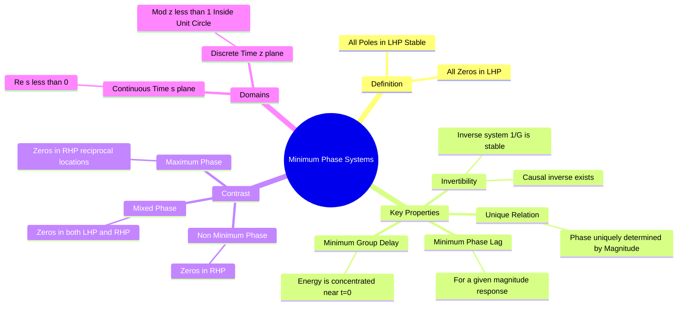

---
tags:
  - control-system
  - signals-and-systems
  - stability
  - gate
  - frequency-domain
created: 2026-08-04T10:03:12
aliases:
  - Minimum Phase Transfer Function
  - Stable Invertible System
  - "Example : Minimum Phase Systems"
  - "Properties : Minimum Phase Systems"
subject: "[[Control Systems]]"
parent:
  - Frequency Response Analysis
modified: 2026-08-04T10:03:12
---
### Minimum Phase Systems
#control-system/frequency-response #stability

> A **Minimum Phase System** is a linear time-invariant (LTI) system where ==**all poles and all zeros** of its transfer function lie in the **Left Half of the s-plane** ($Re(s) < 0$). Ideally, it represents a stable system with a stable inverse==.

---
#### Definition and Pole-Zero Constraint
#control-system/definitions

For a continuous-time transfer function $G(s)$ to be Minimum Phase:
1.  **Stability**: All poles must be in the Left Half Plane (LHP).
2.  **Invertibility**: All zeros must be in the LHP.

**Transfer Function Form:**
$$\boxed{\quad G_{min}(s) = K \frac{(s+z_1)(s+z_2)\dots}{(s+p_1)(s+p_2)\dots} \quad}$$
Where $z_i > 0$ and $p_i > 0$.

**Discrete-Time Equivalent ($z$-domain):**
For a discrete system $H(z)$ to be minimum phase, all poles and zeros must lie **inside the unit circle** ($|z| < 1$).

---
#### Why "Minimum" Phase?
#frequency-response/phase

The term "minimum" refers to the phase lag.
Consider a family of systems that all have the exact same **Magnitude Response** $|G(j\omega)|$. This family includes Minimum Phase, [[Non-Minimum Phase Systems|Non-Minimum Phase]], and Mixed Phase systems.

Among all these systems with the same magnitude spectrum, the **Minimum Phase system has the least amount of phase lag** (or minimum negative phase shift) at all frequencies $\omega>0$.

> [!Example]
> 
> Compare two systems:
> 1.  $G_1(s) = \frac{s+1}{s+5}$ (Zero at $s=-1$: Min Phase)
> 2.  $G_2(s) = \frac{s-1}{s+5}$ (Zero at $s=+1$: Non-Min Phase)
> 
> **Magnitude:**
> $$|G_1(j\omega)| = \frac{\sqrt{\omega^2+1}}{\sqrt{\omega^2+25}} \quad \text{and} \quad |G_2(j\omega)| = \frac{\sqrt{\omega^2+1}}{\sqrt{\omega^2+25}}$$
> They are identical.
> 
> **Phase:**
> * $\phi_1(\omega) = \tan^{-1}(\omega) - \tan^{-1}(\omega/5)$
> * $\phi_2(\omega) = (180^\circ - \tan^{-1}(\omega)) - \tan^{-1}(\omega/5)$
> 
> At any frequency, $\phi_1$ is closer to $0^\circ$ than $\phi_2$. Thus, $G_1$ has the "minimum phase shift".

---
#### Properties
#control-system/properties

1.  **Stable Inverse (Invertibility):**
    Since all zeros of $G(s)$ are in the LHP, the poles of the inverse system $G^{-1}(s) = 1/G(s)$ will also be in the LHP.
    *   This is critical for **Inverse Filtering** and **Deconvolution** (e.g., channel equalization in communications). If a channel is non-minimum phase, an exact stable inverse filter cannot be designed.

2.  **Minimum Group Delay:**
    $$ \tau_g(\omega) = - \frac{d\phi}{d\omega} $$
    Minimum phase systems have the smallest group delay among systems with the same magnitude response. Physically, this means signal energy is concentrated near the start of the impulse response (minimum energy delay).

3.  **Unique Magnitude-Phase Relationship (Bode's Integral Theorem):**
    For minimum phase systems, the phase response is uniquely determined by the magnitude response (and vice-versa) via the Hilbert Transform.
    *   *Significance:* If you have an experimental Bode Magnitude plot of a minimum phase system, you can analytically derive the Phase plot. This is **not** true for Non-Minimum phase systems.

---
#### Maximum Phase and Mixed Phase
#signals-and-systems/classification

* **Maximum Phase System:** All zeros lie in the Right Half Plane (and poles in LHP). In discrete time, zeros lie outside the unit circle. It has the maximum possible phase lag.
* **Mixed Phase System:** Some zeros are in the LHP and some in the RHP.

#### Decomposition

Any causal LTI system can be decomposed into a Minimum Phase component and an All-Pass component:
$$\boxed{\quad G(s) = G_{min}(s) \cdot G_{ap}(s) \quad}$$
*   $G_{min}(s)$ contains all poles and the LHP zeros. RHP zeros are reflected to LHP.
*   $G_{ap}(s)$ accounts for the RHP zeros and ensures the magnitude remains unity.

---
### Related Concepts
#topic/related-concepts

> [[Non-Minimum Phase Systems]] (The direct contrast)
> [[All-Pass Systems]]

[[Inverse Systems]]
[[Group Delay and Phase Delay]]
[[Bode Plots]]
[[Hilbert Transform]] (Mathematical tool linking Mag and Phase for MP systems)
[[Pole-Zero Plot]]