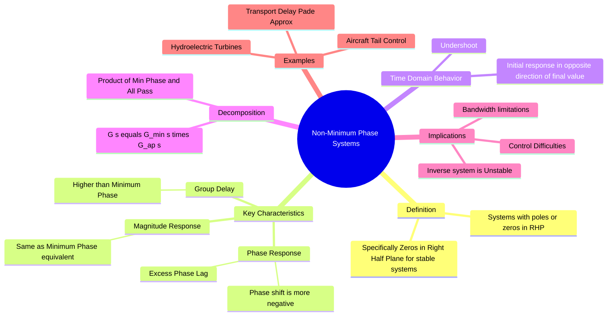

---
tags:
  - control-system
  - stability
  - frequency-response
  - signals-and-systems
  - gate
created: 2026-08-04T10:07:43
aliases:
  - Non-Minimum Phase System
  - RHP Zeros
  - NMP Systems
  - "Example : Non-Minimum Phase System Decomposition"
subject: "[[Control Systems]]"
parent:
  - Frequency Response Analysis
modified: 2026-08-04T10:07:43
---
### Non-Minimum Phase Systems
#control-system/frequency-response #stability

> A **Non-Minimum Phase (NMP) System** is a [[Causality|causal]] system whose transfer function contains one or more **zeros** (or poles) lying in the **Right Half of the $s$-plane** ($Re(s) > 0$). Ideally, for stable control systems design, we focus on stable systems where the **zeros** are in the RHP.

---
#### Definition and Distinction
#control-system/definitions

The classification depends on the location of poles and zeros:
1.  **[[Minimum Phase Systems|Minimum Phase System]]:** All poles and zeros lie in the Left Half Plane (LHP).
    * For a given magnitude response, this system exhibits the *minimum* possible phase lag.
2.  **Non-Minimum Phase System:** At least one zero (or pole) lies in the Right Half Plane (RHP).
    * It exhibits "excess" phase lag compared to the minimum phase equivalent.
3.  **Maximum Phase System:** All zeros lie in the RHP.

**Transfer Function Form:**
$$G(s) = K \frac{(s - z_1)(s + z_2)}{(s + p_1)(s + p_2)}$$
Here, the zero at $s = +z_1$ makes it a Non-Minimum Phase system.

---
#### Frequency Response Characteristics
#frequency-response/bode

The unique property of NMP systems is that they share the **same magnitude plot** as a Minimum Phase system but have a **different phase plot**.

Consider two systems:
*   $G_1(s) = \frac{s+1}{s+2}$ (Minimum Phase: Zero at -1)
*   $G_2(s) = \frac{s-1}{s+2}$ (Non-Minimum Phase: Zero at +1)

**Magnitude:**
$$|G_1(j\omega)| = \frac{\sqrt{\omega^2+1}}{\sqrt{\omega^2+4}} \quad \text{and} \quad |G_2(j\omega)| = \frac{\sqrt{\omega^2+(-1)^2}}{\sqrt{\omega^2+4}}$$
$$\boxed{\quad |G_1(j\omega)| = |G_2(j\omega)| \quad}$$
*Conclusion:* You cannot distinguish between Minimum and Non-Minimum phase systems using the **Magnitude Bode Plot** alone.

**Phase:**
*   $\angle G_1(j\omega) = \tan^{-1}(\omega) - \tan^{-1}(\frac{\omega}{2})$
    *   LHP Zero contributes **Phase Lead** ($0$ to $+90^\circ$).
*   $\angle G_2(j\omega) = \angle(j\omega - 1) - \tan^{-1}(\frac{\omega}{2}) = (180^\circ - \tan^{-1}(\omega)) - \tan^{-1}(\frac{\omega}{2})$
    *   RHP Zero contributes **Phase Lag** ($180^\circ$ to $90^\circ$, net change $-90^\circ$).
    *   Alternatively written as $-(s-1) \implies 1-s$, phase is $-\tan^{-1}(\omega)$.

*Conclusion:* NMP systems have a larger net phase lag (or smaller phase margin) than their minimum phase equivalents.

---
#### System Decomposition
#control-system/decomposition

Any Non-Minimum Phase transfer function $G(s)$ can be factored into a Minimum Phase part and an All-Pass part.

$$\boxed{\quad G(s) = G_{min}(s) \cdot G_{ap}(s) \quad}$$

> [!Example]
> 
> Let $G(s) = \frac{s - 2}{s + 1}$.
> We can multiply and divide by $(s+2)$:
> $$G(s) = \left[ \frac{s+2}{s+1} \right] \cdot \left[ \frac{s-2}{s+2} \right]$$
> 
> * **$G_{min}(s) = \frac{s+2}{s+1}$**: Minimum Phase (Zero reflected to LHP).
> * **$G_{ap}(s) = \frac{s-2}{s+2}$**: [[All-Pass Systems|All-Pass]] (Unit gain, provides the phase shift).
> 
> This decomposition proves that the NMP system has the same magnitude as $G_{min}$ (since $|G_{ap}|=1$) but extra phase lag due to $G_{ap}$.

---
#### Time Domain Behavior (Undershoot)
#time-response/undershoot

NMP systems exhibit a phenomenon called **Undershoot** or "Reverse Action" in their step response.
*   When a step input is applied, the output initially moves in the **wrong direction** (negative) before recovering and moving towards the steady-state value.
*   **Why?** The initial value theorem depends on the high-frequency limit. For $G(s) = \frac{1-s}{1+s}$, as $s \to \infty$, $G(s) \to -1$.

> [!Example] Example : Aircraft altitude control
> When the pilot pulls up (elevator up), the tail goes down, momentarily causing the entire plane to drop slightly before the angle of attack increases and the lift raises the plane.

---
#### Implications for Stability and Control
#stability/control-design

1.  **Reduced Stability Margins:** The extra phase lag reduces the Phase Margin, bringing the system closer to instability.
2.  **Bandwidth Limit:** To maintain stability, the gain crossover frequency must be kept low, limiting the system's speed of response (bandwidth).
3.  **Invertibility:** You cannot simply invert the system to cancel dynamics (e.g., $G_c = 1/G_p$) because the RHP zero of the plant becomes a **RHP pole** of the controller, making the controller unstable.

---
#### Transport Delay as NMP

A pure time delay $e^{-sT}$ is an infinite-dimensional non-minimum phase element. Using the **Padé Approximation**:
$$e^{-sT} \approx \frac{1 - sT/2}{1 + sT/2}$$
This introduces a zero at $s = +2/T$ (RHP), confirming that delay systems behave like NMP systems (adding lag without attenuating magnitude).

---
### Related Concepts
#topic/related-concepts

> [[Minimum Phase Systems]]
> [[All-Pass Systems]]

[[Time Delay Systems]]
[[Bode Plots]]
[[Nyquist Stability Criterion]] (NMP systems change the definition of $N=P-Z$ slightly regarding encirclements)
[[Inverse Systems]]
