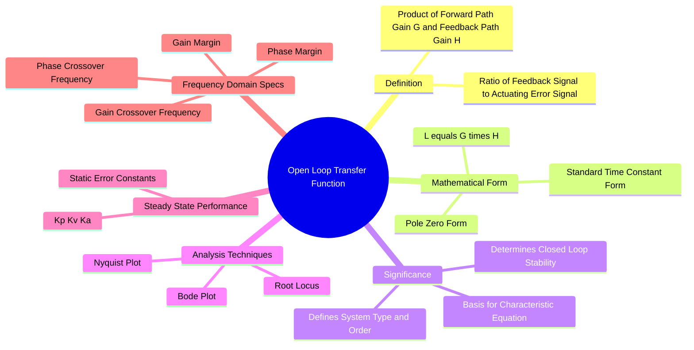

---
tags:
  - control-system
  - transfer-function
  - stability
  - gate
created: 2026-08-04T10:09:24
aliases:
  - OLTF
  - Loop Gain
  - Open-Loop Transfer Function
  - open-loop transfer function
subject: "[[Control Systems]]"
parent: "[[The Transfer Function H(s)]]"
modified: 2026-08-04T10:09:24
---
### Open-Loop Transfer Function (OLTF)
#control-system/transfer-function #loop-gain

> The Open-Loop Transfer Function (often called **Loop Gain**) is the combined [[Transfer Function and Impulse Response|transfer function]] of the forward path and the feedback path in a feedback control system. It is the transfer function encountered as a signal traverses the complete loop once, assuming the feedback connection is broken (opened).

---

#### Definition and Formulation
#oltf/definition

In a canonical negative feedback control system:
*   $G(s)$ = Forward Path Transfer Function.
*   $H(s)$ = Feedback Path Transfer Function.
*   $E(s)$ = Actuating Error Signal.
*   $B(s)$ = Feedback Signal.

The Open-Loop Transfer Function $L(s)$ is defined as the ratio of the feedback signal to the error signal:
$$\boxed{\quad \text{OLTF} = L(s) = \frac{B(s)}{E(s)} = G(s)H(s) \quad}$$

**Distinction:**
*   **Open Loop System:** A system without feedback ($H(s)=0$, Output is just $G(s) \times Input$).
*   **Open Loop Transfer Function:** A mathematical quantity ($G(s)H(s)$) derived from a *closed-loop system* used to analyze its stability and performance.

---
#### Relationship to Closed-Loop System
#oltf/closed-loop-relation

The properties of the closed-loop system are heavily dependent on the OLTF.
The **[[Closed-Loop Transfer Function (CLTF)]]** is:
$$T(s) = \frac{C(s)}{R(s)} = \frac{G(s)}{1 + G(s)H(s)}$$

The denominator leads to the **Characteristic Equation**, which dictates stability:
$$\boxed{\quad 1+G(s)H(s)=0\quad}$$

*   The **Poles** of the OLTF are the "Open-Loop Poles".
*   The **Zeros** of the OLTF are the "Open-Loop Zeros".
*   The **Roots** of the Characteristic Equation ($1+OLTF=0$) are the **Closed-Loop Poles**.

---
#### System Type and Order
#control-system/type-order

The OLTF determines the "Type" of the system, which dictates [[steady-state error]] characteristics.
Representing OLTF in Time-Constant form:

$$\boxed{\quad G(s)H(s) = \frac{K(1+sT_a)(1+sT_b)\dots}{s^N (1+sT_1)(1+sT_2)\dots} \quad}$$
^oltf-in-time-constant-form

*   **Order:** The highest power of $s$ in the denominator (total number of poles).
*   **Type ($N$):** The power of $s$ in the denominator acting as a factor (number of poles at the origin $s=0$).
    *   Type 0: No pole at origin.
    *   Type 1: One pole at origin (integrator).
    *   Type 2: Two poles at origin.

![[Control System Repeated Generic Notes#^time-constant-form-conversion]]

---
#### Importance in Stability Analysis
#stability/frequency-domain

Most frequency domain stability criteria analyze the **Open-Loop** transfer function to predict the **Closed-Loop** stability. This is preferred because $G(s)H(s)$ is factorable and easier to plot than the closed-loop expression.

1.  **[[Concept and Definition of Root Locus|Root Locus]]:** Plots the path of closed-loop poles as the open-loop gain $K$ varies. The locus starts at Open-Loop Poles and ends at Open-Loop Zeros.
2.  **[[Nyquist Stability Criterion]]:** Relates the encirclements of the critical point $(-1, j0)$ by the Nyquist plot of $G(s)H(s)$ to the number of unstable closed-loop poles.
3.  **[[Bode Plots]]:** Plots magnitude and phase of $G(j\omega)H(j\omega)$.
    * **[[Gain Margin (GM)]]:** How much the OLTF gain can increase before instability.
    * **[[Phase Margin (PM)]]:** How much phase lag can be added to the OLTF before instability.

---
#### Steady-State Error Calculation
#control-system/steady-state-error

The [[static error constants]] are calculated directly from the OLTF limits:

$$\begin{align}
\text{Positional Error Constant, } K_p &= \lim_{s \to 0} G(s)H(s) \\
\text{Velocity Error Constant, } K_v &= \lim_{s \to 0} s G(s)H(s) \\
\text{Acceleration Error Constant, } K_a &= \lim_{s \to 0} s^2 G(s)H(s)
\end{align}$$

---
### Related Concepts
#topic/related-concepts

> [[Closed-Loop Transfer Function (CLTF)]]

[[characteristic equation]]
[[Steady-State Error]]
[[Nyquist Stability Criterion]]
[[Bode Plots]]
[[Concept and Definition of Root Locus]]
[[Gain Margin (GM)]] & [[Phase Margin (PM)]]
[[Type and Order of Control Systems]]
