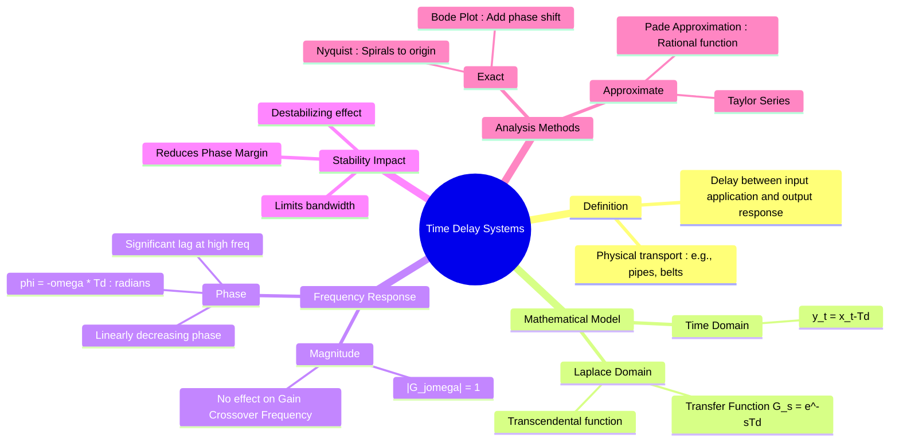

---
tags:
  - control-system
  - stability
  - frequency-response
  - gate
created: 2026-08-04T10:41:24
aliases:
  - Dead Time
  - Transport Lag
  - Transportation Delay
  - transcendental function
subject: "[[Control Systems]]"
parent:
  - Frequency Response Analysis
formula:
  - "Time Delay System : $$G_d(s) = \\frac{Y(s)}{X(s)} = e^{-s T_d}$$"
modified: 2026-08-04T10:41:24
---
### Time Delay Systems (Dead Time)
#control-system/time-delay #stability

> **Time Delay** (or Transport Lag/Dead Time) occurs when there is a physical delay between the application of an input and the start of the response at the output. This is common in chemical process control (flow through pipes), conveyor belts, and communication systems.

---
#### Mathematical Representation
#mathematical-modeling

Let the input be $x(t)$ and the delay be $T_d$ seconds. The output $y(t)$ is simply the input shifted in time:
$$y(t) = x(t - T_d)u(t - T_d)$$

**Laplace Transform:**
Using the time-shifting property of the [[The Laplace Transform|Laplace Transform]]:
$$\boxed{\quad G_d(s) = \frac{Y(s)}{X(s)} = e^{-s T_d} \quad}$$

This is a **[[transcendental function]]**, not a rational algebraic function (polynomial ratio), which complicates analysis using [[Routh-Hurwitz Stability Criterion|Routh-Hurwitz]] or [[Concept and Definition of Root Locus|Root Locus]] directly.

---
#### Frequency Domain Characteristics
#frequency-response

Substituting $s = j\omega$ into the transfer function $G_d(s) = e^{-j\omega T_d} = 1 \angle (-\omega T_d)$:

**A. Magnitude Response:**
$$\boxed{\quad M = |e^{-j\omega T_d}| = 1 \quad (\text{or } 0 \text{ dB}) \quad}$$
*   A pure time delay component is an **[[All-Pass Systems|All-Pass]]** system.
*   It does **not** [[attenuation|attenuate]] or amplify the signal magnitude at any frequency.
*   It does **not** change the [[Phase Margin (PM)| gain crossover frequency]] ($\omega_{gc}$) of the system.

**B. Phase Response:**
$$\boxed{\quad \phi = \angle e^{-j\omega T_d} = -\omega T_d \text{ radians} = -57.3 \omega T_d \text{ degrees} \quad}$$
*   The phase shift is **negative** (lag) and linear with frequency.
*   As frequency $\omega$ increases, the phase lag increases indefinitely.

---
#### Effect on Stability
#stability/phase-margin

Time delay is the "enemy" of stability.

1.  **Phase Margin Reduction:**
    Since the magnitude is unchanged, the gain crossover frequency $\omega_{gc}$ remains the same. However, the phase at $\omega_{gc}$ drops significantly.
    $$\text{New Phase Margin} = \text{Old PM} - (\omega_{gc} T_d \times \frac{180}{\pi})$$
    A reduction in [[Phase Margin (PM)|Phase Margin]] moves the system closer to instability.

2.  **Destabilization:**
    If the lag introduced by the delay is large enough such that the total phase at $\omega_{gc}$ crosses $-180^\circ$, the closed-loop system becomes unstable.

---
#### Approximation Methods (Rationalization)
#pade-approximation

To use techniques like [[Routh-Hurwitz Stability Criterion|Routh-Hurwitz]] or [[Concept and Definition of Root Locus|Root Locus]], we approximate the exponential term $e^{-sT_d}$ as a rational function.

##### A. [[Taylor Series]] Expansion

$$e^{-sT_d} = 1 - sT_d + \frac{(sT_d)^2}{2!} - \dots \approx 1 - sT_d$$
*   Poor approximation for higher frequencies.

##### B. Padé Approximation (Most Common)

A first-order Padé approximation matches the first few terms of the [[Taylor series]] of the numerator and denominator.
$$\boxed{\quad e^{-sT_d} \approx \frac{1 - \frac{T_d}{2}s}{1 + \frac{T_d}{2}s} \quad}$$
*   This models the delay as a **[[Non-Minimum Phase Systems|Non-Minimum Phase]]** system (Pole in LHP, Zero in RHP).
*   Pole at $s = -2/T_d$, Zero at $s = +2/T_d$.
*   Magnitude is 1 (matches the delay).
*   Phase is $-2\tan^{-1}(\omega T_d / 2)$.

---
#### Effect on Plots
#control-system/plots

*   **Bode Plot:**
    *   Magnitude plot is unchanged.
    *   Phase plot drops rapidly at high frequencies (much steeper than standard poles).
*   **Nyquist Plot:**
    *   The plot spirals towards the origin as $\omega \to \infty$ because the magnitude stays constant (or determined by other system parts) while the angle rotates continuously clockwise.
*   **Root Locus:**
    *   With the Padé approximation, the RHP zero attracts root locus branches into the Right Half Plane, indicating instability at high gains.

---
### Related Concepts
#topic/related-concepts

> [[Gain Margin (GM)]]
> [[Phase Margin (PM)]]

[[Non-Minimum Phase Systems]] (Systems with zeros in RHP, like the Padé model)
[[Nyquist Stability Criterion]] (Handling $e^{-sT}$ in Nyquist)
[[Bode Plots]]
[[Routh-Hurwitz Stability Criterion]] (Cannot be applied directly to $e^{-sT}$ without approximation)
[[Process Control]] (Where [[dead time]] is most prevalent)
[[Taylor Series]]
