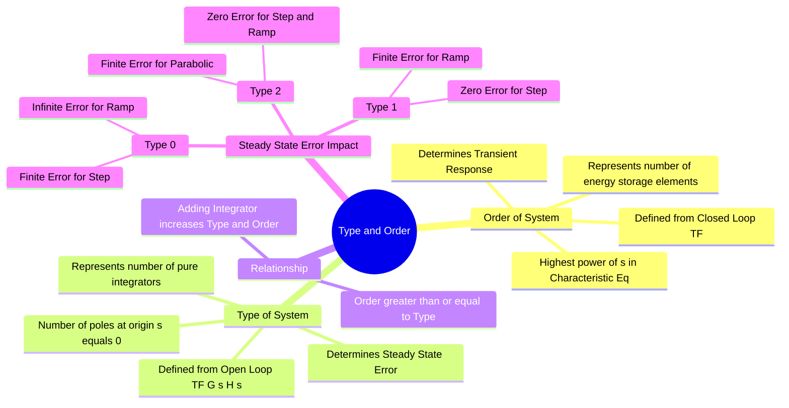

---
tags:
  - control-system
  - time-response
  - steady-state-error
  - gate
created: 2025-10-13
aliases:
  - System Type
  - System Order
  - Type Number
  - "Example : Type & Order of Control Systems"
subject: "[[Control Systems]]"
parent:
  - Time Response Analysis
modified: 2026-07-20
---
### Type and Order of Control Systems
#control-system/type-order #gate

> The concepts of **Order** and **Type** are fundamental classifications of control systems. ==**Order** relates to the system's dynamic complexity and transient behavior (derived from the [[Closed-Loop Transfer Function (CLTF)|Closed-Loop Transfer Function]])==, while ==**Type** relates to the system's steady-state accuracy (derived from the [[Open-Loop Transfer Function (OLTF)|Open-Loop Transfer Function]])==.

---

#### Order of the System
#system-order

==The **Order** of a control system is defined as the highest power of the complex variable $s$ in the denominator of the **[[Closed-Loop Transfer Function (CLTF)#The Standard Formula|Closed-Loop Transfer Function (CLTF)]]**.== Alternatively, it is the number of poles of the closed-loop system.

**Mathematical Definition:**
Given the Characteristic Equation:
$$\boxed{\quad 1+G(s)H(s)=0\quad}$$
==If the equation is a polynomial in $s$ of degree $n$:==
$$a_n s^n + a_{n-1} s^{n-1} + \dots + a_1 s + a_0 = 0$$
==Then, $n$ is the **Order** of the system.==

**Physical Significance:**
* ==Represents the number of independent energy storage elements (Inductors, Capacitors in electrical; Mass, Spring in mechanical).==
* ==Governs the **Transient Response** ([[Time-Domain Specifications#2. Rise Time ($T_r$)|Rise time]], [[Time-Domain Specifications#5. Settling Time ($T_s$)|settling time]], [[Time-Domain Specifications#4. Peak Overshoot ($M_p$)|overshoot]]).==
* Example: A standard Second-Order System ($n=2$) has two poles.

> [!pyq]- PYQ : GATE EE 2020
> ![[ee_2020#^q35]]

---
#### Type of the System
#system-type

==The **Type** of a control system is defined as the number of poles lying at the origin ($s=0$) in the **[[Open-Loop Transfer Function (OLTF)]]** $G(s)H(s)$.==

**Mathematical Definition:**
Represent the OLTF in time-constant form:
$$\boxed{\quad G(s)H(s) = \frac{K(1+sT_a)(1+sT_b)\dots}{s^N (1+sT_1)(1+sT_2)\dots} \quad}$$
Where:
* $N$ is the **Type Number** of the system.
* $N = 0 \rightarrow$ Type-0 System.
* $N = 1 \rightarrow$ Type-1 System.
* $N = 2 \rightarrow$ Type-2 System.

![[Control System Repeated Generic Notes#^time-constant-form-conversion]]

**Physical Significance:**
* $N$ represents the number of **pure integrators** in the forward path.
* Governs the **[[Steady-State Error]]** $(e_{ss})$ accuracy.
* Higher type numbers eliminate steady-state errors for higher-order inputs (e.g., Type 1 eliminates error for step input).

> [!examtip] CRITICAL GATE TIP
> * Check **ORDER** from the **Closed-Loop** denominator ($1+GH$).
> * Check **TYPE** from the **Open-Loop** denominator ($GH$).
> * Do not cancel common poles/zeros when determining Type/Order unless specified, but for physical realizability, assume irreducible forms.

---
#### Effect of Type on Steady-State Error
#steady-state-error

The system type determines which static error constant is non-zero and finite.

| Input Signal | Laplace $R(s)$ | Type 0 System | Type 1 System | Type 2 System |
| :--- | :--- | :--- | :--- | :--- |
| **Step** (Position) | $A/s$ | Constant Error ($e_{ss} = \frac{A}{1+K_p}$) | Zero Error ($0$) | Zero Error ($0$) |
| **Ramp** (Velocity) | $A/s^2$ | Infinite Error ($\infty$) | Constant Error ($e_{ss} = \frac{A}{K_v}$) | Zero Error ($0$) |
| **Parabolic** (Accel) | $A/s^3$ | Infinite Error ($\infty$) | Infinite Error ($\infty$) | Constant Error ($e_{ss} = \frac{A}{K_a}$) |

**Error Constants:**
*   **Position Error Constant:** $K_p = \lim_{s \to 0} G(s)H(s)$
*   **Velocity Error Constant:** $K_v = \lim_{s \to 0} s G(s)H(s)$
*   **Acceleration Error Constant:** $K_a = \lim_{s \to 0} s^2 G(s)H(s)$

---
#### Examples

##### Example 1
$$G(s)H(s) = \frac{10}{s(s+2)}$$
* **Type:** 1 (One pole at $s=0$).
* **Order:** Characteristic Eq is $1 + \frac{10}{s(s+2)} = 0 \Rightarrow s^2 + 2s + 10 = 0$. Highest power is 2. **Order = 2**.

##### Example 2
$$G(s)H(s) = \frac{10}{s^2(s+1)(s+3)}$$
* **Type:** 2 (Two poles at $s=0$).
* **Order:** Characteristic Eq is $s^2(s+1)(s+3) + 10 = 0 \Rightarrow s^4 + \dots$. **Order = 4**.

---
### Related Concepts
#topic/related-concepts

> [[Steady-State Error]]

[[Open-Loop Transfer Function (OLTF)]]
[[Closed-Loop Transfer Function (CLTF)]]
[[characteristic equation]]
[[Proportional (P) Controller|P Controller]] , [[Proportional-Integral (PI) Controller|PI Controller]] , [[Proportional-Derivative (PD) Controller|PD Controller]] & [[Proportional-Integral-Derivative (PID) Controller|PID Controller]] (Integral control increases System Type)
[[DC Gain]]
[[Time Response Analysis]] (Determined by Order)
