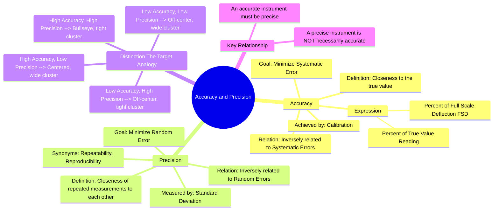

---
tags:
  - measurements
  - instrumentation
  - error-analysis
  - gate
created: 2023-10-26
aliases:
  - Accuracy
  - Precision
  - Measurement Accuracy
  - Measurement Precision
subject: "[[Electrical & Electronic Measurements]]"
parent: Fundamentals of Measurement and Error Analysis
modified: 2026-08-04T09:05:16
---
### Accuracy and Precision
#accuracy #precision #error-analysis #instrument-characteristics

> **Accuracy** is the degree of closeness of a measured value to the true or accepted value. **Precision** is the degree of closeness of repeated measurements to each other, indicating the reproducibility of the result.

An instrument can be precise without being accurate, but it cannot be considered accurate if it is not precise.

---
#### Accuracy
#accuracy #systematic-error #calibration

Accuracy describes how well an instrument's reading agrees with the true value of the quantity being measured. It is a measure of the correctness of the measurement.

-   **Relation to Errors**: Accuracy is inversely related to [[Types of Errors|Systematic Errors]]. High accuracy implies low systematic error.
-   **Improvement**: Accuracy is primarily improved through proper **calibration** against a known standard.

The accuracy of an instrument is often specified in terms of its **inaccuracy** or **limit of error**.

-   **Absolute Static Error** ($\delta A$): The difference between the measured value ($A_m$) and the true value ($A_t$).
    $$\delta A = A_m - A_t$$
-   **Relative Static Error** ($\epsilon_r$): The ratio of the absolute static error to the true value.
    $$\epsilon_r = \frac{\delta A}{A_t} = \frac{A_m - A_t}{A_t}$$
-   **Static Correction**: The negative of the absolute static error, $\delta C = -\delta A = A_t - A_m$.

Accuracy is commonly expressed in two ways:
1.  **Percentage of Full-Scale Deflection (FSD)**: The error is a constant value regardless of the reading.
    $$\boxed{\quad \text{Error (V)} = (\% \text{Accuracy}) \times (\text{Full Scale Voltage}) \quad}$$
    For example, a 100V voltmeter with ±1% FSD accuracy will have a constant limiting error of $\pm (0.01 \times 100) = \pm 1V$ over its entire range. The percentage error with respect to the reading increases as the reading decreases.

2.  **Percentage of True Value ("of Reading")**: The error is proportional to the reading.
    $$\boxed{\quad \text{Error (V)} = (\% \text{Accuracy}) \times (\text{Voltage Reading}) \quad}$$
    This is more desirable as the absolute error decreases for smaller readings.

---
#### Precision
#precision #random-error #repeatability #reproducibility

Precision describes the reproducibility of measurements. It is a measure of the consistency and agreement among a series of independent measurements of the same quantity.

-   **Relation to Errors**: Precision is inversely related to [[Types of Errors|Random Errors]]. High precision implies low random error.
-   **Quantification**: Precision is quantified using statistical methods, typically the **standard deviation** of a set of readings. A smaller standard deviation indicates higher precision.

For a set of $n$ measurements $x_1, x_2, \ldots, x_n$:
-   **Mean (Average Value)**: $\bar{x} = \frac{\sum_{i=1}^{n} x_i}{n}$
-   **Deviation from the Mean**: $d_i = x_i - \bar{x}$
-   **Standard Deviation ($\sigma$)**: A measure of the spread of the data.
    $$\boxed{\quad \sigma = \sqrt{\frac{\sum_{i=1}^{n} d_i^2}{n-1}} \quad}$$
    The term $n-1$ is used for an unbiased estimate from a sample.
-   **Variance ($\sigma^2$)**: The square of the standard deviation.

A measurement is considered precise if it has a small standard deviation.

---
#### Distinction using the Target Analogy
#accuracy-vs-precision

The difference can be visualized using an analogy of shots on a target:

1.  **High Accuracy & High Precision**: All shots are tightly clustered in the center (bullseye). (Low systematic and random errors).
2.  **Low Accuracy & High Precision**: All shots are tightly clustered but away from the center. (Low random error, high systematic error). The instrument is repeatable but has a calibration error.
3.  **High Accuracy & Low Precision**: Shots are scattered widely, but their average position is in the center. (High random error, low systematic error).
4.  **Low Accuracy & Low Precision**: Shots are scattered widely and are not centered. (High systematic and random errors).

---
### Related Concepts
#topic/related-concepts

> [[Types of Errors]]

[[Resolution and Sensitivity]]
[[Statistical Analysis of Random Errors]]
[[Limiting Errors (Guarantee Errors)]]
[[Linearity and Repeatability]]
[[Hysteresis and Dead Zone]]
[[Calibration]]
