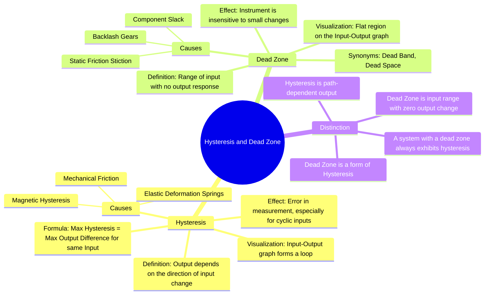

---
tags:
  - measurements
  - instrumentation
  - instrument-characteristics
  - gate
created: 2023-10-28
aliases:
  - Hysteresis
  - Dead Zone
  - Dead Band
  - Measurement Hysteresis
subject: "[[Electrical & Electronic Measurements]]"
parent:
  - Fundamentals of Measurement and Error Analysis
modified: 2026-08-04T09:47:43
---
### Hysteresis and Dead Zone
#hysteresis #dead-zone #error-analysis #instrument-characteristics

> **Hysteresis** is the phenomenon where the output of an instrument depends on the direction of change of the input. **Dead Zone** is the range of input values for which there is no detectable change in the output, representing a region of insensitivity.

Both are undesirable characteristics that introduce errors into measurements.

---
#### Hysteresis
#hysteresis #measurement-error

Hysteresis is the difference in the instrument's output for the same input value, depending on whether the input was reached by increasing from a lower value or decreasing from a higher value.

-   **Cause**: The primary causes of hysteresis are:
    1.  **Mechanical Friction**: The initial static friction (stiction) requires a larger force to start motion than to sustain it.
    2.  **Magnetic Hysteresis**: In instruments using magnetic materials, the magnetic flux density depends on the history of the magnetizing field.
    3.  **Elastic Deformation**: Springs or other elastic elements may not return to their exact original state after being stressed.
-   **Effect**: When the input is varied up and down, the input-output curve forms a loop, known as a hysteresis loop. This difference between the "upscale" and "downscale" readings is a source of error.

The **maximum hysteresis** is the largest difference between the upscale and downscale readings for the same input value, often expressed as a percentage of the full-scale reading.

$$\boxed{\quad \text{Hysteresis Error} = |y_{\text{increasing}} - y_{\text{decreasing}}| \quad}$$
where $y$ is the output for a given input $x$.

---
#### Dead Zone (or Dead Band)
#dead-zone #dead-band #insensitivity

The dead zone is the largest range through which an input quantity can be varied without producing any noticeable change in the output reading.

-   **Cause**: Dead zone is primarily caused by static friction or **backlash** in mechanical components like gears. An input change must be large enough to overcome this friction or take up the slack before the output can respond.
-   **Effect**: The instrument becomes unresponsive to small changes in the input signal, limiting its [[Resolution and Sensitivity|resolution]].
-   **Visualization**: On an input-output graph, the dead zone appears as a flat horizontal region where the output remains constant despite changes in the input.

For example, if the pointer of an ammeter does not move until the current exceeds 5 mA (starting from zero), the instrument has a dead zone of 0-5 mA.

---
#### Distinction and Relationship

-   **Core Difference**: Hysteresis is about the output being different for the same input depending on the *direction of approach*. The dead zone is about the output being *completely unresponsive* over a range of input values.
-   **Relationship**: The dead zone is a specific manifestation of hysteresis, typically occurring when the input signal reverses direction. The static friction that causes the dead zone is also a major contributor to the overall hysteresis of a mechanical system.
-   **Implication**: An instrument with a dead zone will always exhibit hysteresis. However, an instrument can exhibit hysteresis (e.g., from magnetic effects) without having a significant dead zone.

---
### Related Concepts
#topic/related-concepts

> [[Accuracy and Precision]]

[[Resolution and Sensitivity]]
[[Linearity and Repeatability]]
[[Types of Errors]]
[[Essential Torques in Indicating Instruments]]
[[Control Systems]]
