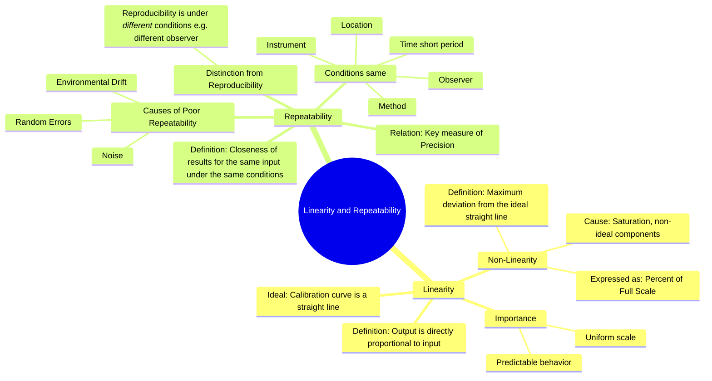

---
tags:
  - measurements
  - instrumentation
  - instrument-characteristics
  - gate
created: 2023-10-29
aliases:
  - Linearity
  - Repeatability
  - Instrument Linearity
  - Measurement Repeatability
subject: "[[Electrical & Electronic Measurements]]"
parent:
  - Fundamentals of Measurement and Error Analysis
modified: 2026-08-04T09:54:47
---
### Linearity and Repeatability
#linearity #repeatability #instrument-characteristics #error-analysis

> **Linearity** is the degree to which the output of an instrument is directly proportional to its input over its operating range. **Repeatability** is the ability of an instrument to provide the same reading for successive measurements of the same input, conducted under the same conditions.

---
#### Linearity
#linearity #non-linearity #calibration-curve

Linearity describes the consistency of the relationship between input and output. For a perfectly linear instrument, the calibration curve—a plot of output versus input—is a straight line.

The relationship can be described by the equation of a straight line:
$$y = mx + c$$
where $y$ is the output, $x$ is the input, $m$ is the slope (sensitivity), and $c$ is the intercept (offset).

**Non-linearity** is the maximum deviation of the instrument's actual calibration curve from an ideal straight line. The straight line can be determined by methods like "best-fit" (using least squares regression) or by drawing a line through the terminal points (zero and full scale).

Non-linearity is typically expressed as a percentage of the full-scale reading.

$$\boxed{\quad \% \text{ Non-linearity} = \frac{\text{Maximum deviation of output from ideal straight line}}{\text{Full-scale reading}} \times 100\% \quad}$$

-   **Importance**: High linearity is desirable because it makes the instrument's scale uniform and its behavior predictable. It simplifies calibration and interpretation of readings.
-   **Causes of Non-linearity**: Can arise from magnetic saturation, non-linear electronic components, or mechanical properties changing with load.

---
#### Repeatability
#repeatability #precision #random-error

Repeatability is a measure of the consistency of an instrument over a short period. It quantifies how close the readings are to each other when the same input is measured multiple times under identical conditions.

-   **Conditions for Repeatability**:
    -   Same observer
    -   Same instrument
    -   Same location
    -   Same method of measurement
    -   Measurements taken over a short period of time.
-   **Relation to Precision**: Repeatability is a primary measure of [[Accuracy and Precision|precision]]. An instrument with high repeatability has low [[Types of Errors|random error]].
-   **Causes of Poor Repeatability**: Random fluctuations, electronic noise, ambient temperature changes, vibrations, or unstable power supplies.

###### Distinction from Reproducibility
#reproducibility

It is important to distinguish repeatability from **reproducibility**.
-   **Repeatability**: Variation in measurements under the *same* conditions.
-   **Reproducibility**: Variation in measurements of the same quantity when the measurement conditions are *changed*. This could involve a different operator, a different instrument, a different location, or measurements taken on different days. Reproducibility is a more stringent and comprehensive measure of consistency.

An instrument can have good repeatability but poor reproducibility if, for example, it is sensitive to environmental changes or operator technique.

---
### Related Concepts
#topic/related-concepts

> [[Accuracy and Precision]]

[[Hysteresis and Dead Zone]]
[[Resolution and Sensitivity]]
[[Types of Errors]]
[[Calibration]]
