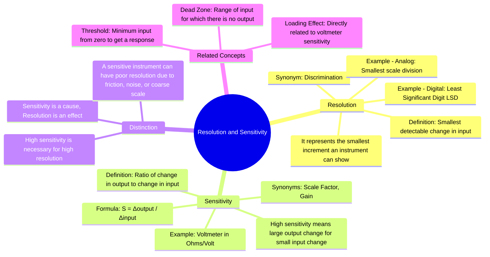

---
tags:
  - measurements
  - instrumentation
  - instrument-characteristics
  - gate
created: 2023-10-27
aliases:
  - Resolution
  - Sensitivity
  - Instrument Resolution
  - Instrument Sensitivity
subject: "[[Electrical & Electronic Measurements]]"
parent:
  - Fundamentals of Measurement and Error Analysis
modified: 2026-08-04T10:25:24
---
### Resolution and Sensitivity
#resolution #sensitivity #instrument-characteristics

> **Resolution** is the smallest change in the input quantity that can be detected by an instrument. **Sensitivity** is the ratio of the change in the instrument's output to the corresponding change in the input quantity. They are fundamental static characteristics that define an instrument's performance.

---
#### Resolution
#resolution #discrimination #lsd

Resolution, also known as **discrimination**, defines the smallest increment of the measured value that can be meaningfully displayed. It represents the limit to which a change can be measured.

$$\boxed{\quad \text{Resolution = Smallest detectable change in input} \quad}$$

-   **Analog Instruments**: The resolution is the smallest subdivision on the instrument's scale. It can be limited by the observer's ability to distinguish between two adjacent markings.
-   **Digital Instruments**: The resolution is determined by the value of the **Least Significant Digit (LSD)** of the display. For example, a 4.5-digit digital voltmeter (DVM) on its 2V range can display up to 1.9999V. Its resolution is the smallest increment, which is 0.0001V or 0.1mV.

A higher resolution means the instrument can detect smaller changes in the input signal.

---
#### Sensitivity
#sensitivity #scale-factor #gain

Sensitivity indicates how much the output of an instrument changes for a unit change in the input (the quantity being measured). It is essentially the gain of the measurement system.

$$\boxed{\quad S = \frac{\text{Change in Output}}{\text{Change in Input}} = \frac{\Delta q_o}{\Delta q_i} \quad}$$

A high sensitivity is desirable as it means a small change in the input will result in a large, easily readable change in the output (e.g., a larger pointer deflection).

###### Voltmeter Sensitivity
#voltmeter-sensitivity #loading-effect

For analog voltmeters, particularly those based on [[PMMC Instruments]], sensitivity is a crucial figure of merit, expressed in **ohms per volt ($\Omega/V$)**. It is determined by the reciprocal of the full-scale deflection current ($I_{fsd}$).

$$\begin{align}
\text{Sensitivity } (S_v) &= \frac{\text{Total Voltmeter Resistance } (R_T)}{\text{Full-Scale Voltage Range } (V_{fsd})} \\
\text{Since } V_{fsd} &= I_{fsd} \times R_T \\
\text{Therefore, } S_v &= \frac{R_T}{I_{fsd} \times R_T} = \frac{1}{I_{fsd}}
\end{align}$$

$$\boxed{\quad S_v = \frac{1}{I_{fsd}} \quad (\Omega/V) \quad}$$

-   **Significance**: A voltmeter with high sensitivity (i.e., a small $I_{fsd}$) will have a very high internal resistance for a given voltage range ($R_T = S_v \times V_{fsd}$).
-   **Loading Effect**: A high resistance voltmeter draws less current from the circuit under test, thus minimizing the **[[Loading Effect]]** and ensuring a more accurate voltage measurement.

---
#### Distinction between Resolution and Sensitivity

-   **Cause and Effect**: Sensitivity is the *cause*, and resolution is the *effect*. An instrument's ability to react to a small input change (sensitivity) allows it to resolve that change.
-   **Limitation**: High sensitivity is a prerequisite for high resolution, but it does not guarantee it. An instrument can be very sensitive, but factors like excessive friction in a moving part, noise, or a poorly marked scale can lead to poor resolution.
-   **Threshold**: This is related but distinct. **Threshold** is the minimum input signal required to produce a detectable output *starting from zero*, whereas resolution is the minimum *change* in input from a non-zero value that causes a detectable change in output.

---
### Related Concepts
#topic/related-concepts

> [[Accuracy and Precision]]

[[Hysteresis and Dead Zone]]
[[Loading Effect]]
[[PMMC Instruments]]
[[Digital Voltmeters (DVMs)]]
[[Types of Errors]]
