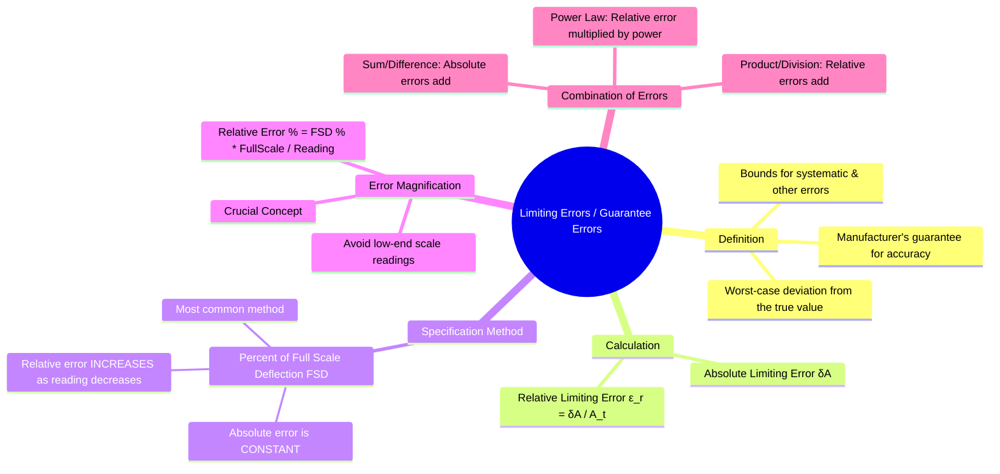

---
tags:
  - measurements
  - error-analysis
  - accuracy
  - gate
created: 2023-11-04
aliases:
  - Limiting Error
  - Guarantee Error
  - Instrument Accuracy
  - "Example : Absolute Limiting Error"
subject: "[[Electrical & Electronic Measurements]]"
parent: Fundamentals of Measurement and Error Analysis
modified: 2026-08-04T09:54:18
---
### Limiting Errors (Guarantee Errors)
#limiting-error #guarantee-error #accuracy #error-analysis

> **Limiting Error**, also known as **Guarantee Error**, is the maximum deviation from the true value specified by the manufacturer for a measuring instrument. It represents the worst-case error that can be expected under specified operating conditions, thus guaranteeing the instrument's [[Accuracy and Precision|accuracy]].

---
#### Definition and Calculation
#limiting-error/definition

Let $A_m$ be the measured value and $A_t$ be the true value.
The **absolute error** is $\delta A = A_m - A_t$.
The limiting error is the maximum possible magnitude of $\delta A$, denoted as $\pm \delta A_{max}$.
Therefore, the true value $A_t$ lies within the range:
$$A_t = A_m \pm |\delta A_{max}|$$

The **relative limiting error** is the ratio of the absolute limiting error to the true value.

$$\boxed{\quad \epsilon_r = \frac{|\delta A_{max}|}{A_t} \quad}$$

Since the true value $A_t$ is often unknown, the measured value $A_m$ is used in the denominator for practical calculations, especially when the error is small.

---
#### Specification: Percentage of Full-Scale Deflection
#full-scale-deflection #fsd-error

The most common way manufacturers specify the limiting error is as a percentage of the **Full-Scale Deflection (FSD)** or full-scale value.

For an instrument with a specified accuracy of $\pm x\%$ of FSD:
$$\boxed{\quad \text{Absolute Limiting Error } (\delta A_{max}) = \frac{x}{100} \times (\text{Full-Scale Value}) \quad}$$
A critical feature of this specification is that the **magnitude of the absolute limiting error is constant over the entire measurement range**.

---
#### Error Magnification at Low Readings
#error-magnification

A major consequence of specifying error based on FSD is that the relative error increases significantly as the measured value decreases.

The percentage limiting error with respect to the value being measured is:
$$\begin{align}
\% \text{ Error at Reading} &= \frac{|\delta A_{max}|}{\text{Measured Value}} \times 100 \\
 &= \frac{(\% \text{FSD Error}/100) \times (\text{Full-Scale Value})}{\text{Measured Value}} \times 100
\end{align}$$

$$\boxed{\quad \% \text{ Error at Reading} = (\% \text{FSD Error}) \times \frac{\text{Full-Scale Value}}{\text{Measured Value}} \quad}$$

**Example:**
A 0-150V voltmeter has a guaranteed accuracy of 1% of FSD.
-   Absolute Limiting Error = $1\% \times 150V = \pm 1.5V$. This is constant everywhere on the scale.
-   **Case 1: Measuring 75V**
    -   \% Error at Reading = $\frac{1.5V}{75V} \times 100 = 2\%$
-   **Case 2: Measuring 15V**
    -   \% Error at Reading = $\frac{1.5V}{15V} \times 100 = 10\%$

This shows that for instruments with FSD-based accuracy, measurements are much less accurate at the lower end of the scale. It is always advisable to choose an instrument range where the reading is as close to full scale as possible.

---
#### Combination of Quantities with Limiting Errors
#error-propagation

When a final quantity is calculated from several independent measurements, their individual limiting errors combine to produce an error in the final result.

Consider a quantity $Y$ calculated from measurements $X_1, X_2, \ldots, X_n$.
Let $\delta X_1, \delta X_2, \ldots$ be the absolute limiting errors.
Let $\epsilon_{r1}, \epsilon_{r2}, \ldots$ be the relative limiting errors ($\epsilon_{ri} = \delta X_i / X_i$).

1.  **Sum or Difference**: $Y = X_1 \pm X_2$
    -   The absolute limiting error of the result is the sum of the absolute errors.
        $$\boxed{\quad \delta Y = |\delta X_1| + |\delta X_2| \quad}$$

2.  **Product or Division**: $Y = X_1 X_2$ or $Y = X_1 / X_2$
    -   The relative limiting error of the result is the sum of the relative errors.
        $$\boxed{\quad \frac{\delta Y}{Y} = \epsilon_r = |\epsilon_{r1}| + |\epsilon_{r2}| = \left|\frac{\delta X_1}{X_1}\right| + \left|\frac{\delta X_2}{X_2}\right| \quad}$$

3.  **Power**: $Y = X^n$
    -   The relative limiting error of the result is $n$ times the relative error of the base.
        $$\boxed{\quad \frac{\delta Y}{Y} = |n| \left|\frac{\delta X}{X}\right| \quad}$$

---
### Related Concepts
#topic/related-concepts

> [[Combination of Quantities with Limiting Errors]]

[[Accuracy and Precision]]
[[Types of Errors]]
[[Statistical Analysis of Random Errors]]
[[Calibration]]
