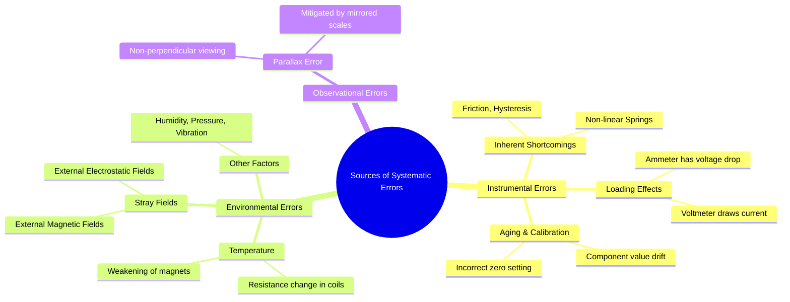

---
tags:
  - measurements
  - error-analysis
  - systematic-error
  - gate
created: 2023-11-02
aliases:
  - Systematic Error Sources
  - Bias Errors
subject: "[[Electrical & Electronic Measurements]]"
parent: "[[Types of Errors]]"
modified: 2026-08-04T10:32:00
---
### Sources of Systematic Errors
#systematic-errors #error-analysis #bias-error

> Systematic errors are consistent, repeatable biases in measurement that arise from identifiable sources. Unlike random errors, their effects can be quantified and corrected. Understanding these sources is crucial for improving the [[Accuracy and Precision|accuracy]] of measurements.

Systematic errors can be traced to three main categories: Instrumental, Environmental, and Observational.

---
#### 1. Instrumental Errors
#instrumental-error

These errors are inherent to the measuring instrument itself.

###### Inherent Shortcomings
This category includes errors due to the construction and calibration of the instrument.
-   **Friction**: In instruments with moving parts (like PMMC or MI), bearing friction can cause the pointer to stick, leading to incorrect readings. This is a primary cause of [[Hysteresis and Dead Zone|Hysteresis and Dead Zone]].
-   **Incorrect Spring Tension**: The controlling torque in many analog instruments is provided by springs. If their stiffness changes over time or is incorrect, it introduces a systematic error.
-   **Non-Linearity**: An instrument's scale is assumed to be linear. Any deviation from this ideal straight-line relationship between input and output is a systematic error.
-   **Calibration Errors**: If the instrument is not calibrated correctly against a standard, all its readings will be offset by a fixed amount or a fixed percentage. This includes an incorrect zero setting.
-   **Aging of Components**: The values of resistors, capacitors, and the strength of permanent magnets can change over time, altering the instrument's calibration.

###### Loading Effects
This is a critical source of error in electrical circuits. The act of measurement itself alters the circuit's behavior.
-   **Voltmeter Loading**: An ideal voltmeter has infinite resistance. A real voltmeter has a finite resistance ($R_v$) and draws current from the circuit, changing the voltage it is intended to measure. This error is minimized by using a voltmeter with a high sensitivity (Ohms/Volt), which implies a high internal resistance.
-   **Ammeter Loading**: An ideal ammeter has zero resistance. A real ammeter has some small resistance ($R_a$) which adds to the circuit's resistance, reducing the current it is supposed to measure.

---
#### 2. Environmental Errors
#environmental-error

These errors are caused by external conditions that affect the instrument's performance.

###### Temperature
-   **Resistance Change**: The resistance of copper coils used in PMMC, MI, and electrodynamometer instruments is highly dependent on temperature. This changes the current flow and affects the deflecting torque. This is often mitigated using **swamping resistors** made of materials with low temperature coefficients (like Manganin) in series with the coil.
-   **Spring Stiffness**: Temperature can alter the elastic properties of the controlling springs.
-   **Magnet Strength**: The strength of permanent magnets in PMMC instruments can decrease at higher temperatures.

###### Stray Fields
-   **External Magnetic Fields**: Stray magnetic fields (from nearby conductors, transformers, etc.) can interfere with the internal magnetic field of instruments like PMMC and MI, altering the deflecting torque. This is minimized by using **magnetic shielding** (enclosing the instrument in a soft iron case).
-   **External Electrostatic Fields**: These fields can affect instruments, especially in high-voltage environments.

---
#### 3. Observational Errors
#observational-error

These errors are introduced by the person conducting the measurement.

###### Parallax Error
This is the most common observational error in analog instruments. It occurs when the observer's eye is not positioned directly perpendicular to the scale at the point of reading. The apparent position of the pointer changes with the viewing angle.

-   **Minimization**: High-quality instruments include a **mirrored scale**. The observer eliminates parallax error by moving their head until the pointer and its reflection in the mirror coincide. At this point, the line of sight is exactly perpendicular to the scale.

---
### Related Concepts
#topic/related-concepts

> [[Types of Errors]]

[[Loading Effect]]
[[Accuracy and Precision]]
[[Hysteresis and Dead Zone]]
[[PMMC Instruments]]
[[Moving Iron (MI) Instruments]]
[[Calibration]]
