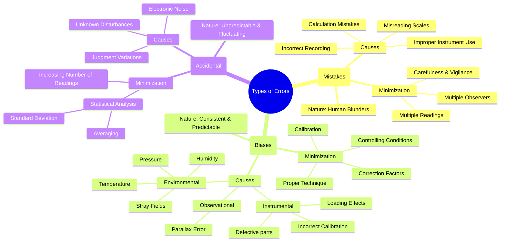

---
tags:
  - measurements
  - instrumentation
  - error-analysis
  - gate
created: 2023-11-01
aliases:
  - Measurement Errors
  - Gross Errors
  - Systematic Errors
  - Random Errors
  - Types of Errors (Gross, Systematic, Random)
subject: "[[Electrical & Electronic Measurements]]"
parent:
  - Fundamentals of Measurement and Error Analysis
modified: 2026-08-04T10:45:28
---
### Types of Errors in Measurement
#error-analysis #measurement-errors

> An error is the deviation of the measured value from the true value of the quantity being measured. Errors in measurement can be broadly classified into three categories: Gross Errors, Systematic Errors, and Random Errors. Understanding the source and nature of these errors is fundamental to performing accurate measurements.

---
#### 1. Gross Errors
#gross-errors #human-error

Gross errors are primarily due to human mistakes or blunders. They are not inherent to the measurement process itself but are a result of carelessness on the part of the observer.

-   **Causes**:
    -   **Misreading the instrument**: Forgetting a leading digit, or reading 3.1V as 8.1V.
    -   **Incorrectly recording the data**: Writing down a different value than the one observed.
    -   **Calculation mistakes**: Errors in arithmetic during data processing.
    -   **Improper use of the instrument**: Using the wrong scale on a multimeter, or forgetting to set the zero correctly.

-   **Minimization**:
    -   Taking great care in reading and recording data.
    -   Taking multiple readings of the same quantity, preferably by different observers.
    -   Verifying the setup and calculations before concluding the measurement.

> Gross errors cannot be treated mathematically and must be eliminated through careful practice. They are not considered in the statistical analysis of data.

---
#### 2. Systematic Errors
#systematic-errors #bias-error

Systematic errors are errors that remain constant or change in a predictable way during repeated measurements of the same quantity. They cause a consistent bias in the measurement, making the readings consistently higher or lower than the true value.

$$\boxed{\quad \text{Systematic errors are associated with } \textbf{Accuracy} \text{ of the instrument.} \quad}$$

Systematic errors are classified based on their source:

1.  **Instrumental Errors**: These are inherent in the measuring instrument itself.
    -   **Causes**: Imperfections in construction (e.g., incorrect spring tension), aging of components, friction, and [[Loading Effect]].
    -   **Minimization**: Careful instrument design, calibration against a standard, applying correction factors.

2.  **Environmental Errors**: These are due to external conditions affecting the instrument or the measurement process.
    -   **Causes**: Changes in ambient temperature, pressure, humidity, or the presence of external electrostatic or magnetic fields.
    -   **Minimization**: Controlling the environment (e.g., using a temperature-controlled lab), shielding the instrument, applying computed correction factors.

3.  **Observational Errors**: These are introduced by the observer.
    -   **Causes**: The most common is **parallax error**, which occurs when the observer's eye is not directly in line with the pointer and the scale.
    -   **Minimization**: Using instruments with mirrored scales, digital displays, and maintaining a consistent viewing position.

---
#### 3. Random Errors
#random-errors #accidental-errors

Random errors, also known as accidental errors, are unpredictable fluctuations in readings. These errors remain even after gross and systematic errors have been eliminated. They arise from a multitude of small, uncontrollable disturbances.

$$\boxed{\quad \text{Random errors are associated with } \textbf{Precision} \text{ of the instrument.} \quad}$$

-   **Causes**: Unknown and unpredictable variations in the measurement system, such as electronic noise in components, slight variations in environmental conditions, or small variations in an observer's judgment when estimating a reading between scale divisions.
-   **Nature**: The magnitude and polarity of the error change randomly. Positive and negative errors are approximately equal in number for a large set of readings.
-   **Minimization and Analysis**:
    -   Random errors cannot be eliminated, but their effect can be reduced by taking the average of a large number of readings.
    -   They are analyzed using statistical methods. The spread of the readings gives an indication of the precision of the measurement.

---
### Related Concepts
#topic/related-concepts

> [[Accuracy and Precision]]

[[Sources of Systematic Errors]]
[[Statistical Analysis of Random Errors]]
[[Limiting Errors (Guarantee Errors)]]
[[Linearity and Repeatability]]
[[Hysteresis and Dead Zone]]
[[Loading Effect]]
