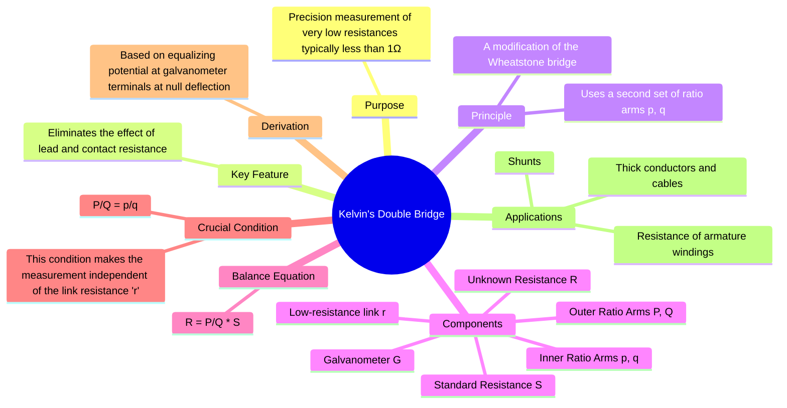

---
tags:
  - measurements
  - dc-bridge
  - resistance-measurement
  - low-resistance
  - gate
created: 2023-11-07
aliases:
  - Kelvin Bridge
  - Kelvin's Bridge
  - "Very Low Resistance : Kelvin's Double Bridge"
  - "Bridge : Kelvin's Double Bridge - Very Low Resistance"
subject: "[[Electrical & Electronic Measurements]]"
parent:
  - Measurement of Low Resistance
define:
  - "Very Low Resistance : Kelvin's Bridge "
modified: 2026-07-23T08:17:28
---
### Kelvin's Double Bridge
#kelvin-bridge #low-resistance #dc-bridge

> The Kelvin's Double Bridge is a modification of the [[Wheatstone Bridge and Sensitivity Analysis]] designed for the accurate measurement of very low resistances (less than 1Ω). Its primary advantage is its ability to eliminate the errors caused by the resistance of connecting leads and contacts, which become significant when measuring small resistances.

---
#### Principle and Purpose
#kelvin-bridge/principle

In a standard Wheatstone bridge, when measuring a low resistance, the resistance of the leads connecting the unknown resistor to the bridge terminals can be comparable to the resistance being measured, leading to significant [[Sources of Systematic Errors|systematic errors]].

The Kelvin bridge solves this by using a second set of ratio arms (the "double bridge") to account for the voltage drop across the low-resistance link connecting the unknown resistance ($R$) and the standard resistance ($S$).

---
#### Circuit and Derivation of Balance
#kelvin-bridge/circuit #kelvin-bridge/derivation

The bridge consists of two sets of ratio arms: outer arms ($P, Q$) and inner arms ($p, q$). The unknown resistance $R$ and the standard low resistance $S$ are connected by a short, low-resistance link, denoted by $r$. The galvanometer is connected between the junction of $P,Q$ and the junction of $p,q$.

At balance, there is no current flowing through the galvanometer ($I_g = 0$). This means the potential at node 'a' is equal to the potential at node 'b'.
$$V_{ac} = V_{ab}$$

Let the main current flowing through the $R-S$ path be $I$. The voltage drop across the path $c-d-e$ is given by:
$$V_{ce} = I (R + S + r)$$
However, the derivation is simpler by considering the voltage drops from node 'c'.
$$V_{ca} = V_{cdb}$$
The voltage drop across P is $V_{ca}$:
$$V_{ca} = \frac{P}{P+Q} V_{ce} = \frac{P}{P+Q} I (R+S+r)$$
The voltage drop across the path $c-d-b$ is:
$$V_{cdb} = I R + I_{pq} p$$
where $I_{pq}$ is the current through the inner arms $p$ and $q$. This current flows through the link resistance $r$. The voltage across the link is $V_{de} = I r$, so $I_{pq} = \frac{Ir}{p+q}$.
Substituting this:
$$V_{cdb} = I R + \frac{Ir p}{p+q}$$

Equating the two expressions for the balanced condition:
$$\frac{P}{P+Q} I (R+S+r) = I R + \frac{Ir p}{p+q}$$
Dividing by $I$ and rearranging:
$$\frac{P}{P+Q} (R+S+r) - R = \frac{r p}{p+q}$$
This is the general equation, but a more common derivation directly equates the voltage ratios:
At balance, the potential at 'a' is equal to the potential at 'b'. Let's find these potentials relative to node 'e'.
$$V_{ae} = \frac{Q}{P+Q} V_{ce} = \frac{Q}{P+Q} I(R+S+r)$$
$$V_{be} = I S + \frac{q}{p+q}(Ir) = I \left(S + \frac{qr}{p+q}\right)$$
Equating $V_{ae}$ and $V_{be}$:
$$\frac{Q}{P+Q} (R+S+r) = S + \frac{qr}{p+q}$$
This leads to a complex expression. The most elegant derivation is as follows:
At balance, the voltage drop ratio is equal:
$$\frac{V_{ca}}{V_{ae}} = \frac{V_{cb}}{V_{be}} \implies \frac{P}{Q} = \frac{V_{cdb}}{V_{dbe}}$$
$$V_{cdb} = I R + \text{Voltage drop across } p = I R + \frac{p}{p+q}(Ir)$$
$$V_{dbe} = I S + \text{Voltage drop across } q = I S + \frac{q}{p+q}(Ir)$$
Substituting these into the ratio:
$$\frac{P}{Q} = \frac{R + \frac{pr}{p+q}}{S + \frac{qr}{p+q}}$$
Rearranging this general equation gives:
$$P\left(S + \frac{qr}{p+q}\right) = Q\left(R + \frac{pr}{p+q}\right)$$
$$PS + \frac{Pqr}{p+q} = QR + \frac{Qpr}{p+q}$$
$$QR - PS = \frac{r}{p+q} (Pq - Qp)$$
$$\boxed{\quad R = \frac{P}{Q}S + \frac{r}{p+q} \left(\frac{Pq - Qp}{Q}\right) \quad}$$
This is the **general balance equation**. The second term represents the error due to the link resistance $r$.

---
#### The Kelvin Condition
#kelvin-bridge/balance-condition

To eliminate the error term, the bridge is constructed such that the ratio of the outer arms is made equal to the ratio of the inner arms.
$$\boxed{\quad \frac{P}{Q} = \frac{p}{q} \quad}$$
When this condition is met, $Pq - Qp = 0$. The error term in the general equation vanishes, regardless of the value of the link resistance $r$.

The balance equation simplifies to:
$$\boxed{\quad R = \frac{P}{Q} S \quad}$$
This is the working equation for Kelvin's Double Bridge, identical in form to the Wheatstone bridge equation, but only valid when the ratio condition is met. In practice, the arms are ganged so that adjusting one ratio automatically adjusts the other to maintain equality.

---
### Related Concepts
#topic/related-concepts

> [[Wheatstone Bridge and Sensitivity Analysis]]

[[Measurement of Low Resistance]]
[[Ammeter-Voltmeter Method for Low Resistance]]
[[Potentiometer Method]]
[[Sources of Systematic Errors]]
[[DC Bridges]]
