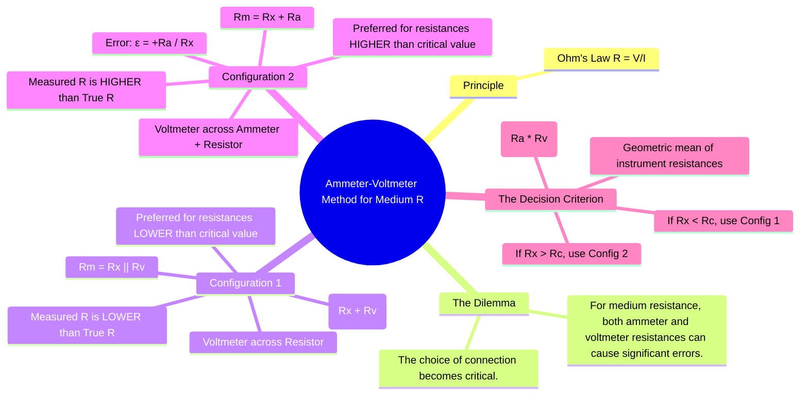

---
tags:
  - measurements
  - resistance-measurement
  - dc-circuits
  - medium-resistance
  - gate
created: 2023-11-09
aliases:
  - V-I Method for Medium Resistance
subject: "[[Electrical & Electronic Measurements]]"
parent:
  - Measurement of Medium Resistance
modified: 2026-08-04T09:07:52
---
### Ammeter-Voltmeter Method for Medium Resistance
#ohm-law #vi-method #resistance-measurement

> For measuring medium resistances (typically in the range of 1Ω to 100 kΩ), the Ammeter-Voltmeter method is commonly used. However, unlike in low or high resistance measurement where one instrument's error dominates, here both the ammeter and voltmeter can introduce significant errors. Therefore, choosing the correct circuit configuration is essential to achieve the highest accuracy.

---
#### The Two Circuit Configurations
#connection-methods #loading-effect

There are two ways to connect the ammeter and voltmeter, each with its own source of error.

###### Configuration 1: Voltmeter across the Resistor
This connection is generally preferred for measuring lower resistances.
-   The voltmeter reads the true voltage ($V_x$) across the resistor.
-   The ammeter reads the sum of the current through the resistor ($I_x$) and the voltmeter ($I_v$).
-   **Measured Resistance**: $R_{m1} = \frac{V_x}{I_x + I_v}$. This reading is **lower** than the true value $R_x$. The measured value is the parallel combination of the true resistance and the voltmeter's resistance.
    $$\boxed{\quad R_{m1} = R_x || R_v = \frac{R_x R_v}{R_x + R_v} \quad}$$

###### Configuration 2: Voltmeter across Ammeter and Resistor
This connection is generally preferred for measuring higher resistances.
-   The ammeter reads the true current ($I_x$) through the resistor.
-   The voltmeter reads the sum of the voltage drop across the resistor ($V_x$) and the ammeter ($V_a$).
-   **Measured Resistance**: $R_{m2} = \frac{V_x + V_a}{I_x} = R_x + R_a$. This reading is **higher** than the true value $R_x$.
    $$\boxed{\quad R_{m2} = R_x + R_a \quad}$$

---
#### Error Analysis and the Decision Criterion
#error-analysis #decision-criterion

To select the better circuit, we compare the magnitude of the relative error produced by each configuration.

-   **Relative Error for Config 1**:
    $$\epsilon_{r1} = \frac{R_{m1} - R_x}{R_x} = -\frac{R_x}{R_x + R_v}$$
-   **Relative Error for Config 2**:
    $$\epsilon_{r2} = \frac{R_{m2} - R_x}{R_x} = +\frac{R_a}{R_x}$$

The configuration that yields a smaller magnitude of error is the better choice. We find the crossover point by equating the magnitudes of the errors:
$$\begin{align}
|\epsilon_{r1}| &= |\epsilon_{r2}| \\
\frac{R_x}{R_x + R_v} &= \frac{R_a}{R_x} \\
R_x^2 &= R_a(R_x + R_v) \\
R_x^2 &= R_a R_x + R_a R_v
\end{align}$$
Since for any practical voltmeter $R_v \gg R_a$, and for medium resistances $R_v \gg R_x$, we can approximate $R_x + R_v \approx R_v$.
$$R_x^2 \approx R_a R_v$$
This gives the **critical resistance** value, which is the geometric mean of the ammeter and voltmeter resistances.
$$R_c = \sqrt{R_a R_v}$$

The decision rule is as follows:
-   If the resistance to be measured is **less than** the critical value ($R_x < \sqrt{R_a R_v}$), **use Configuration 1**.
-   If the resistance to be measured is **greater than** the critical value ($R_x > \sqrt{R_a R_v}$), **use Configuration 2**.

> Since $R_x$ is initially unknown, one can perform a quick measurement with either circuit to get an estimate and then decide if the connection should be changed for better accuracy.

---
### Related Concepts
#topic/related-concepts

> [[Wheatstone Bridge and Sensitivity Analysis]]

[[Ammeter-Voltmeter Method for Low Resistance]]
[[Measurement of Resistance]]
[[Loading Effect]]
[[Sources of Systematic Errors]]
[[Ohm's Law]]
