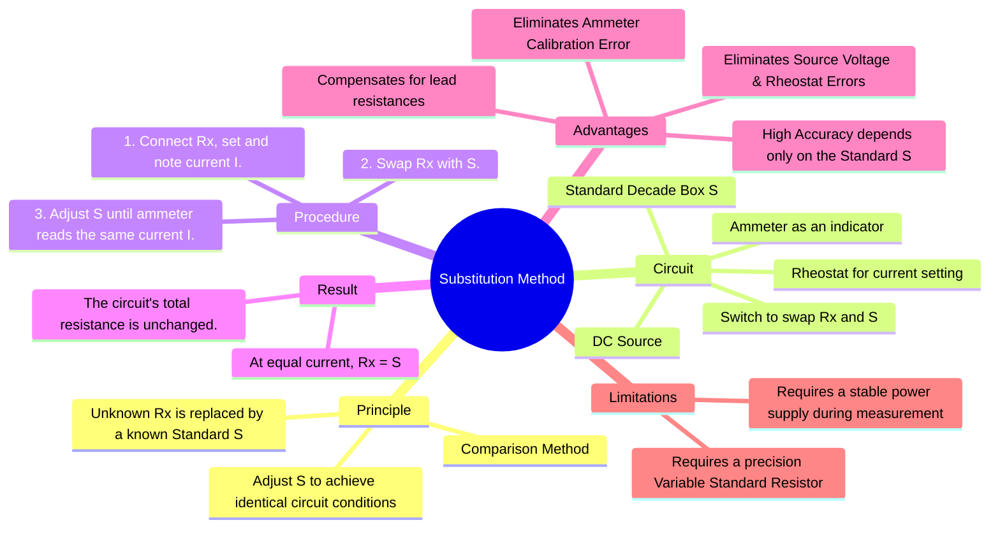

---
tags:
  - measurements
  - resistance-measurement
  - dc-circuits
  - medium-resistance
  - gate
created: 2023-11-11
aliases:
  - Resistance Substitution Method
subject: "[[Electrical & Electronic Measurements]]"
parent:
  - Measurement of Medium Resistance
modified: 2026-08-04T10:36:39
---
### Substitution Method
#resistance-measurement #substitution-method #comparison-method

> The substitution method is a highly accurate technique for measuring medium resistances. It is a comparison method where the unknown resistance ($R_x$) is measured by substituting it with a known and calibrated variable standard resistance ($S$) and adjusting the standard until it produces the exact same effect in the circuit.

---
#### Principle and Procedure
#substitution-method/principle

The core principle is that if an unknown component in a circuit is replaced by a known standard, and this substitution causes no change in the circuit conditions (specifically, the current), then the unknown component's value must be equal to the standard's value.

###### Circuit Setup and Steps:
A simple series circuit is created containing a DC voltage source ($E$), a rheostat for current adjustment, an ammeter, and a switch that allows either the unknown resistance ($R_x$) or a standard variable resistance box ($S$) to be connected into the circuit.

1.  **Step 1: Connect the Unknown Resistor**
    -   The switch is set to connect $R_x$ into the circuit.
    -   The rheostat is adjusted to obtain a suitable deflection on the ammeter. The exact value of this current is not important, but the reading must be noted precisely. Let this current be $I$.
    -   At this point, by Ohm's law: $I = \frac{E}{R_{rheostat} + R_{ammeter} + R_x}$.

2.  **Step 2: Substitute with the Standard Resistor**
    -   Without changing the settings of the power supply or the rheostat, the switch is thrown to replace $R_x$ with the standard resistance box, $S$.
    -   The value of $S$ is adjusted until the ammeter shows the **exact same deflection** as in Step 1, indicating the same current $I$ is flowing.
    -   Now, the circuit equation is: $I = \frac{E}{R_{rheostat} + R_{ammeter} + S}$.

###### Result
Since the voltage $E$, the rheostat setting, and the current $I$ are identical in both steps, the total resistance of the circuit must also be identical.
$$R_{rheostat} + R_{ammeter} + R_x = R_{rheostat} + R_{ammeter} + S$$
This directly implies:
$$\boxed{\quad R_x = S \quad}$$
The value of the unknown resistance is simply the reading on the standard resistance box.

---
#### Advantages and Accuracy
#substitution-method/advantages

The main advantage of this method is its potential for very high accuracy, which is primarily limited by the accuracy of the standard resistor.

-   **Eliminates Instrument Error**: The ammeter is used only as a transfer instrument or indicator to confirm that the current is the same in both steps. Its calibration accuracy is irrelevant. As long as it is sensitive and gives a repeatable reading, it serves its purpose.
-   **Eliminates Circuit Parameter Errors**: The method is independent of the exact values of the supply voltage ($E$) and the rheostat resistance, as these remain constant. The only requirement is their stability during the brief period of measurement.
-   **Compensates for Lead Resistance**: Errors due to the resistance of connecting leads and switch contacts are largely cancelled out, as they are present in the circuit for both measurements.

---
### Related Concepts
#topic/related-concepts

> [[Wheatstone Bridge and Sensitivity Analysis]]

[[Ammeter-Voltmeter Method for Medium Resistance]]
[[Measurement of Medium Resistance]]
[[Types of Errors]]
[[Calibration]]
