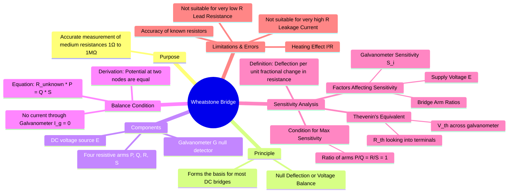

---
tags:
  - measurements
  - dc-bridge
  - resistance-measurement
  - medium-resistance
  - gate
created: 2023-11-10
aliases:
  - Resistance Bridge
subject: "[[Electrical & Electronic Measurements]]"
parent:
  - Measurement of Medium Resistance
modified: 2026-08-04T10:50:02
---
### Wheatstone Bridge and Sensitivity Analysis
#wheatstone-bridge #dc-bridge #null-method

> The Wheatstone bridge is a fundamental DC bridge circuit used for the accurate measurement of an unknown resistance by comparing it with known resistances. It operates on a **null deflection principle**, where the bridge is "balanced" to achieve zero current through a detector, leading to a highly accurate measurement independent of the source voltage calibration.

---
#### Principle and Balance Condition
#wheatstone-bridge/principle #wheatstone-bridge/balance

The bridge consists of four resistive arms in a diamond configuration. Let the arms be $P$ and $Q$ (the ratio arms), $S$ (the variable standard arm), and $R_x$ (the unknown resistance). A galvanometer is connected between the nodes joining $P,Q$ and $R_x,S$. A DC voltage source is connected across the other two nodes.

The bridge is said to be **balanced** when the variable resistor $S$ is adjusted such that there is no current flowing through the galvanometer ($I_g = 0$). This occurs when the potential at node 'a' is equal to the potential at node 'b'.
$$\boxed{\quad R_x = S \left(\frac{Q}{P}\right) \quad}$$

> See [[Bridge Circuits#DC Bridge The Wheatstone Bridge|DC Bridge: The Wheatstone Bridge]] in [[Bridge Circuits]]

---
#### Bridge Sensitivity
#bridge-sensitivity #thevenin-theorem

<u>The sensitivity of a Wheatstone bridge is a measure of how much the galvanometer deflects for a small change in the unknown resistance.</u> A more sensitive bridge can detect smaller resistance changes.

The sensitivity can be rigorously analyzed using [[Thevenin's Theorem]] across the galvanometer terminals 'a' and 'b'.

1.  **Thevenin Voltage ($V_{th}$)**: This is the voltage across the terminals a-b when the galvanometer is removed. Let $R_x$ be slightly unbalanced by $\Delta R$.
    $$V_{th} = V_a - V_b = E \left( \frac{P}{P+Q} - \frac{S}{S+R_x+\Delta R} \right)$$
    At balance ($R_x = S(Q/P)$), $V_{th} \approx \frac{E \cdot S \cdot \Delta R}{(P+Q)(S+R_x)}$.

2.  **Thevenin Resistance ($R_{th}$)**: This is the resistance looking into terminals a-b with the voltage source shorted.
    $$R_{th} = (P || Q) + (S || R_x) = \frac{PQ}{P+Q} + \frac{SR_x}{S+R_x}$$

3.  **Galvanometer Current ($I_g$)**: The current flowing through the galvanometer (resistance $R_g$) during unbalance is:
    $$I_g = \frac{V_{th}}{R_{th} + R_g}$$

**Bridge Sensitivity ($S_B$)** is defined as the deflection per unit fractional change in resistance.
$$S_B = \frac{\text{Deflection } \theta}{\Delta R / R_x} = \frac{S_i \cdot I_g}{\Delta R / R_x}$$
where $S_i$ is the intrinsic current sensitivity of the galvanometer (deflection/current).

###### Condition for Maximum Sensitivity
For a given galvanometer and supply voltage, the sensitivity is maximized when $R_{th}$ is minimized. This occurs when the ratio of the arms is unity:
$$\boxed{\quad \frac{P}{Q} = \frac{S}{R_x} = 1 \quad \text{i.e., } P=Q=S=R_x \quad}$$
Under this condition, all four resistances are equal, which makes the bridge most sensitive to small changes in $R_x$.

---
#### Errors and Limitations
#wheatstone-bridge/errors

1.  **Component Accuracy**: The accuracy of the unknown resistance measurement is limited by the accuracy of the three known resistors ($P, Q, S$).
2.  **Heating Effect**: The current flowing through the resistors can cause them to heat up ($I^2R$), changing their resistance. This effect can be minimized by limiting the voltage applied to the bridge and performing the measurement quickly.
3.  **Lead and Contact Resistance**: For measuring **low resistances**, the resistance of the connecting wires and switch contacts becomes significant compared to $R_x$, leading to large errors. This is why the Wheatstone bridge is not suitable for low resistance measurement.
4.  **Leakage Currents**: For measuring **high resistances**, leakage currents across insulators can provide an alternative path for current, leading to errors.

---
### Related Concepts
#topic/related-concepts

> [[Measurement of Medium Resistance]]

[[Bridge Circuits]] (based on Wheatstone Bridge)
[[Combination of Quantities with Limiting Errors]]
[[Kelvin's Double Bridge]]
[[Ammeter-Voltmeter Method for Medium Resistance]]
[[AC Bridges]]
[[Thevenin's Theorem]]
[[Sources of Systematic Errors]]
[[Potentiometer Method]]
