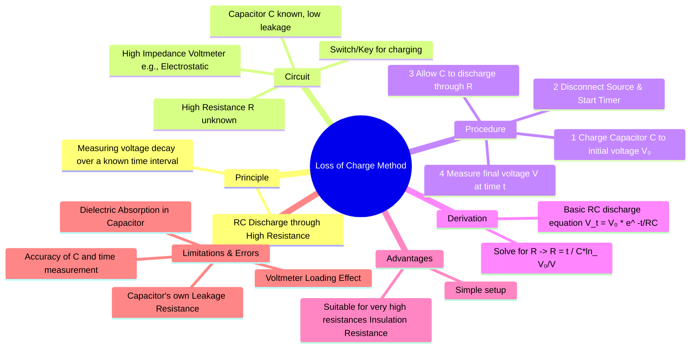

---
tags:
  - measurements
  - resistance-measurement
  - high-resistance
  - dc-circuits
  - gate
created: 2023-11-12
aliases:
  - Charge Loss Method
  - Capacitor Leakage Method
subject: "[[Electrical & Electronic Measurements]]"
parent: Measurement of High Resistance
modified: 2026-08-04T09:56:17
---
### Loss of Charge Method
#high-resistance #insulation-resistance #rc-circuit

> The loss of charge method is a technique for measuring very high resistances, such as the insulation resistance of cables or the leakage resistance of capacitors. The principle involves observing the rate at which a known capacitor loses its charge when it is discharged through the unknown high resistance.

--
#### Principle and Theory
#loss-of-charge/principle

The method is based on the voltage decay in a simple RC circuit. When a charged capacitor, $C$, is allowed to discharge through a resistor, $R$, the voltage, $V$, across it at any time, $t$, is given by the equation:
$$V = V_0 e^{-t/RC}$$
where $V_0$ is the initial voltage across the capacitor at $t=0$.

By rearranging this equation, we can solve for the unknown resistance, $R$:
$$\begin{align}
\frac{V}{V_0} &= e^{-t/RC} \\
\ln\left(\frac{V}{V_0}\right) &= -\frac{t}{RC} \\
\ln\left(\frac{V_0}{V}\right) &= \frac{t}{RC}
\end{align}$$
This gives the formula for the unknown resistance:
$$\boxed{\quad R = \frac{t}{C \ln\left(\frac{V_0}{V}\right)} \quad}$$

---
#### Circuit and Procedure
#loss-of-charge/procedure

The circuit consists of a known-value, low-leakage capacitor ($C$), the unknown high resistance ($R$) connected in parallel, a DC voltage source for charging, and a high-impedance voltmeter (like an electrostatic voltmeter or electrometer) to measure the voltage across the capacitor.

1.  **Charging**: The capacitor $C$ is charged to a suitable initial voltage $V_0$ by connecting it to the DC source.
2.  **Discharging**: The DC source is disconnected, and a stopwatch is started simultaneously. The capacitor now begins to discharge through the unknown resistance $R$.
3.  **Measurement**: After a pre-determined time interval $t$, the voltage $V$ across the capacitor is recorded.
4.  **Calculation**: The value of $R$ is calculated using the formula derived above.

---
#### Sources of Error and Limitations
#loss-of-charge/errors

The accuracy of this method is affected by several factors, which are particularly significant due to the high resistance values being measured.

1.  **Capacitor Leakage Resistance**: This is the most critical error source. The capacitor used will have its own finite leakage resistance, $R_c$, due to imperfections in its dielectric. The discharge, therefore, occurs through the parallel combination of the unknown resistance $R$ and the capacitor's leakage resistance $R_c$. The measured resistance, $R_m$, is actually $R || R_c$.
    -   To find the true value of $R$, the test must first be performed without the external resistor to determine $R_c$. Then, with $R_m$ known from the main test, the true resistance can be found using:
        $$\boxed{\quad R = \frac{R_m R_c}{R_c - R_m} \quad}$$

2.  **Voltmeter Loading Effect**: The voltmeter must have an extremely high input impedance (ideally infinite). If its impedance is not significantly higher than $R$, it will provide an additional discharge path, leading to a measured resistance value that is lower than the true value. Electrostatic voltmeters are preferred as they draw almost no current.

3.  **Dielectric Absorption**: Practical capacitors exhibit dielectric absorption, where the dielectric does not polarize or depolarize instantaneously. This can cause the voltage to change in a non-ideal way, introducing errors in the reading of $V$.

---
### Related Concepts
#topic/related-concepts

> [[Megger (Insulation Resistance Measurement)]]

[[Measurement of High Resistance]]
[[Megohm Bridge]]
[[RC Circuits]]
[[Sources of Systematic Errors]]
[[Capacitors]]
