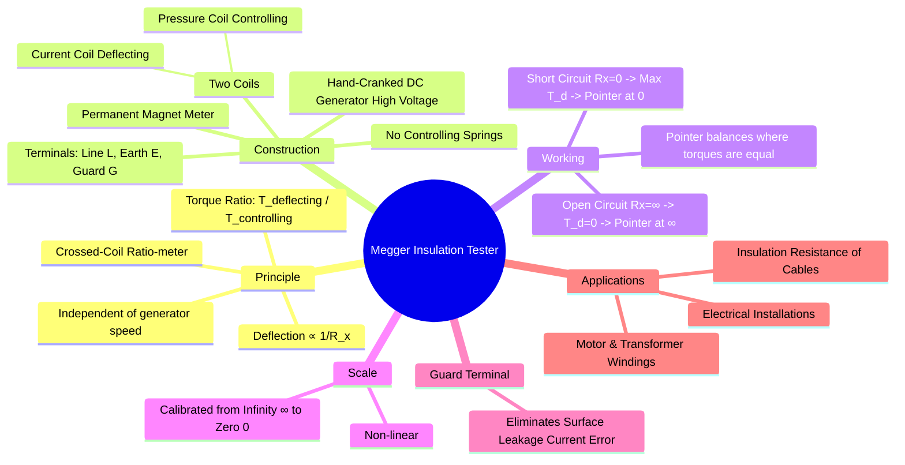

---
tags:
  - measurements
  - high-resistance
  - insulation-resistance
  - megger
  - gate
created: 2023-11-14
aliases:
  - Megger
  - Insulation Tester
subject: "[[Electrical & Electronic Measurements]]"
parent:
  - Measurement of High Resistance
modified: 2026-08-04T10:02:14
---
### Megger (Insulation Resistance Measurement)
#megger #insulation-resistance #high-resistance

> A Megger, or Mega-ohmmeter, is a portable instrument used to measure very high resistances, primarily the insulation resistance of electrical systems like cables, transformers, and motor windings. It operates on the principle of a crossed-coil ratio-meter, which makes its reading independent of the supply voltage.

---
#### Principle of Operation
#megger/principle #ratio-meter

The Megger is essentially a moving coil instrument, but it does not use controlling springs. Instead, it has two coils, a **Pressure Coil (PC)** and a **Current Coil (CC)**, mounted rigidly on the same spindle.

1.  **Pressure Coil (Control Coil)**: Connected directly across the terminals of the built-in DC generator. It produces a **controlling torque** ($T_c$) which is proportional to the voltage, $V$.
    $$T_c \propto V$$
2.  **Current Coil (Deflecting Coil)**: Connected in series with the unknown resistance ($R_x$) to be measured. It produces a **deflecting torque** ($T_d$) which is proportional to the current, $I$, flowing through the insulation.
    $$T_d \propto I = \frac{V}{R_x}$$

The pointer settles at a position where the two opposing torques are balanced ($T_d = T_c$). The deflection, $\theta$, is a function of the ratio of the two torques.
$$\text{Deflection } \theta \propto \frac{T_d}{T_c} \propto \frac{V/R_x}{V}$$
The voltage term $V$ cancels out.
$$\boxed{\quad \text{Deflection } \theta \propto \frac{1}{R_x} \quad}$$

This relationship has two critical implications:
-   The measurement is **independent of the generator voltage** and thus its cranking speed.
-   The scale is non-linear and calibrated "backwards," from infinity to zero.

---
#### Construction
#megger/construction

-   **DC Generator**: A permanent magnet, hand-cranked DC generator provides the high voltage (typically 500V, 1000V, or 2500V) required for the test. A slip-clutch mechanism ensures a constant voltage is generated once a certain cranking speed is reached.
-   **Moving Element**: The Pressure Coil and Current Coil are mounted at a fixed angle to each other on a common spindle, which also carries the pointer.
-   **Magnet System**: A permanent magnet provides the field in which both coils move.
-   **Terminals**: Typically has three terminals: **Line (L)**, **Earth (E)**, and **Guard (G)**.

---
#### Working and Scale
#megger/working

The interaction between the coils and the magnet determines the pointer's position.

-   **When Terminals L and E are Open (Rx = ∞)**: No current flows through the Current Coil ($I=0$), so the deflecting torque $T_d = 0$. The Pressure Coil alone produces the controlling torque $T_c$, which moves the pointer to one extreme of the scale, marked as **infinity ($\infty$)**.
-   **When Terminals L and E are Shorted (Rx = 0)**: A large current flows through the Current Coil, producing a maximum deflecting torque $T_d$. This torque overpowers the controlling torque and moves the pointer to the other extreme, marked as **zero (0)**.
-   **For a finite Rx**: The pointer settles at a point where the torques balance, giving a direct reading of the insulation resistance in megaohms (MΩ).

---
#### The Guard Terminal
#guard-circuit

When measuring the insulation resistance of a cable, surface leakage current can flow along the outer surface of the insulation, in parallel with the actual insulation resistance. This leads to an erroneously low reading.

-   The **Guard Terminal (G)** is used to bypass this surface leakage current from the measurement.
-   For a cable, the L terminal is connected to the core conductor, the E terminal to the outer metallic sheath (earth), and the G terminal to a wire wrapped around the insulation surface.
-   This setup shunts the surface leakage current away from the Current Coil, ensuring that only the true current passing *through* the insulation is measured. This is the same principle used in the [[Megohm Bridge]].

---
### Related Concepts
#topic/related-concepts

> [[Loss of Charge Method]]

[[Megohm Bridge]]
[[Measurement of High Resistance]]
[[Wheatstone Bridge and Sensitivity Analysis]]
[[Sources of Systematic Errors]]
[[Electrodynamometer Type Instruments]]
