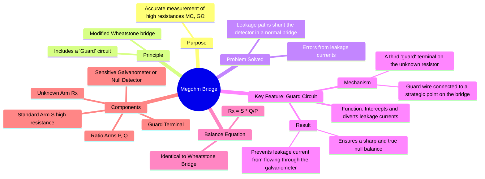

---
tags:
  - measurements
  - dc-bridge
  - resistance-measurement
  - high-resistance
  - gate
created: 2023-11-13
aliases:
  - High Resistance Bridge
subject: "[[Electrical & Electronic Measurements]]"
parent:
  - Measurement of High Resistance
modified: 2026-08-04T10:02:40
---
### Megohm Bridge
#megohm-bridge #high-resistance #guard-circuit

> The Megohm Bridge is a specialized form of the [[Wheatstone Bridge and Sensitivity Analysis]] designed for the accurate measurement of very high resistances, typically in the megohm (MΩ) and gigaohm (GΩ) range. Its key feature is a **guard circuit** that eliminates the significant errors caused by leakage currents.

---
#### The Problem with Measuring High Resistance
#leakage-current #error-analysis

When measuring a very high resistance with a standard Wheatstone bridge, leakage currents over the surface of the resistor, terminals, and insulators become comparable to the very small current flowing through the resistor itself. These leakage paths form an unintended parallel resistance with the unknown resistor ($R_x$) or with the galvanometer arm, causing the null point to be inaccurate or indistinct. This leads to a measured resistance value that is significantly lower than the true value.

---
#### Principle of the Guard Circuit
#guard-circuit #null-method

The Megohm bridge solves the leakage problem by introducing a third terminal, the **guard terminal**, on the unknown resistor and a corresponding guard circuit.

-   **Function**: The guard circuit intercepts the leakage currents and shunts them away from the sensitive galvanometer circuit.
-   **Mechanism**: The guard terminal (G) is connected to a point in the bridge that is at the same potential as one of the galvanometer terminals (e.g., node 'b'). In the diagram below, the leakage path is from the high-potential terminal of $R_x$ to the guard terminal, not to the low-potential terminal 'b'. Since the guard terminal and terminal 'b' are at the same potential (equipotential) at or near balance, no leakage current can flow between them and into the galvanometer.
-   **Effect**: The leakage current is diverted and flows through the arm $P$ and the power supply, bypassing the detector. This ensures that the galvanometer only responds to the current flowing *through* the actual resistance element $R_x$, allowing for a true and sharp balance.

---
#### Circuit and Balance Equation
#megohm-bridge/balance

The circuit is essentially a Wheatstone bridge with the added guard connection. The standard resistor $S$ is also a high-value resistor. A high voltage source (e.g., 500V or 1000V) is often used to produce a detectable current through the high resistances.

The bridge is balanced by adjusting the standard resistor $S$ (or the ratio arms) until the galvanometer shows a null deflection. Since the guard circuit's purpose is to eliminate error currents without altering the main bridge currents at balance, the balance condition remains identical to that of the standard Wheatstone bridge.

The potential at node 'a' equals the potential at node 'b':
$$\frac{P}{P+Q}E = \frac{S}{S+R_x}E$$
$$\implies P(S+R_x) = S(P+Q)$$
This simplifies to the familiar equation:
$$\boxed{\quad R_x = S \left(\frac{Q}{P}\right) \quad}$$

The accuracy of the measurement depends on the accuracy of the standard resistors ($P, Q, S$) and the effectiveness of the guard circuit.

---
### Related Concepts
#topic/related-concepts

> [[Megger (Insulation Resistance Measurement)]]

[[Loss of Charge Method]]
[[Wheatstone Bridge and Sensitivity Analysis]]
[[Measurement of High Resistance]]
[[Sources of Systematic Errors]]
[[Insulation Resistance]]
