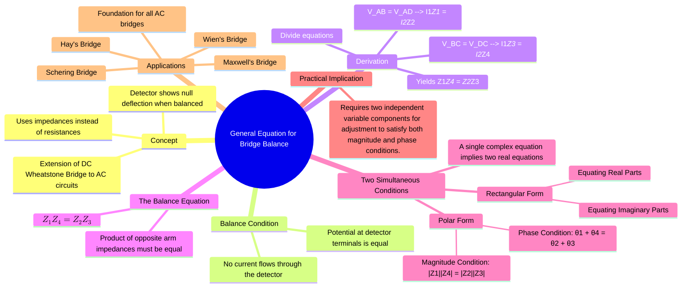

---
tags:
  - measurements
  - ac-bridges
  - gate
  - electrical-engineering
created: 2025-10-18
aliases:
  - AC Bridge Balance
  - Bridge Balance Condition
subject: "[[Electrical & Electronic Measurements]]"
parent:
  - AC Bridges
modified: 2026-08-04T09:46:02
---
### General Equation for Bridge Balance
#ac-bridges #bridge-balance #measurements

> The general equation for AC bridge balance is the fundamental principle used to measure unknown inductance, capacitance, and frequency. It extends the concept of the DC Wheatstone bridge to AC circuits by replacing resistances with complex impedances. For an AC bridge to be balanced, the potential difference across the detector must be zero, which requires satisfying two independent conditions simultaneously: one for magnitude and one for phase.

---
#### The General AC Bridge Circuit
#ac-bridges/circuit-diagram

An AC bridge consists of four arms, each with a complex impedance ($Z_1, Z_2, Z_3, Z_4$), an AC voltage source, and a null detector (like a sensitive galvanometer, headphones, or oscilloscope). The arms are typically arranged in a configuration similar to a Wheatstone bridge.

- **Arm 1**: Impedance $Z_1$ (Often the unknown impedance, $Z_x = R_x + jX_x$)
- **Arm 2**: Impedance $Z_2$
- **Arm 3**: Impedance $Z_3$
- **Arm 4**: Impedance $Z_4$

The product of the impedances of one pair of opposite arms must equal the product of the impedances of the other pair of opposite arms.

#### Derivation of the Balance Equation
#ac-bridges/derivation

At balance, no current flows through the detector, which means the potential at node B is equal to the potential at node D (in terms of both magnitude and phase).
$$ V_B = V_D $$
This implies that the voltage drop across arm 1 is equal to the voltage drop across arm 2, and similarly for arms 3 and 4.
$$\begin{align}
V_{AB} &= V_{AD} \implies I_1 Z_1 = I_2 Z_2 \quad \dots(1) \\
V_{BC} &= V_{DC} \implies I_1 Z_3 = I_2 Z_4 \quad \dots(2)
\end{align}$$
Dividing equation (1) by equation (2), we get:
$$ \frac{I_1 Z_1}{I_1 Z_3} = \frac{I_2 Z_2}{I_2 Z_4} $$
This simplifies to the general condition for AC bridge balance:
$$\boxed{\quad Z_1 Z_4 = Z_2 Z_3 \quad}$$
This is a complex equation, meaning it contains both magnitude and phase information. It can also be written in terms of admittances ($Y=1/Z$):
$$\boxed{\quad Y_1 Y_4 = Y_2 Y_3 \quad}$$

#### Two Conditions for Balance
#ac-bridges/conditions

For the complex equation $Z_1 Z_4 = Z_2 Z_3$ to hold true, both the real parts and the imaginary parts (or magnitude and phase) of both sides must be equal.

##### 1. Polar Form Representation
Let the impedance of each arm be represented in polar form, $Z = |Z|\angle\theta$.
- $Z_1 = |Z_1|\angle\theta_1$
- $Z_2 = |Z_2|\angle\theta_2$
- $Z_3 = |Z_3|\angle\theta_3$
- $Z_4 = |Z_4|\angle\theta_4$

Substituting these into the balance equation:
$$ (|Z_1|\angle\theta_1) (|Z_4|\angle\theta_4) = (|Z_2|\angle\theta_2) (|Z_3|\angle\theta_3) $$
$$ |Z_1||Z_4| \angle(\theta_1 + \theta_4) = |Z_2||Z_3| \angle(\theta_2 + \theta_3) $$
For this equality to be true, we must satisfy two conditions:
1.  **Magnitude Condition:**
    $$\boxed{\quad |Z_1||Z_4| = |Z_2||Z_3| \quad}$$
2.  **Phase Condition:**
    $$\boxed{\quad \theta_1 + \theta_4 = \theta_2 + \theta_3 \quad}$$

The sum of the phase angles of one pair of opposite arms must be equal to the sum of the phase angles of the other pair.

##### 2. Rectangular Form Representation
Let the impedance of each arm be represented in rectangular form, $Z = R + jX$.
$$ (R_1 + jX_1)(R_4 + jX_4) = (R_2 + jX_2)(R_3 + jX_3) $$
Expanding this equation gives:
$$ (R_1 R_4 - X_1 X_4) + j(R_1 X_4 + X_1 R_4) = (R_2 R_3 - X_2 X_3) + j(R_2 X_3 + X_2 R_3) $$
By equating the real and imaginary parts, we get two independent equations:
1.  **Equating Real Parts:**
    $$ R_1 R_4 - X_1 X_4 = R_2 R_3 - X_2 X_3 $$
2.  **Equating Imaginary Parts:**
    $$ R_1 X_4 + X_1 R_4 = R_2 X_3 + X_2 R_3 $$
To achieve bridge balance, both of these equations must be satisfied simultaneously. This is why AC bridges require two independent variable components for adjustment.

---
### Related Concepts
#ac-bridges/related-concepts

> [[Phasor Diagram for Balanced AC Bridges]]

[[AC Bridges]]
[[Wheatstone Bridge and Sensitivity Analysis]]
[[Maxwell's Inductance Bridge]]
[[Schering Bridge]]
[[Hay's Bridge]]
[[Wien's Bridge]]
[[Complex Numbers]]
