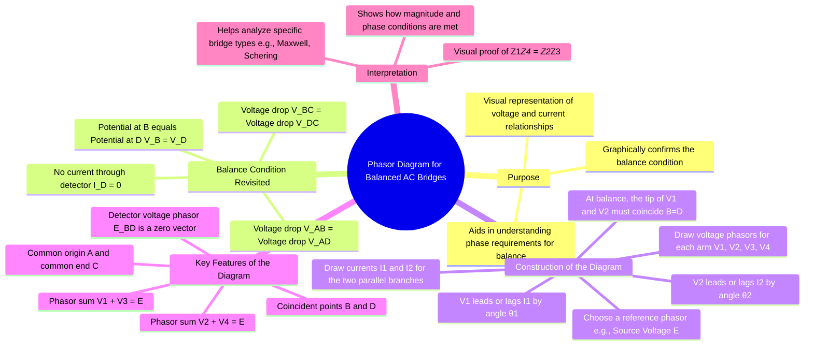

---
tags:
  - measurements
  - ac-bridges
  - phasor-diagram
  - gate
  - electrical-engineering
created: 2025-10-18
aliases:
  - AC Bridge Phasor Diagram
  - Balance Phasor Diagram
subject: "[[Electrical & Electronic Measurements]]"
parent: "[[General Equation for Bridge Balance]]"
modified: 2026-08-04T10:12:27
---
### Phasor Diagram for Balanced AC Bridges
#ac-bridges #phasor-diagram #measurements

> The phasor diagram of a balanced AC bridge is a graphical representation of the voltage and current phasors in each arm of the bridge. It serves as a visual tool to confirm the conditions of balance, illustrating that the potentials at the detector terminals are identical in both magnitude and phase, resulting in zero current through the detector.

---
#### Principle of the Phasor Diagram
#ac-bridges/phasor-principle

The foundation for the phasor diagram is the set of conditions that exist in the bridge circuit when it is balanced. At balance:
1.  The potential at node B is the same as the potential at node D ($V_B = V_D$). This implies there is zero voltage difference across the detector.
2.  The voltage drop from node A to B ($V_{AB}$) is equal to the voltage drop from node A to D ($V_{AD}$).
    $$\boxed{\quad V_{AB} = V_{AD} \implies I_1 Z_1 = I_2 Z_2 \quad}$$
3.  Consequently, the voltage drop from node B to C ($V_{BC}$) is equal to the voltage drop from node D to C ($V_{DC}$).
    $$\boxed{\quad V_{BC} = V_{DC} \implies I_1 Z_3 = I_2 Z_4 \quad}$$
The phasor diagram must graphically satisfy these equalities.

#### Constructing the General Phasor Diagram
#ac-bridges/phasor-construction

A general phasor diagram for a balanced AC bridge can be constructed as follows, typically taking the supply voltage $E$ as the reference phasor.

1.  **Draw the Reference Phasor**: Draw the supply voltage phasor, $E$, usually along the horizontal axis. This phasor represents the potential difference between nodes A and C.

2.  **Draw Branch Currents**: Draw the phasors for the currents in the two parallel branches, $I_1$ (through arms $Z_1$ and $Z_3$) and $I_2$ (through arms $Z_2$ and $Z_4$). These currents originate from the source and their phase angles with respect to $E$ depend on the total impedance of their respective branches, $Z_1+Z_3$ and $Z_2+Z_4$.

3.  **Draw Voltage Drops**:
    *   From the origin (node A), draw the phasor for the voltage drop across $Z_1$, which is $V_1 = I_1 Z_1$. This phasor leads or lags the current $I_1$ by the phase angle of the impedance $Z_1$ ($\theta_1$). The tip of this phasor represents the potential of node B.
    *   From the origin (node A), also draw the phasor for the voltage drop across $Z_2$, which is $V_2 = I_2 Z_2$. This phasor leads or lags $I_2$ by the phase angle of $Z_2$ ($\theta_2$). The tip of this phasor represents the potential of node D.

4.  **Confirm Balance**: **For a balanced bridge, nodes B and D are at the same potential, so their corresponding points on the phasor diagram must coincide.** This means the phasors $V_1$ and $V_2$ are identical.

5.  **Complete the Diagram**:
    *   From point B, draw the phasor for the voltage drop across $Z_3$, which is $V_3 = I_1 Z_3$. This phasor must terminate at point C (the end of the supply voltage phasor $E$).
    *   Similarly, from point D, draw the phasor for the voltage drop across $Z_4$, which is $V_4 = I_2 Z_4$. This phasor must also terminate at point C.

The completed diagram visually confirms that $V_1 + V_3 = E$ and $V_2 + V_4 = E$.

*(A general representation where B and D are at the same potential)*

#### Interpretation of the Phasor Diagram
#ac-bridges/interpretation

-   **Coincident Points B and D**: This is the most crucial feature, graphically showing that $V_{BD} = 0$ and thus the detector current is zero.
-   **Voltage Division**: The diagram illustrates the voltage division in the two parallel branches. At balance, the voltage division ratios are equal:
    $$ \frac{Z_1}{Z_1+Z_3} = \frac{Z_2}{Z_2+Z_4} $$
-   **Phase Relationships**: The diagram clearly shows the phase relationships between voltages and currents. For example, in a Maxwell's bridge, the voltage across the inductive arm will lead its current, while the voltage across the capacitive arm will lag its current. The diagram shows how these phase shifts combine to achieve balance. This visual aid is often more intuitive than the complex algebra of the balance equation for understanding how a particular bridge works.

---
### Related Concepts
#ac-bridges/related-concepts

> [[General Equation for Bridge Balance]]

[[AC Bridges]]
[[Phasor Representation]]
[[Complex Impedance]]
[[Maxwell's Inductance Bridge]]
[[Schering Bridge]]
[[Voltage Divider Rule]]
