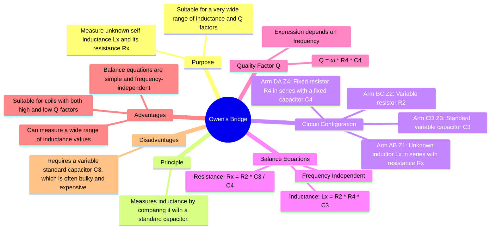

---
tags:
  - measurements
  - ac-bridges
  - inductance-measurement
  - gate
  - electrical-engineering
created: 2025-10-18
aliases:
  - Owen Bridge
subject: "[[Electrical & Electronic Measurements]]"
parent:
  - AC Bridges
modified: 2026-08-04T10:09:48
---
### Owen's Bridge
#ac-bridges #inductance-measurement #wide-range

> Owen's Bridge is a versatile AC bridge used to measure an unknown self-inductance ($L_x$) and its internal resistance ($R_x$). It is notable for its wide range of applicability, as it can accurately measure inductors with both high and low Quality Factors. The bridge balances the unknown inductive impedance against capacitive impedances, and the resulting balance equations are conveniently independent of the supply frequency.

---
#### Circuit Diagram and Impedances
#ac-bridges/circuit-diagram #owens-bridge

The four arms of the Owen's Bridge are configured as follows:
-   **Arm AB (Z1)**: The unknown inductor $L_x$ in series with its effective resistance $R_x$.
    -   $Z_1 = R_x + j\omega L_x$
-   **Arm BC (Z2)**: A standard variable non-inductive resistor $R_2$.
    -   $Z_2 = R_2$
-   **Arm CD (Z3)**: A standard variable capacitor $C_3$.
    -   $Z_3 = \frac{1}{j\omega C_3}$
-   **Arm DA (Z4)**: A fixed standard resistor $R_4$ in series with a fixed standard capacitor $C_4$.
    -   $Z_4 = R_4 + \frac{1}{j\omega C_4}$

The bridge is balanced by varying $R_2$ and $C_3$.

#### Derivation of Balance Equations
#ac-bridges/derivation

The balance condition for an AC bridge is given by $Z_1 Z_3 = Z_2 Z_4$.
Substituting the impedance expressions for the arms of the Owen's Bridge:
$$\begin{align}
(R_x + j\omega L_x)\left(\frac{1}{j\omega C_3}\right) &= R_2 \left(R_4 + \frac{1}{j\omega C_4}\right) \\
\frac{R_x}{j\omega C_3} + \frac{j\omega L_x}{j\omega C_3} &= R_2 R_4 + \frac{R_2}{j\omega C_4} \\
\frac{L_x}{C_3} - j\frac{R_x}{\omega C_3} &= R_2 R_4 - j\frac{R_2}{\omega C_4}
\end{align}$$
For this complex equation to hold, the real parts and the imaginary parts on both sides must be equal.

1.  **Equating Real Parts:**
    $$ \frac{L_x}{C_3} = R_2 R_4 $$
    $$\boxed{\quad L_x = R_2 R_4 C_3 \quad}$$

2.  **Equating Imaginary Parts:**
    $$ -\frac{R_x}{\omega C_3} = -\frac{R_2}{\omega C_4} $$
    $$ \frac{R_x}{C_3} = \frac{R_2}{C_4} $$
    $$\boxed{\quad R_x = R_2 \frac{C_3}{C_4} \quad}$$

Both balance equations are independent of the source frequency $\omega$.

#### Quality Factor (Q) of the Coil
#quality-factor #owens-bridge

The quality factor of the unknown coil is defined as $Q = \frac{\omega L_x}{R_x}$. Substituting the derived expressions for $L_x$ and $R_x$:
$$\begin{align}
Q &= \frac{\omega (R_2 R_4 C_3)}{R_2 \frac{C_3}{C_4}} \\
&= \omega R_4 C_4
\end{align}$$
$$\boxed{\quad Q = \omega R_4 C_4 \quad}$$
While the balance equations for $L_x$ and $R_x$ are independent of frequency, the expression for the Q-factor is frequency-dependent.

#### Advantages and Disadvantages
#owens-bridge/pros-cons

##### Advantages
-   **Frequency Independent Balance**: The equations for both $L_x$ and $R_x$ are independent of the supply frequency, which adds to the convenience and accuracy.
-   **Wide Range of Measurement**: The bridge is suitable for measuring inductance over a wide range of values.
-   **Measures Coils of all Q-factors**: Unlike Maxwell's and Hay's bridges, which are specialized for medium and high-Q coils respectively, Owen's bridge can be used for coils with low, medium, and high Q-factors.

##### Disadvantages
-   **Requires a Variable Capacitor**: The bridge requires a high-quality, precision variable capacitor ($C_3$) for balancing. Such capacitors are typically bulky, have a limited range, and are significantly more expensive than precision variable resistors.
-   **Capacitor Accuracy**: The accuracy of the measurement is highly dependent on the accuracy of the fixed capacitors ($C_3$ and $C_4$).

---
### Related Concepts
#ac-bridges/related-concepts

> [[Maxwell's Inductance Bridge]]

[[General Equation for Bridge Balance]]
[[Hay's Bridge]]
[[Anderson's Bridge]]
[[AC Bridges]]
[[Quality Factor (Q Factor)]]
