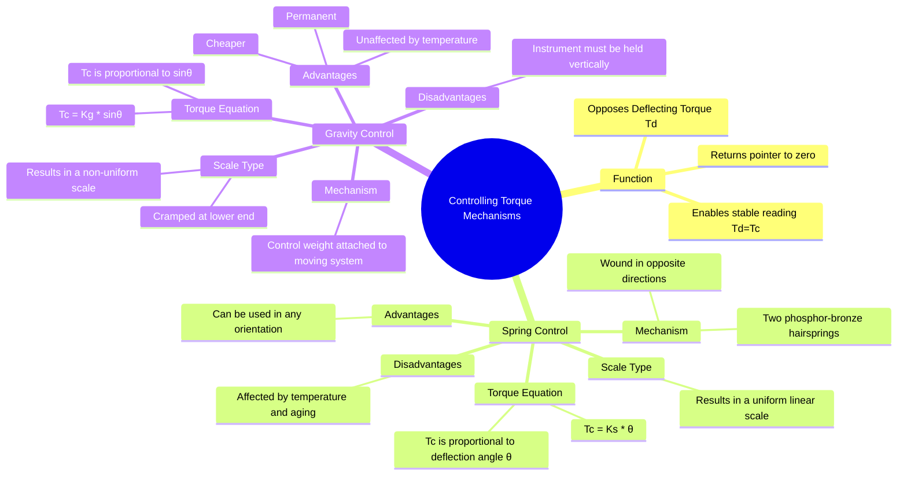

---
tags:
  - measurements
  - indicating-instruments
  - controlling-torque
  - gate
  - electrical-engineering
created: 2025-10-18
aliases:
  - Spring Control
  - Gravity Control
  - Restoring Torque
  - Types of Controlling Torques (Spring, Gravity)
subject: "[[Electrical & Electronic Measurements]]"
parent: "[[Essential Torques in Indicating Instruments]]"
modified: 2026-08-04T10:44:28
---
### Types of Controlling Torques (Spring, Gravity)
#indicating-instruments #controlling-torque #measurements

> The controlling torque ($T_c$) is the restoring force in an indicating instrument that opposes the deflecting torque and brings the pointer to rest at its final position. It is also responsible for returning the pointer to the zero mark when the instrument is disconnected. The two primary methods for generating this torque are spring control and gravity control.

---
#### 1. Spring Control
#spring-control

Spring control is the most common method for providing controlling torque in portable and panel-mounted indicating instruments.

-   **Mechanism**: It uses two hairsprings, typically made of a non-magnetic alloy like phosphor bronze or beryllium-copper. The springs are wound in opposite directions so that one unwinds while the other winds up as the pointer deflects. This design neutralizes the effect of temperature variations on the spring length and also serves to lead current into and out of the moving coil in instruments like PMMC.
-   **Torque Equation**: The restoring torque produced by the springs is directly proportional to the angle of deflection, $\theta$, of the pointer.
    $$\boxed{\quad T_c = K_s \theta \quad}$$
    where $K_s$ is the combined spring constant (stiffness) of the two springs.
-   **Scale Characteristics**: Since $T_c \propto \theta$, the scale of the instrument will be uniform if the deflecting torque ($T_d$) is also directly proportional to the quantity being measured (e.g., in PMMC instruments, $T_d \propto I$). At the final position, $T_d = T_c$, which means $I \propto \theta$, resulting in a linear scale.

##### Advantages
-   Allows the instrument to be used in any orientation (horizontal, vertical, or inclined).
-   Provides a uniform scale for many instrument types.

##### Disadvantages
-   Temperature changes can alter the stiffness of the springs, introducing errors.
-   The springs can lose their elasticity over time due to aging or fatigue, affecting the accuracy of the instrument.

---
#### 2. Gravity Control
#gravity-control

Gravity control uses the force of gravity on a small adjustable weight to produce the controlling torque.

-   **Mechanism**: A small control weight is attached to an arm on the moving system. This weight is balanced by another weight placed diametrically opposite to it, ensuring the system is balanced at the zero position. When the pointer deflects by an angle $\theta$, the control weight creates a restoring torque due to gravity.
-   **Torque Equation**: The controlling torque is proportional to the sine of the deflection angle.
    $$\boxed{\quad T_c = Wl \sin\theta = K_g \sin\theta \quad}$$
    where $W$ is the magnitude of the control weight and $l$ is the distance of the weight from the axis of rotation.
-   **Scale Characteristics**: Since $T_c \propto \sin\theta$, the scale is non-uniform. It is cramped at the lower end (where $\sin\theta \approx \theta$) and spread out at the upper end. For example, in a moving-iron instrument with gravity control, $T_d \propto I^2$. At balance, $I^2 \propto \sin\theta$, so the deflection is not linearly related to the current.

##### Advantages
-   Cheaper to manufacture than spring control.
-   Unaffected by temperature changes.
-   Does not deteriorate with time; the controlling torque is permanent.

##### Disadvantages
-   The instrument must be used in a specific, level, vertical position for the gravity control to work correctly.
-   The non-uniform scale can be difficult to read accurately at low values.

---
### Related Concepts
#topic/related-concepts

> [[Essential Torques in Indicating Instruments]]

[[Permanent Magnet Moving Coil (PMMC) Instruments]]
[[Moving Iron (MI) Instruments]]
[[Types of Damping Torques]]