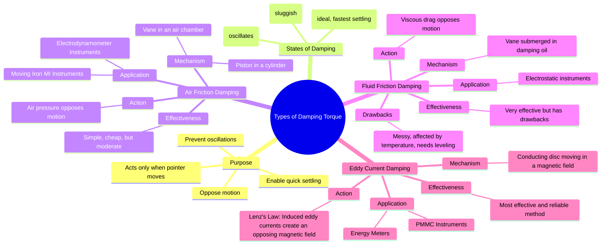

---
tags:
  - measurements
  - indicating-instruments
  - damping-torque
  - gate
  - electrical-engineering
created: 2025-10-18
aliases:
  - Damping Methods
  - Damping in Instruments
  - Types of Damping Torques (Air Friction, Fluid Friction, Eddy Current)
subject: "[[Electrical & Electronic Measurements]]"
parent: "[[Essential Torques in Indicating Instruments]]"
modified: 2026-08-04T10:45:04
---
### Types of Damping Torques (Air Friction, Fluid Friction, Eddy Current)
#indicating-instruments #damping-torque #measurements

> Damping torque is an essential force in indicating instruments that acts only when the moving system is in motion. Its purpose is to oppose this motion, thereby preventing the pointer from oscillating around its final reading and allowing it to settle quickly and accurately. The ideal level of damping is **critical damping**, where the pointer reaches its final position in the shortest possible time without any overshoot. The three main methods used to produce this torque are air friction, fluid friction, and eddy current damping.

---
#### 1. Air Friction Damping
#air-friction-damping

This method relies on the resistance that air offers to a moving object.
-   **Mechanism**: A light aluminum vane or piston is attached to the spindle of the moving system. This vane moves inside a closed, sector-shaped air chamber, or the piston moves within a cylinder. When the pointer moves, the vane/piston compresses the air in front of it and creates a partial vacuum behind it. The resulting pressure difference creates a force that opposes the motion.
-   **Application**: This method is simple and economical. It is commonly used in instruments where the operating magnetic field is weak or variable, making eddy current damping unsuitable. Prime examples are **Moving Iron (MI) Instruments** and **Electrodynamometer type instruments**.

#### 2. Fluid Friction Damping
#fluid-friction-damping

This method is similar to air friction damping but uses a high-viscosity liquid (damping oil) instead of air.
-   **Mechanism**: A set of vanes is attached to the spindle and submerged in a pot of damping oil. As the pointer moves, the vanes experience a viscous drag from the oil, which opposes the motion.
-   **Application**: This method can provide a very high degree of damping and is primarily used in high-voltage **electrostatic instruments** where the moving forces are small and strong damping is required.
-   **Disadvantages**: It is not widely used due to several drawbacks: the oil can leak, become dirty, and change its viscosity with temperature. The instrument must also be kept in a specific orientation.

#### 3. Eddy Current Damping
#eddy-current-damping

This is the most effective and widely used method of damping. It is based on the principles of electromagnetic induction.
-   **Mechanism**: A non-magnetic conducting disc (usually aluminum or copper) or a conducting former is mounted on the same spindle as the pointer. This disc is positioned to rotate through the magnetic field of a strong, permanent "damping magnet". When the spindle rotates, the disc cuts through the magnetic flux lines.
    1.  An EMF is induced in the disc according to Faraday's Law.
    2.  This EMF drives circulating currents within the disc, known as **eddy currents**.
    3.  According to **Lenz's Law**, these eddy currents create their own magnetic field that opposes the very motion causing them. This interaction produces a braking or damping torque.
-   **Torque Relationship**: The damping torque produced is proportional to the strength of the magnetic field and the velocity of the moving system.
    $$\boxed{\quad T_{da} \propto B^2 \cdot (\text{velocity of disc}) \quad}$$
-   **Application**: This method is used in instruments that already have a strong, permanent magnetic field as part of their operating mechanism, making it very convenient. The best example is **Permanent Magnet Moving Coil (PMMC) Instruments**. It is also the principle behind the braking system in **Induction Type Energy Meters**.

---
### Related Concepts
#topic/related-concepts

> [[Essential Torques in Indicating Instruments]]

[[Permanent Magnet Moving Coil (PMMC) Instruments]]
[[Moving Iron (MI) Instruments]]
[[Single-Phase Induction Type Energy Meter]]
[[lenz's law]]
[[Faraday's Law of Induction]]