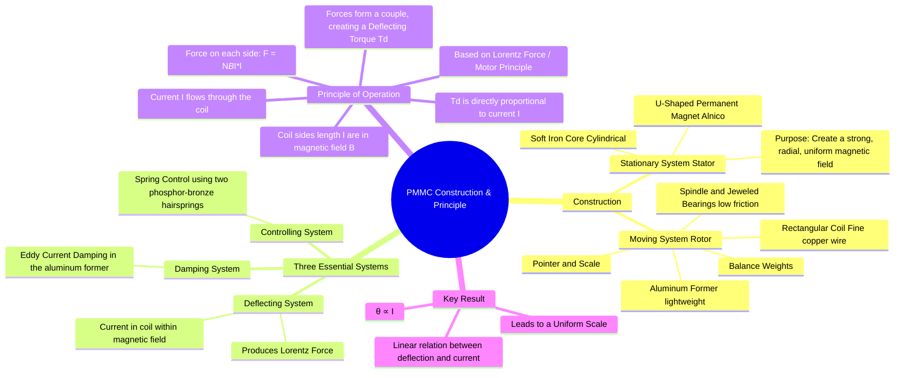

---
tags:
  - measurements
  - indicating-instruments
  - pmmc
  - gate
  - electrical-engineering
created: 2025-10-18
aliases:
  - PMMC Construction
  - PMMC Principle
  - D'Arsonval Galvanometer
subject: "[[Electrical & Electronic Measurements]]"
parent:
  - Permanent Magnet Moving Coil (PMMC) Instruments
modified: 2026-08-04T09:27:23
---
### Construction and Principle of Operation
#pmmc #d-arsonval-galvanometer #indicating-instruments

> The Permanent Magnet Moving Coil (PMMC) instrument, also known as the D'Arsonval galvanometer, is a type of indicating instrument used for measuring DC current and voltage. Its operation is based on the motor principle (Lorentz Force), where a current-carrying coil placed in a magnetic field experiences a torque. PMMC instruments are known for their high accuracy, high sensitivity, and uniform scale.

---
#### Construction of a PMMC Instrument
#pmmc/construction

A PMMC instrument consists of two main parts: a stationary system (stator) and a moving system (rotor).

1.  **Stationary System (Stator)**:
    -   **Permanent Magnet**: A strong U-shaped permanent magnet, typically made of Alnico, provides a constant and uniform magnetic field.
    -   **Soft Iron Core**: A cylindrical soft iron core is placed concentrically inside the magnet's poles. It is not in physical contact with the coil but is placed inside it. Its purpose is to concentrate the magnetic flux lines and make the field in the air gap **radial and uniform**.

2.  **Moving System (Rotor)**:
    -   **Moving Coil**: A rectangular coil with many turns of fine, insulated copper wire is wound on a lightweight **aluminum former**. This entire assembly is mounted on a spindle.
    -   **Spindle and Bearings**: The spindle is supported by delicate, low-friction jeweled bearings, allowing the coil to rotate freely within the magnetic field.
    -   **Pointer and Scale**: A lightweight pointer is attached to the spindle. It moves over a calibrated, linear scale to indicate the measured value. Counterweights are attached to the pointer to balance the system.

3.  **Integrated Systems**:
    -   **Controlling System**: [[Types of Controlling Torques|Spring control]] is used. Two phosphor-bronze hairsprings, wound in opposite directions, are attached to the spindle. They provide the necessary controlling torque and also serve as the electrical leads to pass current into and out of the moving coil.
    -   **Damping System**: [[Types of Damping Torques|Eddy current damping]] is employed. As the aluminum former (which is conductive) moves through the magnetic field, eddy currents are induced in it. According to Lenz's law, these currents produce a torque that opposes the coil's motion, providing highly effective damping.

---
#### Principle of Operation
#pmmc/principle

The operation is based on the **Lorentz Force Principle**: when a conductor carrying a current is placed in a magnetic field, it experiences a mechanical force.

1.  The DC current to be measured ($I$) is passed through the moving coil via the hairsprings.
2.  The two vertical sides of the coil are in the magnetic field created by the permanent magnet. According to Fleming's Left-Hand Rule, the side under the N-pole experiences an upward force, while the side under the S-pole experiences a downward force.
3.  These two equal and opposite forces create a turning moment, or a **deflecting torque** ($T_d$), which causes the coil to rotate on its spindle.
4.  The presence of the soft iron core makes the field radial. This means the conductors on the coil sides are always perpendicular to the magnetic flux lines, regardless of the coil's position. This ensures the torque is proportional to the current only and not the angle of deflection.

The deflecting torque is given by:
$$\begin{align}
T_d &= (\text{Force on one side}) \times (\text{perpendicular distance between forces}) \\
T_d &= (N B I l) \times w
\end{align}$$
where,
- $N$ = number of turns in the coil
- $B$ = magnetic flux density in the air gap (Wb/m² or Tesla)
- $I$ = current flowing through the coil (A)
- $l$ = length of the coil side in the field (m)
- $w$ = width of the coil (m)

Since the area of the coil is $A = l \times w$, the equation becomes:
$$\boxed{\quad T_d = N B A I = G I \quad}$$
where $G = NBA$ is the galvanometer constant.
This shows that the **deflecting torque is directly proportional to the current**.

The pointer comes to rest when the deflecting torque equals the controlling torque from the springs ($T_c = K_s \theta$).
$$ T_d = T_c \implies G I = K_s \theta $$
$$\boxed{\quad \theta = \left(\frac{G}{K_s}\right)I \quad \implies \quad \theta \propto I \quad}$$
Since the deflection angle ($\theta$) is directly proportional to the current ($I$), PMMC instruments have a **uniform (linear) scale**.

---
### Related Concepts
#topic/related-concepts

> [[Permanent Magnet Moving Coil (PMMC) Instruments]]

[[Torque Equation of a PMMC Instrument]]
[[Use as Ammeter and Voltmeter (DC only)]]
[[Essential Torques in Indicating Instruments]]
[[Lorentz Force]]
[[Fleming's Left-Hand Rule]]
[[Eddy Current Damping]]