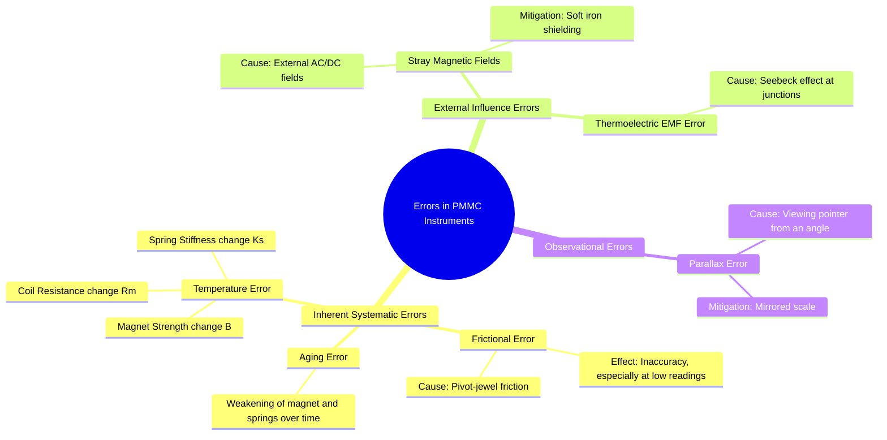

---
tags:
  - measurements
  - indicating-instruments
  - pmmc
  - errors
  - gate
  - electrical-engineering
created: 2025-10-18
aliases:
  - PMMC Errors
  - Errors in D'Arsonval Instruments
subject: "[[Electrical & Electronic Measurements]]"
parent:
  - Permanent Magnet Moving Coil (PMMC) Instruments
modified: 2026-08-04T09:40:00
---
### Errors in PMMC Instruments
#pmmc #instrument-errors #measurements

> While Permanent Magnet Moving Coil (PMMC) instruments are known for their high accuracy and sensitivity, they are subject to several inherent and external errors that can affect their performance. Understanding these errors is crucial for accurate measurement and proper instrument design.

---
#### Inherent Systematic Errors
#systematic-errors

These errors are built into the instrument due to its construction and the properties of its materials.

##### 1. Frictional Error
#frictional-error
-   **Cause**: Friction in the jeweled pivot and bearing system, though minimized, is always present.
-   **Effect**: It causes the pointer to be somewhat "sticky," leading to a lack of repeatability and inaccuracy, especially for small deflection angles where the deflecting torque is low.

##### 2. Temperature Errors
#temperature-errors
This is a significant source of error in PMMC instruments. Temperature changes affect three key components:
1.  **Change in Spring Stiffness ($K_s$)**: An increase in temperature weakens the springs, causing their stiffness constant $K_s$ to decrease. Since deflection $\theta = T_d / K_s$, a weaker spring results in a larger deflection for the same current. This causes the instrument to **read high**.
2.  **Change in Coil Resistance ($R_m$)**: The moving coil is made of copper, which has a significant positive temperature coefficient of resistance (approx. +0.4% per °C). As temperature rises, $R_m$ increases.
    -   **As a Voltmeter**: The total resistance ($R_{se} + R_m$) increases, causing less current to flow for a given voltage. This leads to a smaller deflection, and the instrument **reads low**.
    -   **As an Ammeter**: The current division ratio between the meter and the shunt changes. As $R_m$ increases, less current flows through the meter, causing it to **read low**.
3.  **Change in Magnet Strength ($B$)**: The strength of the permanent magnet decreases slightly with an increase in temperature. This reduces the magnetic flux density $B$, which in turn reduces the deflecting torque ($T_d = NBAI$). This causes the instrument to **read low**.

Of these, the error due to the change in coil resistance is the most significant. It is compensated for by using a **swamping resistor** (made of a material with a near-zero temperature coefficient, like Manganin) in series with the coil for ammeters, and by ensuring the multiplier resistor for voltmeters is also made of Manganin.

##### 3. Aging of Components
#aging-errors
-   **Magnet Aging**: Over a long period, the permanent magnet can lose some of its strength, causing $B$ to decrease. This reduces $T_d$ and makes the instrument read low.
-   **Spring Aging**: The springs may lose their elasticity or "fatigue" over time, causing their stiffness $K_s$ to decrease. This reduces $T_c$ and makes the instrument read high.
-   **Combined Effect**: Since deflection $\theta = (NBA/K_s)I$, the decrease in $B$ (numerator) and the decrease in $K_s$ (denominator) tend to cancel each other out, but the compensation is rarely perfect.

#### External and Observational Errors
#external-errors

##### 1. Stray Magnetic Fields
#stray-field-errors
-   **Cause**: External magnetic fields (from nearby conductors, transformers, etc.) can interfere with the instrument's internal field.
-   **Effect**: The external field can either add to or subtract from the internal field, causing the instrument to read high or low depending on the field's orientation.
-   **Mitigation**: PMMC instruments have a very strong internal magnetic field, so they are less susceptible than other instrument types (like MI). However, for high precision, they are shielded by enclosing the entire movement in a soft iron case, which diverts the stray magnetic flux.

##### 2. Thermoelectric EMF Error
#thermoelectric-errors
-   **Cause**: When junctions of dissimilar metals (e.g., copper coil wire connected to a Manganin shunt) are at different temperatures, a small thermoelectric EMF is generated (Seebeck effect).
-   **Effect**: This EMF can drive a small parasitic current, causing a minor error in the reading. This is usually negligible in most applications.

##### 3. Parallax Error
#parallax-error
-   **Cause**: This is an observational error that occurs if the observer's eye is not directly perpendicular to the pointer's tip. Reading the scale from an angle will result in an incorrect value.
-   **Mitigation**: High-accuracy PMMC instruments are fitted with a **mirrored scale**. The user aligns the pointer with its reflection in the mirror before taking a reading, ensuring their line of sight is perfectly perpendicular to the scale, thus eliminating parallax error.

---
### Related Concepts
#topic/related-concepts

> [[Permanent Magnet Moving Coil (PMMC) Instruments]]

[[Construction and Principle of Operation of PMMC]]
[[Torque Equation of a PMMC Instrument]]
[[Use as Ammeter and Voltmeter (DC only)]]
[[Types of Errors]]