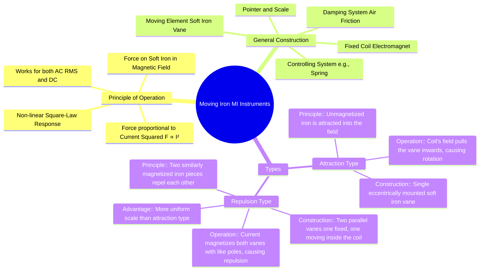

---
tags:
  - measurements
  - indicating-instruments
  - moving-iron
  - gate
created: 2025-10-18
aliases:
  - MI Instruments
  - Moving Iron Principle
  - Attraction Type MI
  - Repulsion Type MI
subject: "[[Electrical & Electronic Measurements]]"
parent:
  - Indicating Instruments
modified: 2026-08-04T09:25:30
---
### Construction and Principle of Moving Iron (MI) Instruments
#mi-instruments #attraction-type #repulsion-type #instrument-construction

> Moving Iron (MI) instruments operate on the principle that a piece of soft iron, when placed in a magnetic field, experiences a force that moves it from a weaker field area to a stronger one. The force is proportional to the square of the current, enabling these instruments to measure both DC and the RMS value of AC.

---
#### General Construction
#mi-instruments/construction

A moving iron instrument consists of the following essential parts:
- **Fixed Coil:** A stationary coil of copper wire carries the current to be measured, producing a proportional magnetic field.
- **Moving Element:** A small, lightweight piece of high-permeability soft iron (vane or rod) that is free to move.
- **Controlling System:** Typically a spring control mechanism (`[[Types of Controlling Torques (Spring, Gravity)]]`) provides the controlling torque ($T_c$) to oppose the deflection.
- **Damping System:** Air friction damping (`[[Types of Damping Torques (Air Friction, Fluid Friction, Eddy Current)]]`) is used to dissipate the energy of oscillation and bring the pointer to rest quickly.
- **Pointer and Scale:** A lightweight pointer attached to the moving system indicates the reading on a calibrated, non-uniform scale.

---

#### Principle of Operation
#mi-instruments/principle

When the current to be measured flows through the fixed coil, it sets up a magnetic field. This field induces magnetism in the soft iron vane. A force acts on the magnetized vane, causing it to move. This force always acts in a direction to increase the inductance of the coil by pulling the vane into a region of a stronger magnetic field.

The instantaneous deflecting torque ($T_d$) is proportional to the square of the current flowing through the coil.
$$ T_d \propto I^2 $$
Since the torque is proportional to $I^2$, it is always unidirectional, regardless of the direction of the current.
- **For DC:** The deflection is proportional to the current squared.
- **For AC:** The instrument responds to the average torque, which is proportional to the mean square value of the current. The deflection is thus proportional to the RMS value of the AC.
$$ T_{d,avg} \propto \frac{1}{T}\int_0^T i(t)^2 dt = I_{rms}^2 $$
This square-law response results in a non-linear, cramped scale at the lower end.

---

### Types of Moving Iron Instruments

There are two main types of MI instruments based on how the force is produced.

#### 1. Attraction Type
#attraction-type #mi-instruments

- **Principle:** An unmagnetized, soft iron piece is attracted towards the magnetic field produced by the current-carrying coil.
- **Construction:** It consists of a stationary coil and a single, eccentrically mounted soft iron vane. The vane is attached to the spindle, which also carries the pointer.
- **Operation:** When current flows through the coil, it becomes an electromagnet. The soft iron vane is attracted from the weaker field outside the coil to the stronger field inside. This attraction force creates a deflecting torque, causing the spindle and pointer to rotate against the controlling torque of the spring.

 <!-- Placeholder for a diagram -->

#### 2. Repulsion Type
#repulsion-type #mi-instruments

- **Principle:** Two pieces of soft iron placed adjacently in the same magnetic field will be magnetized with the same polarity, causing a force of repulsion between them.
- **Construction:** It consists of a fixed coil inside which two soft iron vanes are placed. One vane is fixed to the coil's frame, while the other is mounted on the spindle and is free to move.
- **Operation:** When current flows through the coil, it creates a magnetic field that magnetizes both vanes with the same polarity. A repulsive force is generated between the two vanes. This force pushes the moving vane away from the fixed vane, producing a deflecting torque that rotates the spindle.
- **Advantage:** Repulsion-type instruments are more commonly used as they can be designed to have a more uniform scale compared to the attraction type.

 <!-- Placeholder for a diagram -->

---

### Related Concepts
#topic/related-concepts

> [[Torque Equation of an MI Instrument]]

[[Essential Torques in Indicating Instruments]]
[[Errors in MI Instruments]]
[[Permanent Magnet Moving Coil (PMMC) Instruments]]
[[Use for both AC and DC Measurements]]
[[Electrodynamometer Type Instruments]]
