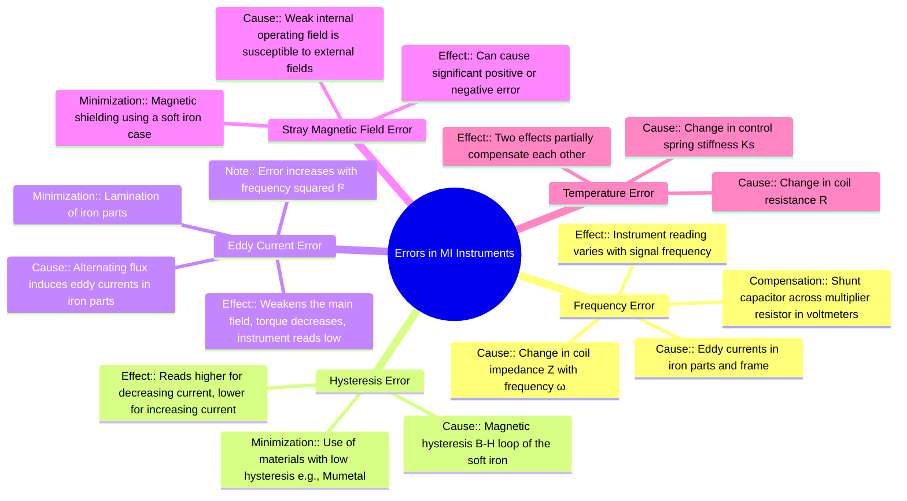

---
tags:
  - measurements
  - indicating-instruments
  - error-analysis
  - moving-iron
  - gate
created: 2025-10-18
aliases:
  - Moving Iron Instrument Errors
  - MI Instrument Errors
subject: "[[Electrical & Electronic Measurements]]"
parent:
  - Moving Iron (MI) Instruments
modified: 2026-08-04T09:39:35
---
### Errors in MI Instruments
#mi-instruments #error-analysis #instrument-accuracy

> Moving Iron (MI) instruments, while versatile for both AC and DC measurements, are susceptible to several errors that can affect their accuracy. These errors are more pronounced in AC applications due to frequency-dependent effects like changes in reactance, hysteresis, and eddy currents.

---

#### 1. Frequency Errors
#frequency-error #reactance #ac-measurement

This is a significant error in AC measurements. The instrument's reading can change with the frequency of the signal being measured. This error arises from two main sources:

-   **Change in Coil Impedance:** The impedance of the instrument's coil is given by $Z = \sqrt{R^2 + X_L^2} = \sqrt{R^2 + (2\pi f L)^2}$. As frequency ($f$) changes, the inductive reactance ($X_L$) changes, altering the total impedance.
    -   **In MI Voltmeters:** The coil is in series with a high multiplier resistance ($R_{mult}$). The total impedance is $Z_v = \sqrt{(R_{coil} + R_{mult})^2 + (2\pi f L)^2}$. An increase in frequency increases $Z_v$, which decreases the current for a given voltage, causing the instrument to **read low**.
    -   **Compensation:** To minimize this, a capacitor $C$ is connected in parallel with the multiplier resistor. At higher frequencies, the decreasing capacitive reactance ($X_C$) draws more current, compensating for the increase in the coil's inductive reactance. For perfect compensation over a range of frequencies, the time constant of the coil should match that of the multiplier: $L/R_{coil} = C R_{mult}$.

-   **Change due to Eddy Currents:** Eddy currents induced in the iron parts increase with frequency, which also alters the effective resistance and inductance of the coil, contributing to the overall frequency error.

#### 2. Hysteresis Error
#hysteresis-error #magnetic-error

-   **Cause:** This error is caused by magnetic hysteresis in the soft iron vane. The flux density ($B$) for a given magnetizing force ($H$, produced by the coil current) is different when the current is increasing compared to when it is decreasing.
-   **Effect:** For the same value of current, the flux is higher when the current is decreasing. This results in a higher reading for descending values of current and a lower reading for ascending values. This error is present in both AC and DC measurements but is generally small in well-designed instruments.
-   **Minimization:** Using materials with a very narrow B-H loop (low coercivity and retentivity), such as **Mumetal** or **Permalloy**, for the moving iron vane.

#### 3. Eddy Current Error
#eddy-current-error #ac-error

-   **Cause:** When used for AC measurements, the alternating magnetic field from the coil induces eddy currents in the iron parts (vane) and any nearby conducting metal parts (like the instrument frame).
-   **Effect:** According to Lenz's law, the magnetic field produced by these eddy currents opposes the main field. This weakens the net magnetic field, resulting in a lower deflecting torque ($T_d$). Consequently, the instrument tends to **read low**. This error increases significantly with the square of the frequency ($Error \propto f^2$).
-   **Minimization:** Using laminated iron parts or materials with high electrical resistivity to reduce the magnitude of eddy currents.

#### 4. Stray Magnetic Field Error
#stray-field-error #magnetic-shielding

-   **Cause:** The operating magnetic field produced by the coil in MI instruments is relatively weak. This makes the instrument highly susceptible to the influence of external (stray) magnetic fields from nearby conductors or equipment.
-   **Effect:** Stray fields can distort the internal operating field, causing a significant error in the reading. The error can be positive or negative depending on the direction and magnitude of the stray field relative to the instrument's field.
-   **Minimization:** The entire instrument mechanism is enclosed in a case made of a high-permeability material like **soft iron**. This case acts as a magnetic shield, providing a low-reluctance path for the stray magnetic flux, effectively diverting it from the instrument's working parts.

#### 5. Temperature Error
#temperature-error #instrument-error

-   **Cause:** Changes in ambient temperature can affect the instrument's accuracy in two ways:
    1.  **Change in Coil Resistance:** The resistance of the copper coil increases with a rise in temperature.
    2.  **Change in Spring Stiffness:** The stiffness of the control spring ($K_s$) decreases with a rise in temperature (the spring becomes weaker).
-   **Effect:** In an MI voltmeter, an increase in coil resistance causes the current to decrease, leading to a **lower reading**. A decrease in spring stiffness reduces the controlling torque, leading to a **higher reading**. These two effects tend to **partially compensate** for each other, so the net temperature error in MI voltmeters is usually small.

---

### Related Concepts
#topic/related-concepts

> [[Construction and Principle (Attraction and Repulsion Types)]]

[[Torque Equation of an MI Instrument]]
[[Use for both AC and DC Measurements]]
[[Hysteresis]]
[[Eddy Currents]]
[[Errors in PMMC Instruments]]
[[Stray Magnetic Fields]]
