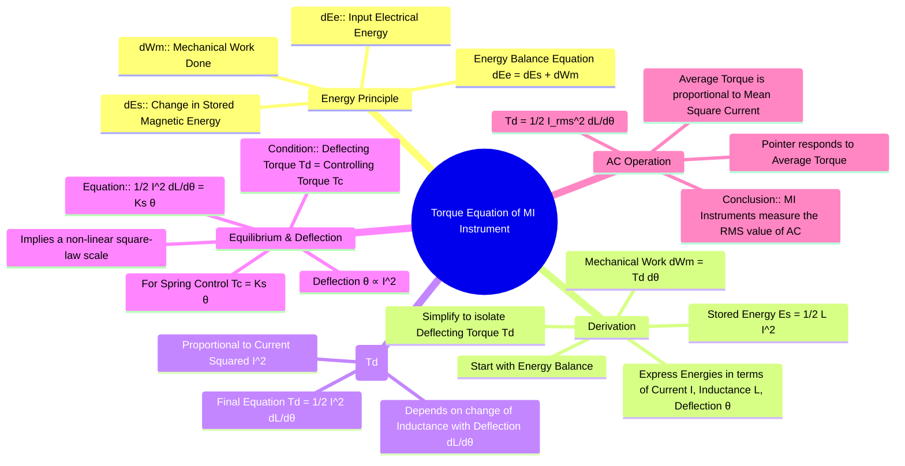

---
tags:
  - measurements
  - indicating-instruments
  - moving-iron
  - gate
created: 2025-10-18
aliases:
  - MI Torque
  - Moving Iron Torque Equation
subject: "[[Electrical & Electronic Measurements]]"
parent:
  - Moving Iron (MI) Instruments
modified: 2026-08-04T10:42:28
---
### Torque Equation of a Moving Iron (MI) Instrument
#mi-instruments #torque-equation #electromechanical-conversion

> The deflecting torque in a Moving Iron (MI) instrument is derived from the principle of energy conservation. The electrical energy supplied to the instrument's coil is partly stored in the magnetic field and partly converted into mechanical work, which causes the pointer to deflect.

---
#### Derivation from Energy Principle
#energy-balance #instrument-derivation

The operation is based on the fact that the moving system will move in a direction to increase the inductance ($L$) of the coil, as this corresponds to a state of minimum reluctance and minimum potential energy.

Let:
- $I$ = Current through the coil
- $L$ = Inductance of the coil (which is a function of deflection $\theta$, i.e., $L(\theta)$)
- $\theta$ = Deflection of the pointer in radians
- $T_d$ = Deflecting torque

Consider a small increment in current $dI$ which causes a small change in deflection $d\theta$ and a small change in inductance $dL$.
The electrical energy supplied to the coil is:
$$ dE_e = e \cdot i \cdot dt = \frac{d\psi}{dt} \cdot i \cdot dt = i \cdot d\psi $$
where $\psi = Li$ is the flux linkage.
$$ dE_e = i \cdot d(Li) = i(Ldi + idL) = iLdi + i^2 dL $$
The change in stored magnetic energy is:
$$ dE_s = d\left(\frac{1}{2}Li^2\right) = \frac{1}{2}(L \cdot 2i \cdot di + i^2 dL) = Li \cdot di + \frac{1}{2}i^2 dL $$
The mechanical work done by the deflecting torque is:
$$ dW_m = T_d \cdot d\theta $$
According to the principle of energy conservation:
$$\begin{align}
\text{Electrical Energy Supplied} &= \text{Change in Stored Energy} + \text{Mechanical Work Done} \\
dE_e &= dE_s + dW_m \\
iLdi + i^2 dL &= Li \cdot di + \frac{1}{2}i^2 dL + T_d d\theta \\
\frac{1}{2}i^2 dL &= T_d d\theta
\end{align}$$
Since inductance $L$ is a function of deflection $\theta$, we can write $dL = \frac{dL}{d\theta}d\theta$. Substituting this gives:
$$ T_d d\theta = \frac{1}{2}i^2 \frac{dL}{d\theta} d\theta $$

---

#### Deflecting Torque ($T_d$)
#mi-instruments/torque

From the derivation, the instantaneous deflecting torque is given by:
$$\boxed{\quad T_d = \frac{1}{2} I^2 \frac{dL}{d\theta} \quad}$$
Key observations from this equation:
1.  **Proportionality to Current Squared:** $T_d \propto I^2$. This means the torque is always in the same direction, regardless of the current's polarity. Hence, the instrument can be used for both DC and AC.
2.  **Dependence on Inductance Gradient:** The torque depends on $\frac{dL}{d\theta}$, the rate of change of inductance with deflection. To obtain a deflecting torque, the inductance must change as the pointer moves.

---

#### Equilibrium Condition and Deflection
#instrument-scale #steady-state

The pointer comes to rest when the deflecting torque ($T_d$) is balanced by the controlling torque ($T_c$) provided by the springs.
$$ T_d = T_c $$
For a spring-controlled instrument, the controlling torque is proportional to the deflection, $T_c = K_s \theta$, where $K_s$ is the spring constant.
$$\begin{align}
\frac{1}{2} I^2 \frac{dL}{d\theta} &= K_s \theta \\
\end{align}$$
The deflection is therefore:
$$\boxed{\quad \theta = \frac{I^2}{2 K_s} \frac{dL}{d\theta} \quad}$$
Since $\theta \propto I^2$, the scale of a moving iron instrument is non-linear and is typically cramped at the lower end and spread out at the higher end. The scale can be made more uniform by carefully shaping the iron vanes to make the term $\frac{dL}{d\theta}$ change appropriately with deflection.

---

#### For AC Measurement
#rms-measurement #ac-instruments

For an alternating current $i(t)$, the instantaneous torque is $t_d(t) = \frac{1}{2} i(t)^2 \frac{dL}{d\theta}$. Due to the inertia of the moving system, the pointer cannot follow rapid variations and responds to the average torque over one cycle.
$$ T_d = \text{Average}(t_d) = \frac{1}{T} \int_0^T \frac{1}{2} i(t)^2 \frac{dL}{d\theta} dt $$
$$ T_d = \frac{1}{2} \left( \frac{1}{T} \int_0^T i(t)^2 dt \right) \frac{dL}{d\theta} $$
The term in the parenthesis is the mean square value of the current, which is the square of the RMS value ($I_{rms}^2$).
$$ \implies T_d = \frac{1}{2} I_{rms}^2 \frac{dL}{d\theta} $$
Therefore, for an AC input, the deflection is proportional to the square of the RMS value of the current. The instrument is calibrated to read the RMS value directly.

---

### Related Concepts
#topic/related-concepts

> [[Construction and Principle (Attraction and Repulsion Types)]]

[[Errors in MI Instruments]]
[[Essential Torques in Indicating Instruments]]
[[Permanent Magnet Moving Coil (PMMC) Instruments]]
[[Use for both AC and DC Measurements]]
[[Inductance]]
