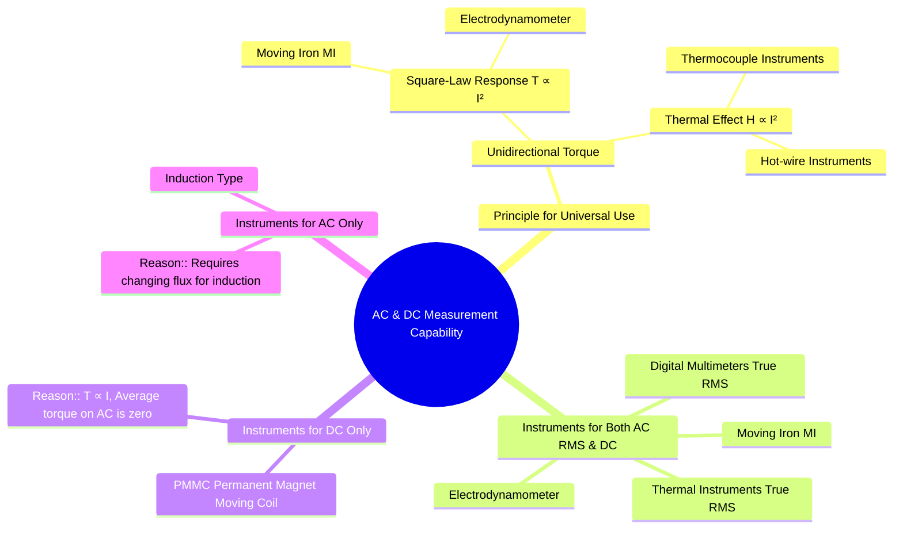

---
tags:
  - measurements
  - ac-measurement
  - dc-measurement
  - instrument-types
  - gate
created: 2025-10-18
aliases:
  - AC/DC Measurement
  - Universal Instruments
subject: "[[Electrical & Electronic Measurements]]"
parent:
  - Indicating Instruments
modified: 2026-08-04T10:47:16
---
### Use for both AC and DC Measurements
#instrument-classification #ac-dc-measurement #rms-value

> The ability of an instrument to measure both AC and DC quantities depends on its operating principle. Instruments that produce a deflecting torque independent of the current's direction (i.e., a unidirectional torque) can be used for both. This is typically achieved through principles based on the square of the current ($I^2$).

---

#### Principle of Universal (AC/DC) Instruments
#unidirectional-torque #square-law

For an instrument to work on both AC and DC, the deflecting torque ($T_d$) must always be in the same direction, regardless of the current's polarity. This is achieved if the torque is proportional to an even power of the current, most commonly the square ($T_d \propto I^2$).

When a DC current $I$ is applied, the deflection is proportional to $I^2$.
When an AC current $i(t)$ is applied, the instantaneous torque is $t_d(t) \propto i(t)^2$. Due to mechanical inertia, the pointer responds to the average torque:
$$ T_{d,avg} \propto \text{Average of } i(t)^2 = \frac{1}{T}\int_0^T i(t)^2 dt = I_{rms}^2 $$
Thus, these instruments inherently measure the **RMS value** of an alternating current.

The two main physical effects that produce such a torque are:
1.  **Electromagnetic Force/Torque based on $I^2$**: Found in Moving Iron and Electrodynamometer instruments.
2.  **Thermal Effect based on $I^2$**: Found in Hot-wire and Thermocouple instruments.

---

### Instruments Capable of Measuring Both AC and DC

#### 1. Moving Iron (MI) Instruments
#mi-instruments #ac-dc
The deflecting torque in an MI instrument is given by:
$$\boxed{\quad T_d = \frac{1}{2} I^2 \frac{dL}{d\theta} \quad}$$
Since $T_d \propto I^2$, the torque is always positive. The instrument shows a positive deflection for current in either direction and is calibrated to read the RMS value for AC.

#### 2. Electrodynamometer Type Instruments
#electrodynamometer #ac-dc
The torque is proportional to the product of currents in the fixed ($I_f$) and moving ($I_m$) coils: $T_d \propto I_f I_m$.
When used as an ammeter or voltmeter, the same current flows through both coils ($I_f = I_m = I$).
$$\boxed{\quad T_d \propto I^2 \quad}$$
This square-law relationship makes them suitable for both AC (RMS) and DC measurements. They are highly accurate and are used as **transfer instruments** to calibrate other AC instruments.

#### 3. Thermal Instruments (Hot-wire, Thermocouple)
#thermal-instruments #true-rms
These instruments use the heating effect of current ($H = I^2Rt$).
-   **Hot-wire:** Measures the expansion of a wire heated by the current.
-   **Thermocouple:** A heater element produces heat, and a thermocouple measures the temperature, generating a proportional DC voltage.
Since the heating effect is proportional to $I^2$, they are independent of the current's direction and waveform. A key advantage is that they read the **true RMS value** of any waveform, even if it is non-sinusoidal or distorted.

---

### Instruments with Limited Use (DC Only or AC Only)

This contrast highlights the importance of the operating principle.

#### 1. Permanent Magnet Moving Coil (PMMC) - DC Only
#pmmc #dc-only
The torque in a PMMC instrument is directly proportional to the current:
$$\boxed{\quad T_d = BINA \cdot I \quad}$$
The torque's direction reverses if the current's direction reverses. For an AC input, the torque reverses every half-cycle. The average torque over a complete cycle is zero, so the pointer does not deflect. PMMC instruments can be adapted to measure AC by using a rectifier, but they then measure the *average* value of the rectified wave, though the scale is calibrated in RMS for a sine wave.

#### 2. Induction Type Instruments - AC Only
#induction-instruments #ac-only
These instruments, like the common household energy meter, operate on the principle of a rotating magnetic field inducing eddy currents in a metallic disc. They require a time-varying magnetic flux to work. They will produce zero torque on DC and are exclusively used for AC measurements.

---

### Related Concepts
#topic/related-concepts

> [[Moving Iron (MI) Instruments]]

[[Electrodynamometer Type Instruments]]
[[Permanent Magnet Moving Coil (PMMC) Instruments]]
[[Torque Equation of an MI Instrument]]
[[Torque Equation of a PMMC Instrument]]
[[Essential Torques in Indicating Instruments]]
[[RMS Value]]
