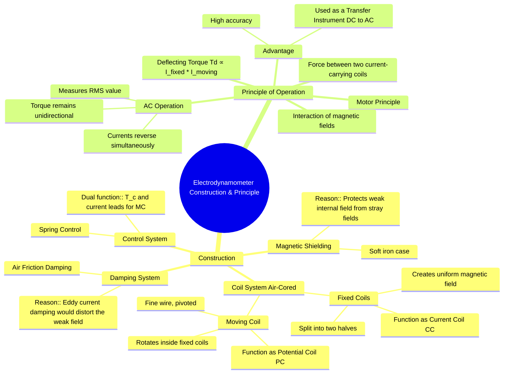

---
tags:
  - measurements
  - indicating-instruments
  - electrodynamometer
  - gate
created: 2025-10-18
aliases:
  - Electrodynamometer
  - Dynamometer Instrument
  - Dynamometer Construction and Principle
subject: "[[Electrical & Electronic Measurements]]"
parent:
  - Electrodynamometer Type Instruments
modified: 2026-08-04T09:26:48
---
### Construction and Principle of Operation of Electrodynamometer Type Instruments
#electrodynamometer #instrument-construction #instrument-principle

> The Electrodynamometer instrument operates on the motor principle, where a mechanical torque is produced by the interaction of magnetic fields from two sets of current-carrying coils. It is an air-cored instrument, which makes it highly accurate and suitable as a standard for calibrating other instruments.

---
#### Construction
#electrodynamometer/construction

The main components of an electrodynamometer instrument are:

1.  **Fixed Coils (FC):**
    -   These are stationary coils, typically split into two identical sections to provide a more uniform magnetic field near the center.
    -   They are wound with heavy wire to carry the main circuit current (when used as an ammeter or the current coil of a wattmeter).
    -   The coils are **air-cored** to avoid hysteresis and eddy current errors that would occur in an iron core, ensuring high accuracy on AC.

2.  **Moving Coil (MC):**
    -   A single coil of fine wire is pivoted on a spindle, allowing it to rotate freely inside the magnetic field of the fixed coils.
    -   This coil carries a smaller current, typically proportional to the voltage (when used as a voltmeter or the potential coil of a wattmeter).
    -   It is also **air-cored**.

3.  **Control System:**
    -   **Spring control** is used exclusively.
    -   Two phosphor-bronze springs provide the controlling torque ($T_c$).
    -   Crucially, these springs also serve as the electrical leads to carry current into and out of the moving coil, eliminating the need for flexible ligaments which could introduce error.

4.  **Damping System:**
    -   **Air friction damping** is employed. It consists of a pair of lightweight aluminum vanes attached to the spindle, which move in a closed, sector-shaped chamber.
    -   **Eddy current damping is not used** because the operating magnetic field is very weak (due to the air core). Introducing a permanent magnet for damping would distort this weak field and cause significant errors.

5.  **Magnetic Shielding:**
    -   The weak operating field makes the instrument highly susceptible to stray external magnetic fields.
    -   To prevent errors, the entire mechanism is enclosed in a high-permeability soft iron case, which acts as a magnetic shield.

---

#### Principle of Operation
#electrodynamometer/principle #motor-principle

The operation is based on the fundamental principle that a mechanical force is exerted between two current-carrying conductors.

1.  **Field Interaction:** When current flows through the fixed coils ($i_1$) and the moving coil ($i_2$), each produces a magnetic field. The magnetic field from the moving coil interacts with the magnetic field from the fixed coils.
2.  **Torque Production:** This interaction produces a deflecting torque ($T_d$) on the moving coil, causing it to rotate. The torque tries to align the moving coil's axis with the fixed coil's axis (the position of maximum mutual inductance).
3.  **Torque Proportionality:** The magnitude of the deflecting torque is proportional to the product of the instantaneous currents flowing through the fixed and moving coils.
    $$ T_d \propto I_1 \cdot I_2 $$
4.  **AC Operation:** When used on AC, the currents in both coils reverse at the same time (assuming they are in phase). The direction of both magnetic fields reverses, but the direction of the resulting force and torque remains unchanged. For example, $(-I_1) \times (-I_2) = I_1 I_2$. Therefore, the instrument produces a net unidirectional torque over a full cycle. The pointer responds to the average torque, which is proportional to the RMS values of the currents.
5.  **Transfer Instrument:** Because its mechanism behaves identically on DC and AC (for RMS values), it can be calibrated with high precision using a DC source and then used as a standard for accurately measuring AC. This is why it is known as a **transfer instrument**.

---

### Related Concepts
#topic/related-concepts

> [[Torque Equation of an Electrodynamometer Instrument]]

[[Use as Ammeter, Voltmeter, and Wattmeter]]
[[Essential Torques in Indicating Instruments]]
[[Permanent Magnet Moving Coil (PMMC) Instruments]]
[[Moving Iron (MI) Instruments]]
[[Transfer Instrument]]