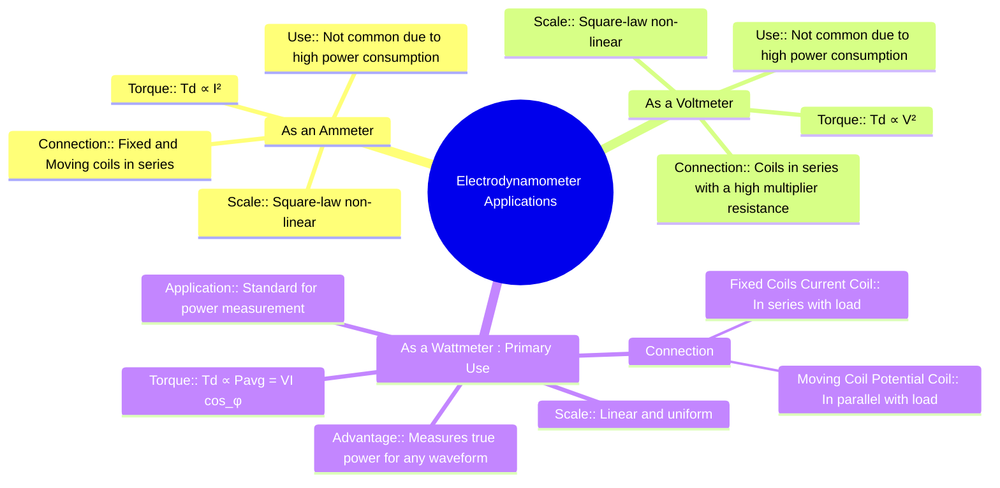

---
tags:
  - measurements
  - indicating-instruments
  - electrodynamometer
  - gate
created: 2025-10-18
aliases:
  - Electrodynamometer Applications
  - Dynamometer Ammeter
  - Dynamometer Voltmeter
  - Dynamometer Wattmeter
subject: "[[Electrical & Electronic Measurements]]"
parent:
  - Electrodynamometer Type Instruments
modified: 2026-08-04T10:46:56
---
### Use as Ammeter, Voltmeter, and Wattmeter
#electrodynamometer #ammeter #voltmeter #wattmeter

> The electrodynamometer instrument is highly versatile. By arranging its fixed and moving coils in different configurations, it can be used as an ammeter, a voltmeter, or a wattmeter. Its most significant and common application is as a wattmeter, where it serves as a standard for power measurement.

---

#### As an Ammeter
#dynamometer-ammeter

-   **Connection:** To measure current, the fixed coils (FC) and the moving coil (MC) are connected in series. The current to be measured, $I$, flows through both sets of coils.
-   **Torque Equation:** The deflecting torque is proportional to the product of the currents in the coils and the rate of change of mutual inductance ($M$) with deflection ($\theta$).
    $$ T_d = I_{FC} \cdot I_{MC} \frac{dM}{d\theta} $$
    Since the coils are in series, $I_{FC} = I_{MC} = I$.
    $$\boxed{\quad T_d = I^2 \frac{dM}{d\theta} \quad}$$
    For AC, the instrument responds to the average torque, which is proportional to the mean square current ($I_{rms}^2$).
-   **Scale:** Since the deflection $\theta$ is proportional to $I^2$, the scale is **non-linear** (a square-law scale), cramped at the beginning and spaced out at the end.
-   **Limitations:** Due to the air core, the magnetic field is weak. To produce sufficient torque, the coils require many turns, resulting in high inductance, high power consumption, and a significant voltage drop. Therefore, MI and PMMC instruments are generally preferred for current measurement.

---

#### As a Voltmeter
#dynamometer-voltmeter

-   **Connection:** The fixed and moving coils are connected in series with a high non-inductive multiplier resistance ($R_{mult}$). The entire assembly is connected across the voltage source to be measured.
-   **Torque Equation:** The current flowing through the instrument is $I = \frac{V}{Z}$, where $Z$ is the total impedance of the instrument.
    The deflecting torque is:
    $$ T_d = I^2 \frac{dM}{d\theta} = \left(\frac{V}{Z}\right)^2 \frac{dM}{d\theta} $$
    Assuming impedance $Z$ is constant, the torque is proportional to the square of the voltage.
    $$\boxed{\quad T_d \propto V^2 \quad}$$
-   **Scale:** The scale is non-linear (square-law) for the same reason as the ammeter.
-   **Limitations:** This configuration suffers from high power consumption compared to other voltmeter types and is also sensitive to frequency errors.

---

#### As a Wattmeter
#dynamometer-wattmeter #power-measurement

This is the most important and common application of the electrodynamometer instrument.

-   **Connection:**
    -   **Fixed Coils (Current Coil - CC):** The two fixed coils are connected in series with the load. They carry the load current $i_L$ and have low resistance.
    -   **Moving Coil (Potential Coil - PC):** The moving coil is connected in series with a high multiplier resistance. This combination is connected in parallel (across) the load. It carries a current $i_p$ which is proportional to the load voltage $v_L$.
-   **Principle & Torque Equation:**
    -   The instantaneous torque is proportional to the product of the instantaneous currents in the coils: $t_d(t) \propto i_{CC}(t) \cdot i_{PC}(t)$.
    -   Current in CC is the load current: $i_{CC}(t) = i_L(t)$.
    -   Current in PC is proportional to load voltage: $i_{PC}(t) = \frac{v_L(t)}{R_p}$ (where $R_p$ is the high resistance of the potential coil path, making it almost purely resistive).
    $$ t_d(t) \propto i_L(t) \cdot \frac{v_L(t)}{R_p} \propto v_L(t)i_L(t) = p(t) $$
    The instantaneous torque is proportional to the **instantaneous power** $p(t)$. Due to inertia, the pointer responds to the **average torque**:
    $$ T_d = \text{Average of } t_d(t) \propto \text{Average of } p(t) = P_{avg} $$
    For sinusoidal AC, $P_{avg} = V_{rms} I_{rms} \cos(\phi)$.
    $$\boxed{\quad T_d \propto P_{avg} = VI\cos(\phi) \quad}$$
-   **Scale:** The deflection $\theta$ is directly proportional to the average deflecting torque ($T_d$). Since $T_d \propto P_{avg}$, the deflection is directly proportional to the true power.
    $$\boxed{\quad \theta \propto P_{avg} \quad}$$
    Therefore, the scale of an electrodynamometer wattmeter is **linear and uniform**. This makes it an accurate and standard instrument for measuring true power in both DC and AC circuits, regardless of the waveform.

---

### Related Concepts
#topic/related-concepts

> [[Electrodynamometer Type Instruments]]

[[Construction and Principle of Operation of PMMC]]
[[Torque Equation of an Electrodynamometer Instrument]]
[[Errors in Wattmeter Measurement and Compensation]]
[[Measurement of Power in Three-Phase Circuits]]
[[Low Power Factor (LPF) Wattmeter]]
[[Blondel's Theorem and the Two-Wattmeter Method]]
