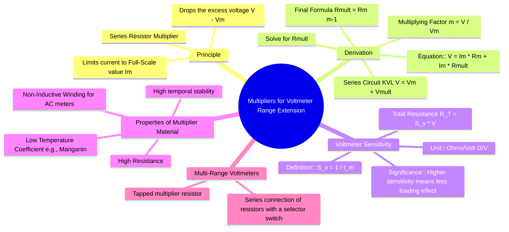

---
tags:
  - measurements
  - instrument-extension
  - voltmeter
  - multiplier
  - gate
created: 2025-10-18
aliases:
  - Voltmeter Multiplier
  - Range Extension of Voltmeter
  - Voltmeter Range Extension
subject: "[[Electrical & Electronic Measurements]]"
parent: Instrument Range Extension
modified: 2026-08-04T10:05:15
---
### Multipliers for Voltmeter Range Extension
#voltmeter #multiplier #range-extension #series-resistor

> The basic movement of a voltmeter (like a PMMC) is a low-current device that can only handle a small voltage across its terminals, known as the full-scale deflection voltage ($V_m = I_m R_m$). To measure voltages higher than this, a high resistance, called a **multiplier**, is connected in series with the meter. This multiplier limits the current to the meter's full-scale value and drops the excess voltage.

---
#### Derivation of Multiplier Resistance ($R_{mult}$)
#multiplier-derivation #multiplying-factor

The multiplier resistor ($R_{mult}$) is connected in series with the instrument's internal resistance ($R_m$).

Let:
-   $V$ = Total voltage to be measured (new range).
-   $V_m$ = Voltage drop across the meter at full-scale deflection ($V_m = I_m R_m$).
-   $I_m$ = Full-scale deflection current of the meter.
-   $R_m$ = Internal resistance of the meter.
-   $R_{mult}$ = Resistance of the multiplier.

According to Kirchhoff's Voltage Law (KVL) for the series circuit, the total voltage is the sum of the voltage drops across the meter and the multiplier:
$$ V = V_m + V_{mult} $$
Using Ohm's law, with $I_m$ being the current flowing through the series combination at full scale:
$$ V = I_m R_m + I_m R_{mult} = I_m(R_m + R_{mult}) $$
Solving for the required multiplier resistance $R_{mult}$:
$$ R_m + R_{mult} = \frac{V}{I_m} \implies R_{mult} = \frac{V}{I_m} - R_m $$
To simplify this, we introduce the **multiplying factor**, $m$:
$$ m = \frac{V}{V_m} = \frac{V}{I_m R_m} $$
This factor represents how many times the voltmeter's range is being increased. From this, $V = m V_m = m I_m R_m$. Substituting this into the equation for $R_{mult}$:
$$\begin{align}
R_{mult} &= \frac{m I_m R_m}{I_m} - R_m \\
&= m R_m - R_m
\end{align}$$
This gives the final, widely used formula:
$$\boxed{\quad R_{mult} = R_m (m - 1) \quad}$$

---

#### Voltmeter Sensitivity ($S_v$)
#voltmeter-sensitivity #loading-effect

Voltmeter sensitivity is a figure of merit that indicates how much resistance the voltmeter presents to the circuit for every volt of its range. It is defined as the reciprocal of the full-scale deflection current.
$$\boxed{\quad S_v = \frac{1}{I_m} \quad (\Omega/V) \quad}$$
A higher sensitivity is desirable as it implies a higher total resistance ($R_T = R_m + R_{mult}$) for a given range, which minimizes the **loading effect** of the voltmeter on the circuit under test.
The total resistance of the voltmeter on a range $V$ can be expressed as:
$$ R_T = \frac{V}{I_m} = S_v \cdot V $$

---

#### Properties of Multiplier Material
#multiplier-material #manganin

The material used for multipliers must have:
1.  **Low Temperature Coefficient of Resistance:** To ensure the resistance does not change significantly with temperature, which would affect the accuracy. **Manganin** or **Constantan** are commonly used.
2.  **High Stability:** The resistance value should remain constant over a long period.
3.  **Non-Inductive Winding:** For AC voltmeters, the multiplier must have negligible inductance and capacitance to minimize frequency errors. This is achieved by techniques like bifilar winding.

---

### Related Concepts
#topic/related-concepts

> [[Shunts for Ammeter Range Extension]]

[[Permanent Magnet Moving Coil (PMMC) Instruments]]
[[Voltmeter Loading Effect]]
[[Voltmeter Sensitivity]]
[[Kirchhoff's Laws]]
[[Ohm's Law]]
