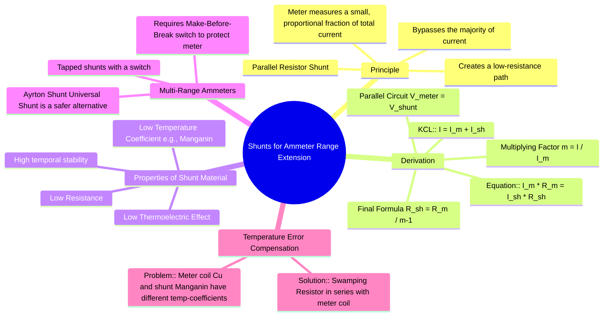

---
tags:
  - measurements
  - instrument-extension
  - ammeter
  - shunt
  - gate
created: 2025-10-18
aliases:
  - Ammeter Shunt
  - Range Extension of Ammeter
  - Ammeter Range Extension
subject: "[[Electrical & Electronic Measurements]]"
parent:
  - Instrument Range Extension
modified: 2026-08-04T10:27:17
---
### Shunts for Ammeter Range Extension
#ammeter #shunt #range-extension #parallel-resistor

> An ammeter's basic movement (like a PMMC) is a delicate instrument designed to handle only very small currents, known as the full-scale deflection current ($I_m$). To measure currents larger than this, a low-resistance conductor called a **shunt** is connected in parallel with the ammeter. The shunt bypasses the majority of the current, allowing only a small, known fraction to flow through the meter itself.

---

#### Derivation of Shunt Resistance ($R_{sh}$)
#shunt-derivation #multiplying-factor

The shunt resistor ($R_{sh}$) is connected in parallel with the instrument's internal resistance ($R_m$).

Let:
-   $I$ = Total current to be measured (new range).
-   $I_m$ = Full-scale deflection current of the meter.
-   $R_m$ = Internal resistance of the meter.
-   $I_{sh}$ = Current flowing through the shunt.
-   $R_{sh}$ = Resistance of the shunt.

Since the shunt and the meter are in parallel, the voltage drop across both is identical:
$$ V_m = V_{sh} $$
$$ I_m R_m = I_{sh} R_{sh} $$
From Kirchhoff's Current Law (KCL) at the input node:
$$ I = I_m + I_{sh} \implies I_{sh} = I - I_m $$
Substituting this into the voltage equation:
$$ I_m R_m = (I - I_m) R_{sh} $$
Solving for the required shunt resistance $R_{sh}$:
$$ R_{sh} = \frac{I_m R_m}{I - I_m} $$
To simplify this, we introduce the **multiplying factor (or multiplying power)**, $m$:
$$ m = \frac{I}{I_m} $$
This factor represents how many times the ammeter's range is being increased. Rearranging gives $I = m I_m$. Substituting this into the equation for $R_{sh}$:
$$\begin{align}
R_{sh} &= \frac{I_m R_m}{m I_m - I_m} \\
&= \frac{I_m R_m}{I_m (m - 1)}
\end{align}$$
This gives the final, widely used formula:
$$\boxed{\quad R_{sh} = \frac{R_m}{m - 1} \quad}$$

---

#### Properties of Shunt Material
#shunt-material #manganin

The material used for shunts must have specific properties to ensure accuracy:
1.  **Low Temperature Coefficient of Resistance:** The shunt's resistance must remain constant with temperature changes. Otherwise, the current division ratio between the shunt and meter would change, causing significant measurement errors. **Manganin** (an alloy of copper, manganese, and nickel) is the most common material for this purpose.
2.  **Low Thermoelectric Effect:** The junction between the shunt material and the copper leads of the instrument should not generate a thermal EMF, which could affect the accuracy of DC measurements. Manganin has a very low thermoelectric effect with copper.
3.  **High Stability:** The resistance of the shunt should not change over time.

---

#### Temperature Error Compensation
#swamping-resistance #temperature-compensation

A significant source of error is the difference in temperature coefficients between the meter's copper coil and the Manganin shunt. To mitigate this, a **swamping resistance**, made of Manganin, is connected in series with the meter coil. This makes the overall temperature coefficient of the meter branch much smaller and closer to that of the shunt, thus minimizing temperature-induced errors.

---

#### Multi-Range Ammeters
#multi-range-ammeter #ayrton-shunt

For multi-range ammeters, a switch is used to select different shunt resistors. It is critical that this is a **make-before-break switch**. This type of switch connects to the new shunt *before* disconnecting from the old one, ensuring the meter is never left unshunted in the live circuit, which would force the entire current through its delicate coil. The **Ayrton Shunt** (or Universal Shunt) is a more sophisticated arrangement that provides multiple ranges while inherently protecting the meter movement.

---

### Related Concepts
#topic/related-concepts

> [[Multipliers for Voltmeter Range Extension]]

[[Permanent Magnet Moving Coil (PMMC) Instruments]]
[[Moving Iron (MI) Instruments]]
[[Ammeter-Voltmeter Method for Low Resistance]]
[[Kirchhoff's Laws]]
[[Ohm's Law]]
