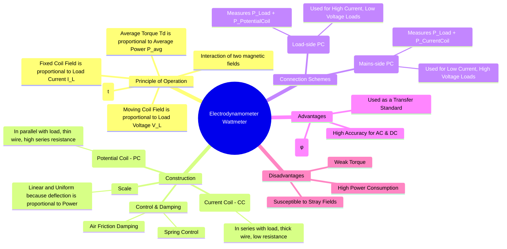

---
tags:
  - measurements
  - power-measurement
  - electrodynamometer
  - wattmeter
  - gate
created: 2025-10-18
aliases:
  - Dynamometer Wattmeter
  - Wattmeter
subject: "[[Electrical & Electronic Measurements]]"
parent:
  - Measurement of Power and Energy 
modified: 2026-08-04T09:36:57
---
### Electrodynamometer Wattmeter
#electrodynamometer #wattmeter #power-measurement

> The electrodynamometer wattmeter is the most fundamental and accurate instrument for measuring electric power in both DC and AC circuits. Its operation relies on the electrodynamic principle, where the torque produced is proportional to the product of the currents in two sets of coils, which are connected to represent the load current and voltage.

---

#### Construction
#wattmeter-construction

A wattmeter has two coil systems: a fixed system and a moving system.
1.  **Fixed Coils (Current Coil - CC):**
    -   These coils are connected **in series with the load** to carry the full load current ($I_L$).
    -   They are wound with a few turns of thick wire to have low resistance and high current-carrying capacity. They are split into two halves to create a uniform magnetic field.

2.  **Moving Coil (Potential Coil - PC):**
    -   This coil is connected **in parallel with the load**, across the voltage supply.
    -   It is wound with many turns of thin wire and connected in series with a high non-inductive multiplier resistor. This makes the potential coil circuit highly resistive, ensuring that the current through it ($I_p$) is in phase with and directly proportional to the load voltage ($V_L$).

3.  **Control and Damping:**
    -   **Spring control** provides the controlling torque. The springs also serve as leads for the current to the moving coil.
    -   **Air friction damping** is used to damp the oscillations of the pointer.

---

#### Principle of Operation
#wattmeter-principle

The instantaneous torque ($t_d$) on the moving coil is proportional to the product of the instantaneous currents in the fixed and moving coils.
$$ t_d(t) \propto i_{cc}(t) \cdot i_{pc}(t) $$
-   Current in the Current Coil: $i_{cc}(t) = i_L(t)$ (Load current)
-   Current in the Potential Coil: $i_{pc}(t) = \frac{v_L(t)}{R_p}$ (Proportional to Load voltage)
where $R_p$ is the total high resistance of the potential coil circuit.

Substituting these into the torque equation:
$$ t_d(t) \propto i_L(t) \cdot \frac{v_L(t)}{R_p} \propto v_L(t)i_L(t) = p(t) $$
The instantaneous torque is proportional to the **instantaneous power** consumed by the load.

Due to the inertia of the moving system, the pointer responds to the **average torque** over a cycle.
$$\begin{align}
T_d &= \text{Average of } t_d(t) \propto \text{Average of } p(t) \\
T_d &\propto P_{avg}
\end{align}$$
For sinusoidal AC, the average power is $P_{avg} = V_{L} I_{L} \cos(\phi)$, where $\phi$ is the phase angle between the load voltage and current. At equilibrium, $T_d = T_c = K_s\theta$.
$$\boxed{\quad \theta \propto P_{avg} = V_{L} I_{L} \cos(\phi) \quad}$$
Since the deflection $\theta$ is directly proportional to the average power, the wattmeter has a **linear and uniform scale**.

---

#### Wattmeter Connections
#wattmeter-connections #measurement-error

There are two ways to connect the potential coil, which affects what the wattmeter actually measures. This choice is crucial for minimizing measurement errors.

1.  **L-C Short Connection (PC on Load side):**
    -   The potential coil is connected directly across the load terminals.
    -   The current coil is placed before the PC and measures the sum of load current ($I_L$) and potential coil current ($I_p$).
    -   **Measured Power = Power in Load + Power Loss in Potential Coil**
        $$ P_{measured} = P_{load} + P_{PC} = P_{load} + \frac{V_L^2}{R_p} $$
    -   This connection is preferred for **high current, low voltage loads** where $I_L \gg I_p$.

2.  **M-C Short Connection (PC on Mains side):**
    -   The potential coil is connected across the supply side, including the current coil.
    -   The current coil measures only the true load current ($I_L$).
    -   The potential coil measures the voltage drop across both the current coil and the load ($V_{CC} + V_L$).
    -   **Measured Power = Power in Load + Power Loss in Current Coil**
        $$ P_{measured} = P_{load} + P_{CC} = P_{load} + I_L^2 R_c $$
    -   This connection is preferred for **low current, high voltage loads** where the voltage drop across the current coil is negligible.

---

### Related Concepts
#topic/related-concepts

> [[Errors in Wattmeter Measurement and Compensation]]

[[Use as Ammeter, Voltmeter, and Wattmeter]]
[[Low Power Factor (LPF) Wattmeter]]
[[Blondel's Theorem and the Two-Wattmeter Method]]
[[Measurement of Power in Three-Phase Circuits]]
[[Torque Equation of an Electrodynamometer Instrument]]
[[Construction and Principle of Operation of PMMC]]
