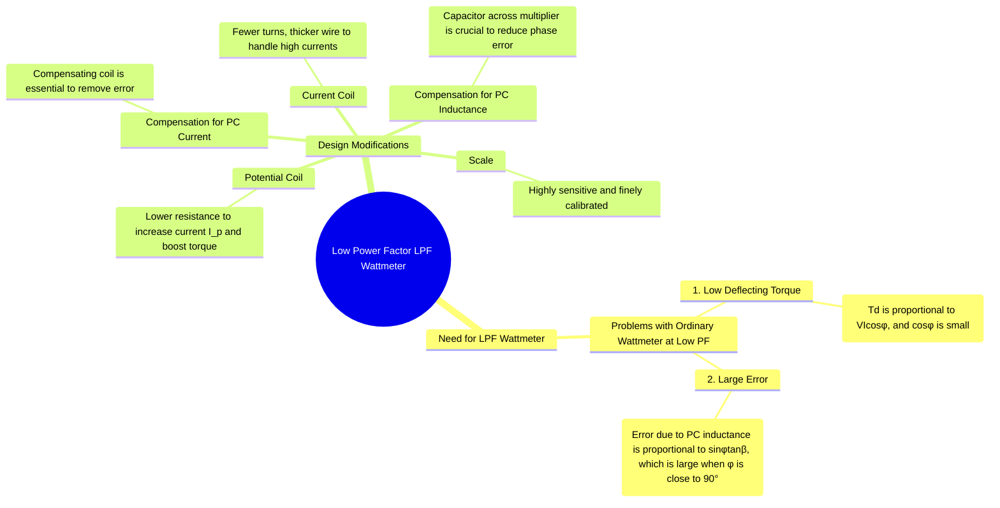

---
tags:
  - measurements
  - power-measurement
  - wattmeter
  - lpf
  - gate
created: 2025-10-18
aliases:
  - LPF Wattmeter
  - Low Power Factor Wattmeter
subject: "[[Electrical & Electronic Measurements]]"
parent: "[[Electrodynamometer Wattmeter]]"
modified: 2026-08-04T09:56:34
---
### Low Power Factor (LPF) Wattmeter
#lpf-wattmeter #power-measurement #error-compensation

> A Low Power Factor (LPF) wattmeter is a specially designed electrodynamometer wattmeter used for accurately measuring power in circuits where the phase angle between voltage and current is large (i.e., the power factor, $\cos\phi$, is very low). Examples include measuring the no-load losses of a transformer or the power consumed by fluorescent lamps. Ordinary wattmeters are unsuitable for this task due to their low torque and high inherent errors under low PF conditions.

---

#### Problems with Ordinary Wattmeters at Low Power Factor
#wattmeter-error/low-pf

When an ordinary wattmeter is used to measure power in a low power factor circuit, two major problems arise:

1.  **Small Deflecting Torque:**
    The deflecting torque is proportional to the true power: $T_d \propto VI \cos\phi$. When the power factor $\cos\phi$ is very low (e.g., 0.1 or less), the torque produced is extremely small, even if the voltage $V$ and current $I$ are at their rated values. This results in a very small deflection that is difficult to read accurately.

2.  **Large Measurement Error due to Potential Coil Inductance:**
    The error caused by the inductance of the potential coil becomes unacceptably large at low power factors. The error is given by:
    $$ \text{Error} \approx V I \sin\phi \tan\beta $$
    where $\beta$ is the phase angle of the potential coil circuit. At a low power factor, the load phase angle $\phi$ is close to $90^\circ$, so $\sin\phi \approx 1$. This makes the error value large and a significant fraction of the true power ($VI \cos\phi$). The percentage error becomes very high.

---

#### Design Modifications in LPF Wattmeters
#lpf-wattmeter/construction

To overcome these issues, LPF wattmeters incorporate several key design modifications:

1.  **Current Coil (CC):**
    The current coil is designed to have a higher current rating. It is wound with **fewer turns of thicker wire** to handle the large reactive currents typical of low PF loads, and to keep its own resistance and power loss ($I^2R_c$) minimal.

2.  **Potential Coil (PC):**
    The total resistance of the potential coil circuit is kept **as low as possible** (while still being primarily resistive). This increases the current flowing through the potential coil ($I_p = V/R_p$). A larger $I_p$ results in a stronger magnetic field from the moving coil, which significantly boosts the deflecting torque ($T_d \propto I_c I_p \cos\phi$), making the instrument usable even when $\cos\phi$ is small.

3.  **Compensation for Potential Coil Current:**
    An LPF wattmeter is almost always equipped with a **compensating coil**. Because the potential coil current ($I_p$) is deliberately made larger, it can be a significant fraction of the total current being measured by the current coil. The compensating coil is essential to cancel out the effect of $I_p$ and ensure the wattmeter only measures the power due to the true load current.

4.  **Compensation for Potential Coil Inductance:**
    This is the most critical feature. A **capacitor** is connected in parallel across a portion of the multiplier resistor in the potential coil circuit. This capacitor introduces a leading current component that cancels the lagging current caused by the coil's inductance. This compensation makes the phase angle $\beta$ of the potential coil circuit virtually zero, thus eliminating the large error associated with it at low power factors.

5.  **Scale:**
    The instrument has a sensitive movement and a finely divided, uniform scale, allowing for precise readings of the small deflections produced.

---

### Related Concepts
#topic/related-concepts

> [[Electrodynamometer Wattmeter]]

[[Errors in Wattmeter Measurement and Compensation]]
[[Power Factor]]
[[Measurement of Power in Three-Phase Circuits]]
[[Instrument Transformers]]
[[Blondel's Theorem and the Two-Wattmeter Method]]