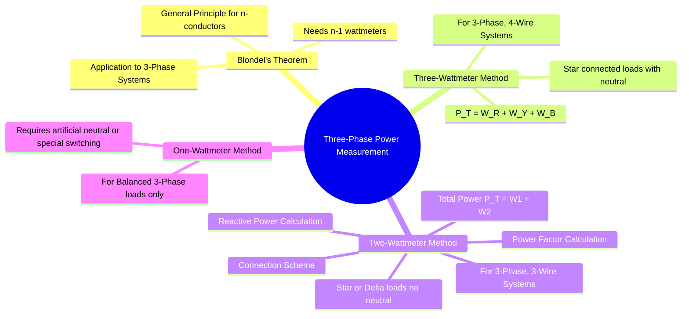

---
tags:
  - measurements
  - power-measurement
  - three-phase
  - wattmeter
  - gate
created: 2025-10-18
aliases:
  - Three-Phase Power Measurement
  - 2-Wattmeter Method
  - Two-Wattmeter Method
subject: "[[Electrical & Electronic Measurements]]"
parent:
  - Measurement of Power and Energy 
modified: 2026-08-04T10:01:29
---
### Measurement of Power in Three-Phase Circuits
#three-phase #power-measurement #blondels-theorem

> The measurement of total power in a three-phase system is governed by Blondel's Theorem. This leads to the use of three, two, or one wattmeter depending on the system configuration and load balance. The two-wattmeter method is the most important and versatile technique for 3-wire systems.

---
#### Blondel's Theorem
#blondels-theorem

![[Blondel's Theorem and the Two-Wattmeter Method#Blondel's Theorem]]

---

#### Two-Wattmeter Method (for 3-Phase, 3-Wire Systems)
#two-wattmeter-method

This is the most common method and is valid for both balanced and unbalanced loads in a 3-wire system.

-   **Connection:** The current coils (CC) of the two wattmeters ($W_1$ and $W_2$) are inserted into any two of the three lines (e.g., R and B). The potential coil (PC) of each wattmeter is connected between its own line and the third line (Y), which acts as the common point.

-   **Phasor Analysis (for a balanced inductive load):**
    Let's assume a star-connected load with phase sequence R-Y-B and a lagging power factor angle $\phi$.
    -   Current in $W_1$ = $I_R$
    -   Voltage across PC of $W_1$ = $V_{RY}$ (Line Voltage)
    -   Current in $W_2$ = $I_B$
    -   Voltage across PC of $W_2$ = $V_{BY}$ (Line Voltage)

    From the phasor diagram, the angle between $V_{RY}$ and $I_R$ is $(30^\circ + \phi)$. The angle between $V_{BY}$ and $I_B$ is $(30^\circ - \phi)$.

-   **Reading of Wattmeter 1:**

$$W_1 = V_{RY} I_R \cos(30^\circ + \phi) = V_L I_L \cos(30^\circ + \phi)$$
^wattmeter1-reading

-   **Reading of Wattmeter 2:**

$$W_2 = V_{BY} I_B \cos(30^\circ - \phi) = V_L I_L \cos(30^\circ - \phi)$$
^wattmeter2-reading

-   **Total Active Power ($P_T$):**
    The total power is the algebraic sum of the two readings.

$$\begin{align}
P_T &= W_1 + W_2 = V_L I_L [\cos(30^\circ + \phi) + \cos(30^\circ - \phi)] \\
&= V_L I_L [2 \cos(30^\circ) \cos(\phi)] \\
&= V_L I_L [2 \cdot (\sqrt{3}/2) \cos(\phi)]
\end{align}$$

$$\boxed{\quad P_T = W_1 + W_2 = \sqrt{3} V_L I_L \cos(\phi) \quad}$$
^total-active-power

This result holds true even for unbalanced loads, where it measures the true total power.

-   **Total Reactive Power ($Q_T$):**

$$\begin{align}
W_2 - W_1 &= V_L I_L [\cos(30^\circ - \phi) - \cos(30^\circ + \phi)] \\
&= V_L I_L [2 \sin(30^\circ) \sin(\phi)] \\
&= V_L I_L [2 \cdot (1/2) \sin(\phi)] = V_L I_L \sin(\phi)
\end{align}$$

The total three-phase reactive power is $Q_T = \sqrt{3} V_L I_L \sin(\phi)$. Therefore:

$$\boxed{\quad Q_T = \sqrt{3} (W_2 - W_1) \quad}$$
^total-reactive-power

-   **Power Factor Calculation:**
    By dividing the two derived expressions:
    $$ \frac{Q_T}{P_T} = \frac{\sqrt{3} (W_2 - W_1)}{W_1 + W_2} = \frac{\sqrt{3} V_L I_L \sin(\phi)}{\sqrt{3} V_L I_L \cos(\phi)} = \tan(\phi) $$
    $$\boxed{\quad \tan(\phi) = \sqrt{3} \frac{W_2 - W_1}{W_1 + W_2} \quad}$$
    From this, the power factor angle $\phi$ and the power factor $\cos(\phi)$ can be determined.

---

#### Effect of Power Factor on Wattmeter Readings (Balanced Load)

| Power Factor ($\cos\phi$) | PF Angle ($\phi$) | $W_1 = V_L I_L \cos(30+\phi)$ | $W_2 = V_L I_L \cos(30-\phi)$ | Remark                  |
| ------------------------ | ----------------- | -------------------------------- | -------------------------------- | ----------------------- |
| 1.0 (UPF)                | $0^\circ$         | Positive                         | Positive                         | $W_1 = W_2$             |
| 0.5 lag                  | $60^\circ$        | Zero                             | Positive                         | $P_T = W_2$             |
| < 0.5 lag                | $>60^\circ$       | Negative                         | Positive                         | $P_T = W_2 - \|W_1\|$     |
| 0.0 lag (ZPF)            | $90^\circ$        | Negative                         | Positive                         | $W_1 = -W_2$, $P_T = 0$ |

**Note on Negative Reading:** If one wattmeter ($W_1$) tries to deflect backward (reads negative), its current coil or potential coil terminals must be reversed to get a positive reading. This reading is then treated as negative in calculations for total power and power factor.

---

#### Three-Wattmeter Method (for 3-Phase, 4-Wire Systems)
#three-wattmeter-method

This method is used for 4-wire systems, typically star-connected loads with a neutral connection.
-   **Connection:** The current coil of each of the three wattmeters is connected in each of the three lines (R, Y, B). The potential coil of each wattmeter is connected between its respective line and the neutral (N).
-   **Total Power:** Each wattmeter measures the power of the phase it is connected to. The total power is the simple algebraic sum of the three readings.
    $$\boxed{\quad P_T = W_R + W_Y + W_B \quad}$$

---
### Related Concepts
#topic/related-concepts

> [[Blondel's Theorem and the Two-Wattmeter Method]]

[[Electrodynamometer Wattmeter]]
[[Errors in Wattmeter Measurement and Compensation]]
[[Low Power Factor (LPF) Wattmeter]]
[[Three-Phase Circuits]]
[[Power Factor]]
[[Phasor Diagram]]
