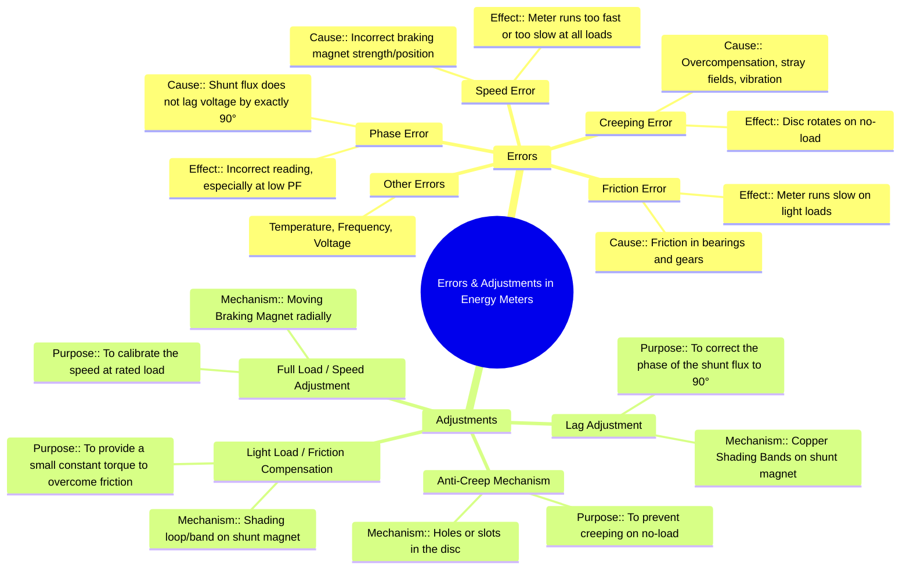

---
tags:
  - measurements
  - energy-measurement
  - error-analysis
  - induction-meter
  - gate
created: 2025-10-18
aliases:
  - Energy Meter Errors
  - Energy Meter Adjustments
  - Meter Calibration
subject: "[[Electrical & Electronic Measurements]]"
parent: "[[Single-Phase Induction Type Energy Meter]]"
modified: 2026-08-04T09:39:15
---
### Errors and Adjustments in Energy Meters
#energy-meter #error-analysis #meter-calibration

> As an electromechanical instrument, the induction energy meter is subject to several inherent errors. To ensure accuracy, it is designed with various mechanisms for adjustment and calibration. These adjustments are typically made sequentially to correct for specific types of errors.

---

#### 1. Phase and Power Factor Error
#phase-angle-error #power-factor-error

-   **Cause:** The driving torque is proportional to $VI\cos(\phi)$ only if the shunt magnet flux ($\phi_{sh}$) lags the supply voltage ($V$) by exactly $90^\circ$. In reality, due to the resistance of the potential coil, this angle is slightly less than $90^\circ$. This results in an incorrect measurement, with the error being most pronounced at low power factors.
-   **Adjustment (Lag Adjustment):** To correct this, **copper shading bands** (or a lag coil) are placed on the central limb of the shunt magnet. The position of these bands is adjustable. The induced currents in these bands produce their own magnetic flux, which interacts with the main shunt flux to shift its phase. The bands are adjusted until the total shunt flux lags the supply voltage by precisely $90^\circ$. This adjustment is typically carried out while the meter is running on a load with a low power factor (e.g., 0.5 lagging).

---

#### 2. Speed Error
#speed-error #calibration

-   **Cause:** The speed of the disc may not be correct even if the power measurement is accurate. This is due to the braking torque not being correctly calibrated for the driving torque. If the braking torque is too weak, the disc will run fast; if it's too strong, it will run slow.
-   **Adjustment (Full Load or Speed Adjustment):** The braking torque is produced by the permanent brake magnet and is proportional to the flux it provides. The magnitude of this braking torque is adjusted by changing the **radial position of the brake magnet**.
    -   Moving the magnet **towards the edge** of the disc increases the flux cut by the disc, increasing the braking torque and making the meter run **slower**.
    -   Moving the magnet **towards the center** of the disc decreases the braking torque, making the meter run **faster**.
    This adjustment is performed at the rated or full load current and unity power factor.

---

#### 3. Friction Error (Light Load Error)
#friction-error #light-load-adjustment

-   **Cause:** Mechanical friction from the spindle's bearings and the registering gear mechanism provides a small, constant retarding torque. At high loads, this is negligible, but at very light loads, it can be a significant fraction of the driving torque, causing the meter to run slow or even stop.
-   **Adjustment (Light Load or Friction Compensator):** A small, constant driving torque is added to the system to counteract the friction. This is achieved by placing a small **copper shading loop or band** in the air gap of the shunt magnet, slightly off-center. Its position is adjustable. This loop creates a small, constant, asymmetrical flux that produces a small driving torque, independent of the load current. The loop is adjusted so that this torque just overcomes the friction without causing rotation on no-load. This adjustment is done at a very light load (e.g., 5-10% of full load).

---

#### 4. Creeping Error
#creeping-error #no-load-error

-   **Cause:** "Creeping" is a phenomenon where the disc rotates slowly and continuously even when there is no load current. It can be caused by over-compensation for friction, excessive supply voltage, vibrations, or stray magnetic fields. This leads to the consumer being billed for energy not consumed.
-   **Adjustment (Anti-Creep Mechanism):** To prevent creeping, two **diametrically opposite holes are drilled** in the aluminum disc. When a hole comes under the pole of the shunt magnet, the path for eddy currents is distorted. This causes a sufficient opposing torque to stop the disc. The continuous torque from the friction compensator is not strong enough to move the disc past this stopping point.

---

### Other Errors
-   **Temperature Error:** Changes in temperature affect the resistance of the coils, the strength of the braking magnet, and friction. These effects partially cancel each other out, and modern meters use materials with low temperature coefficients to minimize this error.
-   **Frequency and Voltage Errors:** Energy meters are designed for a specific frequency and voltage. Deviations from these rated values can introduce errors. These are typically minimized by careful design rather than user adjustments.

---

### Related Concepts
#topic/related-concepts

> [[Single-Phase Induction Type Energy Meter]]

[[Construction, Principle, and Operation]]
[[Eddy Currents]]
[[Power Factor]]
[[lenz's law]]
[[Electrodynamometer Wattmeter]]
