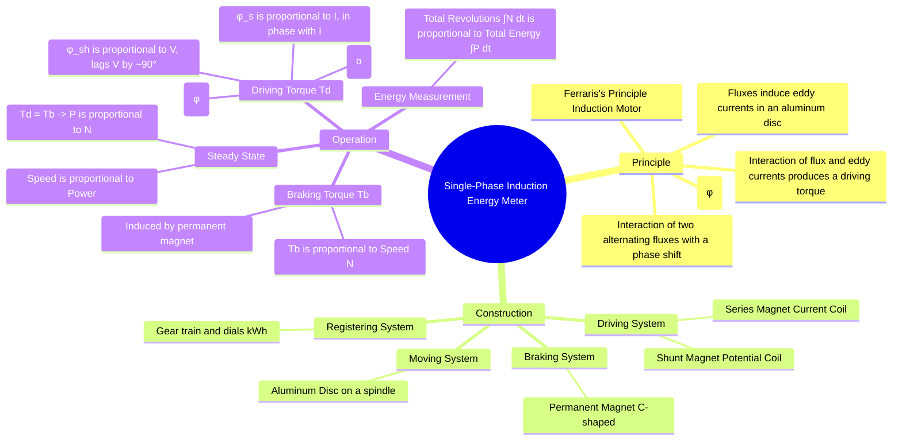

---
tags:
  - measurements
  - energy-measurement
  - induction-meter
  - gate
created: 2025-10-18
aliases:
  - Energy Meter
  - kWh Meter
  - Induction Type Energy Meter
subject: "[[Electrical & Electronic Measurements]]"
parent:
  - Measurement of Power and Energy 
modified: 2026-08-04T10:28:43
---
### Single-Phase Induction Type Energy Meter
#energy-meter #induction-principle #kwh-measurement

> The single-phase induction type energy meter is an integrating instrument that continuously measures and records the electrical energy consumed over a period of time. It operates on the principle of an induction motor, where a driving torque is produced on a rotating aluminum disc by the interaction of two magnetic fluxes, which is then counteracted by a braking torque. The total number of revolutions of the disc is proportional to the energy consumed.

---
#### Construction
#energy-meter/construction

An energy meter consists of four main systems:
1.  **Driving System:** This produces the driving torque. It consists of two laminated silicon steel electromagnets:
    -   **Shunt Magnet (Potential Coil - PC):** Wound with many turns of thin wire, it is connected in parallel with the supply voltage. Its coil is made highly inductive to ensure its magnetic flux ($\phi_{sh}$) lags the supply voltage by nearly $90^\circ$.
    -   **Series Magnet (Current Coil - CC):** Wound with a few turns of thick wire, it is connected in series with the load. Its magnetic flux ($\phi_s$) is proportional to and in phase with the load current.

2.  **Moving System:** This consists of a lightweight aluminum disc mounted on a vertical spindle. The disc is positioned in the air gap between the two electromagnets and is free to rotate.

3.  **Braking System:** This provides the braking torque to control the disc's speed. It consists of a C-shaped permanent magnet (the braking magnet) placed at the edge of the aluminum disc. As the disc rotates, it cuts the magnetic flux of this magnet, inducing eddy currents that produce a braking torque proportional to the disc's speed.

4.  **Registering System:** This is a gear train mechanism driven by the spindle of the moving system. It counts the total number of revolutions of the disc and displays the corresponding energy consumed, typically in kilowatt-hours (kWh), on a set of dials.

---

#### Principle and Operation
#energy-meter/operation #ferraris-principle

The operation is based on producing a driving torque proportional to the power consumed and balancing it against a braking torque proportional to the speed of rotation.

##### 1. Driving Torque ($T_d$)
The alternating fluxes from the shunt magnet ($\phi_{sh}$) and series magnet ($\phi_s$) induce eddy currents in the aluminum disc. The key to producing a net torque is the phase difference between these two fluxes. The flux from one magnet interacts with the eddy currents induced by the *other* magnet.

-   Shunt flux $\phi_{sh}$ is proportional to voltage $V$ and lags it by nearly $90^\circ$.
-   Series flux $\phi_s$ is proportional to current $I$ and is in phase with it.

The phase angle between the two fluxes, $\alpha$, becomes approximately $(90^\circ - \phi)$, where $\phi$ is the power factor angle of the load. The instantaneous driving torque is proportional to the product of the fluxes and the sine of the angle between them. The average driving torque is:
$$\begin{align}
T_d &\propto \phi_{sh} \phi_s \sin(\alpha) \\
&\propto V I \sin(90^\circ - \phi) \\
&\propto V I \cos(\phi)
\end{align}$$
Therefore, the driving torque is directly proportional to the true power consumed by the load.
$$\boxed{\quad T_d \propto P \quad}$$

##### 2. Braking Torque ($T_b$)
As the disc rotates with speed $N$, it cuts the flux from the permanent braking magnet. This induces eddy currents in the disc, which, by Lenz's law, create a force opposing the motion. This braking torque is directly proportional to the speed of the disc.
$$\boxed{\quad T_b \propto N \quad}$$

##### 3. Steady-State Operation and Energy Measurement
The disc achieves a steady speed ($N$) when the driving torque equals the braking torque.
$$ T_d = T_b $$
$$ P \propto N $$
This means the **speed of the disc is directly proportional to the power consumed**.

Since energy is the integral of power over time ($E = \int P \, dt$), the total number of revolutions of the disc (which is the integral of its speed) is proportional to the total energy consumed.
$$ \text{Total Revolutions} = \int N \, dt \propto \int P \, dt = E $$
The registering mechanism is calibrated with a **meter constant (K)**, usually given in revolutions/kWh, to accurately record the energy consumed.

---

### Related Concepts
#topic/related-concepts

> [[Errors and Adjustments in Energy Meters]]

[[Electrodynamometer Wattmeter]]
[[Eddy Currents]]
[[Induction Motor]]
[[Power Factor]]
[[Instrument Transformers]]
[[lenz's law]]
