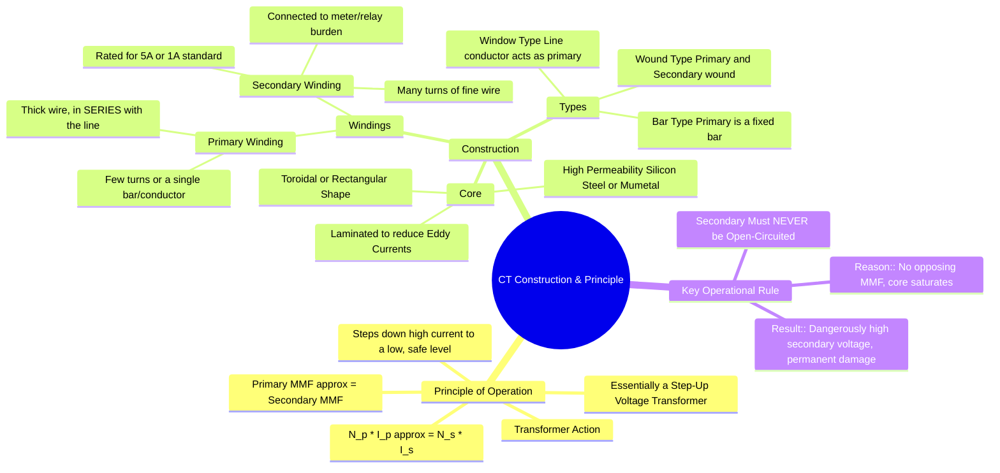

---
tags:
  - measurements
  - instrument-transformers
  - current-transformer
  - ct
  - gate
created: 2025-10-18
aliases:
  - CT
  - Current Transformer
  - CT Construction
  - CT Principle
subject:
  - "[[Electrical & Electronic Measurements]]"
parent:
  - "[[Transformers]]"
modified: 2026-08-04T09:26:03
---
### Construction and Principle of Operation of a Current Transformer (CT)
#current-transformer #instrument-transformer

> A Current Transformer (CT) is an instrument transformer used to measure or monitor high alternating currents. It produces a secondary current that is accurately proportional to the primary current but at a much lower, safer magnitude. The CT's primary is connected in series with the high-current line, effectively making it a current sensor.

---

### Principle of Operation
#ct/principle #transformer-action

A CT works on the same principle as a standard power transformer. When an alternating current ($I_p$) flows through the primary winding, it produces an alternating magnetic flux in the core. This flux links the secondary winding and, according to Faraday's Law of Induction, induces an electromotive force (EMF). This EMF drives the secondary current ($I_s$) through the connected load (the "burden"), which is typically an ammeter, a relay, or the current coil of a wattmeter.

The operation is governed by the MMF (Magnetomotive Force) balance equation:
$$ N_p I_p = N_s I_s + I_e N_p $$
where $I_e$ is the exciting current required to magnetize the core. In an ideal CT, the exciting current is negligible ($I_e \approx 0$). This leads to the ideal MMF balance:
$$ N_p I_p \approx N_s I_s $$
The **Transformation Ratio (Nominal Ratio, $K_n$)** is therefore:
$$\boxed{\quad K_n = \frac{I_p}{I_s} \approx \frac{N_s}{N_p} \quad}$$
A CT is a **current step-down** transformer ($I_s < I_p$). As seen from the ratio, this requires the secondary turns ($N_s$) to be much greater than the primary turns ($N_p$). Consequently, a CT acts as a **voltage step-up** transformer.

---

### Construction
#ct/construction

1.  **Core:**
    -   The core is made from high-permeability, low-loss materials like silicon steel or Mumetal. This is crucial to minimize the exciting current ($I_e$), which is the primary source of measurement errors.
    -   It is constructed from thin laminations to reduce eddy current losses. The core is typically toroidal (ring-shaped) for maximum accuracy and to minimize [[Ideal and Practical Transformers#^leakage-flux|leakage flux]].

2.  **Windings:**
    -   **Primary Winding:** This winding is connected in series with the high-current line. It consists of a **very small number of turns** (often just a single turn) of a thick conductor capable of carrying the full line current.
    -   **Secondary Winding:** This winding has a **large number of turns** of finer wire. It is wound uniformly over the core to minimize leakage reactance. The terminals of the secondary winding are connected to the measuring instrument or protective relay. The standard secondary current ratings are **5 A** or **1 A**.

#### Types of CTs
-   **Wound Type:** The primary and secondary windings are wound on the core, similar to a conventional transformer. The primary has more than one full turn.
-   **Bar Type:** The primary winding is a single bar of conductor that is an integral part of the CT.
-   **Window (or Toroidal) Type:** This type has only a secondary winding on a toroidal core. The high-current line conductor is passed through the hole or "window" of the toroid, acting as a single-turn primary winding.

---

### Why the CT Secondary Must Never Be Open-Circuited
#safety #ct/operation

This is the most critical operational rule for a current transformer.
-   **Normal Operation:** Under normal conditions, the secondary current ($I_s$) creates an MMF ($N_s I_s$) that opposes the primary MMF ($N_p I_p$). The net MMF is very small, just enough to produce the working flux in the core.
-   **Open-Circuit Condition:** If the secondary circuit is opened while the primary is energized, the secondary current becomes zero ($I_s=0$). The opposing MMF disappears. The entire primary MMF ($N_p I_p$) now acts as a magnetizing force, driving the core into deep saturation.
-   **Consequences:**
    1.  **Dangerously High Voltage:** The flux in the saturated core changes extremely rapidly as it passes through zero. This high rate of change of flux ($d\phi/dt$) induces a very high, potentially lethal voltage across the open secondary terminals.
    2.  **Permanent Damage:** The extreme flux density can permanently magnetize the core, degrading its magnetic properties and destroying the accuracy of the CT.

**Therefore, the secondary terminals of a CT must always be short-circuited or connected to its burden before the primary is energized.**

---

### Related Concepts
#topic/related-concepts

> [[Phasor Diagram of a CT]]

[[8. Electrical & Electronic Measurements/6. Instrument Transformers/1. Current Transformers (CT)/Ratio Error and Phase Angle Error]]
[[Instrument Transformers]]
[[Potential Transformers (PT)]]
[[Difference between CT and PT]]
[[Transformer]]
[[Faraday's Law of Induction]]