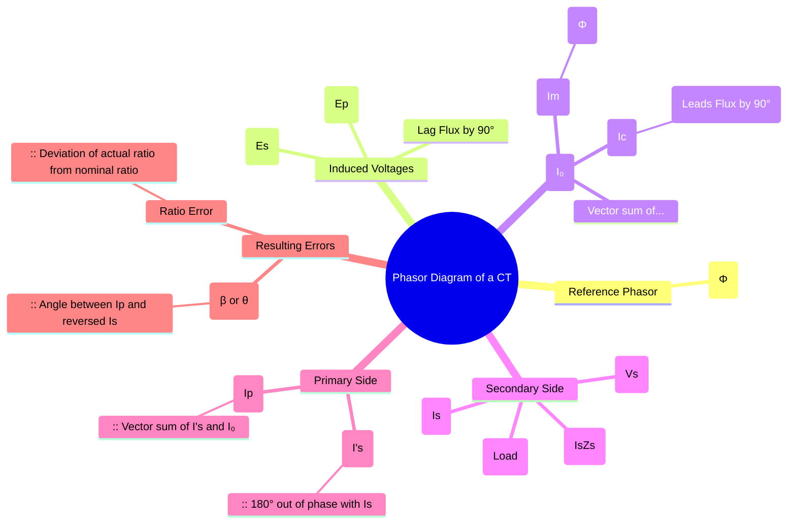

---
tags:
  - instrument-transformer
  - current-transformer
  - phasor-diagram
  - electrical-measurements
  - gate
created: 2025-10-18
aliases:
  - CT Phasor Diagram
  - Current Transformer Phasor Diagram
subject: "[[Electrical & Electronic Measurements]]"
parent:
  - Current Transformers (CT)
modified: 2026-08-04T10:12:47
---
### Phasor Diagram of a Current Transformer (CT)
#current-transformer/phasor-diagram #instrument-transformer/errors

> The phasor diagram of a Current Transformer (CT) is a graphical representation of the magnitudes and phase relationships between the various voltages and currents within the transformer. It is crucial for understanding the sources of errors in a CT, namely the **Ratio Error** and the **Phase Angle Error**, which arise primarily due to the exciting current ($I_0$) required to magnetize the core.

---
#### Construction of the Phasor Diagram
#phasor-diagram/construction

The phasor diagram is constructed step-by-step, typically assuming a lagging power factor burden on the secondary side.

1.  **Reference Phasor**: The mutual flux $\Phi$ in the core is taken as the reference phasor.
2.  **Induced EMFs**: The EMFs induced in the primary ($E_p$) and secondary ($E_s$) windings lag the flux $\Phi$ by $90^\circ$, according to Faraday's law of induction ($e = -N \frac{d\phi}{dt}$).
    $$E_p \text{ and } E_s \text{ lag } \Phi \text{ by } 90^\circ$$
3.  **Exciting Current ($I_0$)**: This is the no-load current required by the primary. It has two components:
    *   **Magnetizing Current ($I_m$)**: This component sets up the flux and is in phase with $\Phi$.
    *   **Core-Loss Current ($I_c$ or $I_w$)**: This component supplies the hysteresis and eddy current losses in the core. It is in phase with the voltage component that causes the loss, which is equal and opposite to $E_p$. Thus, $I_c$ leads $\Phi$ by $90^\circ$.
    The exciting current is the vector sum: $I_0 = I_m + I_c$.
4.  **Secondary Current ($I_s$)**: The secondary current $I_s$ is determined by the secondary EMF ($E_s$) and the total impedance of the secondary circuit ($Z_s + Z_b$, where $Z_s$ is winding impedance and $Z_b$ is burden impedance). It lags $E_s$ by an angle $\theta_s$. The angle of the burden alone is denoted by $\delta$.
5.  **Secondary Terminal Voltage ($V_s$)**: This is the voltage across the burden, given by $V_s = I_s Z_b$. $E_s$ is the vector sum of $V_s$ and the internal voltage drop in the secondary winding, $I_s Z_s = I_s(R_s + jX_s)$.
6.  **Primary Current ($I_p$)**: The primary current $I_p$ consists of two components:
    *   A component to balance the secondary MMF. This is the **reflected secondary current**, $I_s'$, which is $180^\circ$ out of phase with $I_s$ and has a magnitude of $I_s' = (N_s/N_p)I_s = K_n I_s$, where $K_n$ is the nominal turns ratio.
    *   The exciting current $I_0$.
    Therefore, the total primary current is the vector sum:
    $$\vec{I_p} = \vec{I_s'} + \vec{I_0}$$

The final diagram shows that due to the exciting current $I_0$, the primary current $I_p$ is not exactly $180^\circ$ out of phase with $I_s$, and its magnitude is not exactly $K_n$ times $I_s$. This discrepancy gives rise to the errors.

#### Errors from the Phasor Diagram
#ratio-error #phase-angle-error

From the geometry of the phasor diagram, we can derive expressions for the two main errors in a CT.

1.  **Phase Angle Error ($\beta$ or $\theta$)**:
    This is the angle between the primary current phasor $I_p$ and the reversed secondary current phasor $I_s'$. A positive $\beta$ means the primary current leads the reversed secondary current.
    By resolving $I_0$ into components parallel and perpendicular to the reversed secondary current $I_s'$ (which is approximately the direction of $I_p$), we get:
    $$\boxed{\quad \beta \approx \tan \beta = \frac{I_0 \sin(\theta_s + \alpha)}{K_n I_s + I_0 \cos(\theta_s + \alpha)} \approx \frac{I_m \cos\delta - I_c \sin\delta}{K_n I_s} \quad \text{(in radians)}}$$
    where $\delta$ is the phase angle of the burden, $I_c = I_0 \sin\alpha$, and $I_m = I_0 \cos\alpha$.

2.  **Actual Transformation Ratio (R)**:
    The actual ratio $R = I_p / I_s$ differs from the nominal turns ratio $K_n = N_s / N_p$. From the phasor diagram, by projecting the current phasors onto the reversed secondary current axis:
    $$I_p \approx K_n I_s + I_0 \cos(\theta_s + \alpha) = K_n I_s + I_m \sin\delta + I_c \cos\delta$$
    $$\boxed{\quad R = \frac{I_p}{I_s} \approx K_n + \frac{I_m \sin\delta + I_c \cos\delta}{I_s} \quad}$$
    The **Ratio Error** is then calculated as:
    $$\boxed{\quad \text{Ratio Error \%} = \frac{K_n - R}{R} \times 100 \approx \frac{K_n I_s - I_p}{I_p} \times 100 \quad}$$

---
### Related Concepts
#topic/related-concepts

> [[8. Electrical & Electronic Measurements/6. Instrument Transformers/1. Current Transformers (CT)/Ratio Error and Phase Angle Error]]

[[Current Transformers (CT)]]
[[Instrument Transformers]]
[[Phasor Diagrams]]
[[Transformer Equivalent Circuit]]
[[Potential Transformers (PT)]]
[[Magnetic Circuits]]
