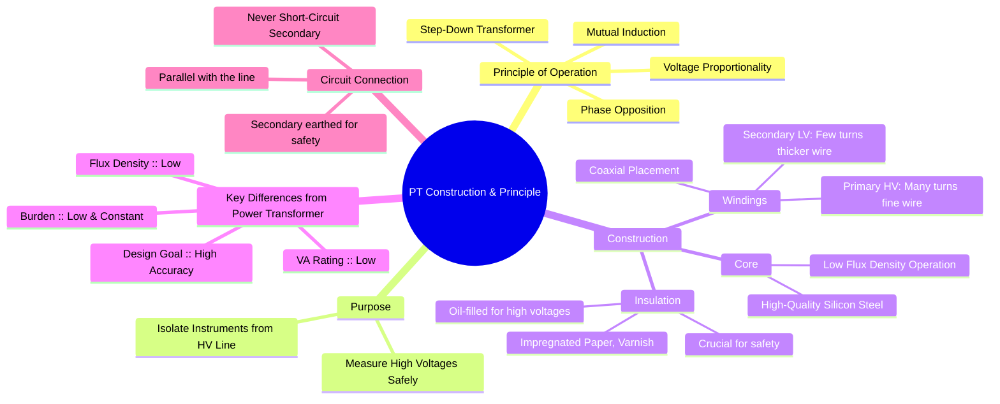

---
tags:
  - instrument-transformer
  - potential-transformer
  - voltage-transformer
  - electrical-measurements
  - gate
created: 2025-10-18
aliases:
  - PT Construction
  - PT Principle of Operation
  - Voltage Transformer (VT)
subject: "[[Electrical & Electronic Measurements]]"
parent:
  - Potential Transformers (PT)
modified: 2026-08-04T09:27:28
---
### Construction and Principle of Operation of a Potential Transformer (PT)
#potential-transformer/construction #potential-transformer/principle

> A **Potential Transformer (PT)** or **Voltage Transformer (VT)** is an instrument transformer used to step down high, unsafe system voltages to a low, standardized, and safe level (typically 110 V) for measurement by standard low-range instruments like voltmeters, wattmeters, and relays. Its design prioritizes accuracy over power handling capability.

---
#### Principle of Operation
#mutual-induction #voltage-transformation

The working principle of a PT is the same as that of a conventional power transformer—**mutual induction**.

1.  The primary winding, which has a large number of turns, is connected in parallel with the high-voltage line whose voltage is to be measured.
2.  This high primary voltage ($V_p$) induces a magnetic flux in the core.
3.  The alternating flux links with the secondary winding, which has a few turns, inducing a much lower voltage ($V_s$) across it.
4.  In an ideal transformer, the voltage ratio is equal to the turns ratio:
    $$\boxed{\quad \frac{V_p}{V_s} = \frac{N_p}{N_s} = K_n \quad}$$
    where $K_n$ is the nominal transformation (turns) ratio.
The secondary voltage is measured by an instrument. The actual line voltage is then calculated by multiplying the instrument reading by the transformation ratio.
$$\text{Line Voltage} = V_p = K_n \times V_s$$
The goal is to design the PT such that $V_s$ is an exact, scaled-down replica of $V_p$, both in magnitude and phase.

#### Construction
#potential-transformer/construction-details

The construction of a PT is similar to a power transformer, but with special emphasis on design features that ensure high accuracy.

1.  **Core:**
    *   Constructed from high-quality silicon steel laminations to minimize hysteresis and eddy current losses.
    *   It is operated at a very **low flux density** (well below the knee of the B-H curve). This keeps the magnetizing current ($I_m$) very small, which is the primary requirement for minimizing voltage errors.
    *   Both core-type and shell-type constructions are used.

2.  **Windings:**
    *   **Primary Winding:** Contains a large number of turns of fine copper wire.
    *   **Secondary Winding:** Contains a small number of turns of thicker copper wire.
    *   To reduce leakage reactance, which causes voltage drop and ratio error, **coaxial windings** are used, with the low-voltage secondary winding placed next to the core.

3.  **Insulation:**
    *   Since the primary is connected to a high-voltage line, robust insulation between the primary and secondary windings, and between windings and the core, is critical.
    *   Materials like varnished cambric and impregnated paper are used.
    *   For voltages above 7 kV, PTs are typically oil-filled, where the oil serves as both an insulator and a coolant.

4.  **Safety:**
    *   One terminal of the secondary winding is always **earthed** to ensure the safety of personnel and equipment by keeping the secondary potential near ground.
    *   **The secondary of a PT should never be short-circuited.** Unlike a CT, a short circuit would draw an enormous current from the primary, as the PT behaves like a conventional transformer with a low impedance path, leading to overheating and winding failure.

#### Comparison with Power Transformer
#pt-vs-power-transformer

| Feature | Potential Transformer (PT) | Power Transformer |
| :--- | :--- | :--- |
| **Primary Goal** | High Accuracy | High Efficiency / Power Transfer|
| **VA Rating** | Very Low (e.g., 50-200 VA) | Very High (kVA or MVA) |
| **Burden (Load)** | Small, constant, and highly resistive | Large, variable, and inductive |
| **Flux Density** | Low (to minimize exciting current) | High (near saturation for economy)|
| **Exciting Current** | Kept to a minimum for accuracy | A small percentage of full-load current |
| **Secondary** | Never short-circuited | Designed to withstand short circuits |

---
### Related Concepts
#topic/related-concepts

> [[Ratio Error and Phase Angle Error for PT]]

[[Potential Transformers (PT)]]
[[Phasor Diagram of a PT]]
[[Instrument Transformers]]
[[Current Transformers (CT)]]
[[Transformer]]
[[Electrical & Electronic Measurements]]
