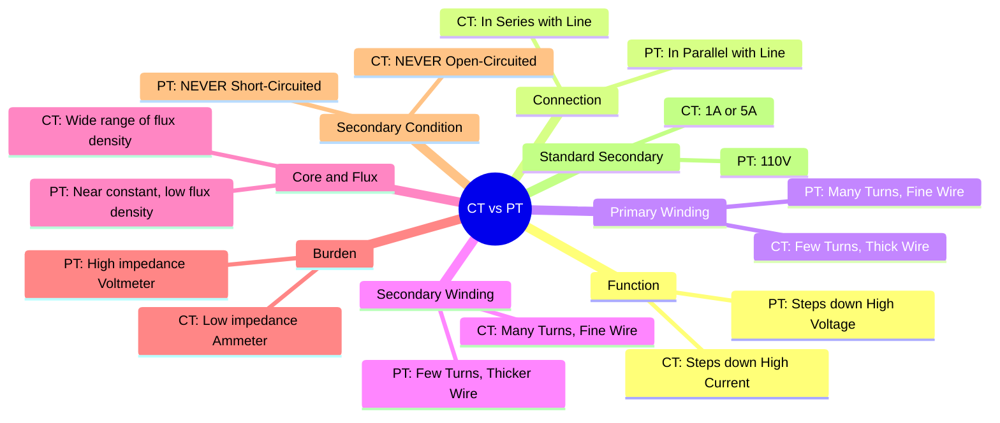

---
tags:
  - instrument-transformer
  - ct-vs-pt
  - electrical-measurements
  - gate
created: 2025-10-18
aliases:
  - CT vs PT
  - Difference between Current Transformer and Potential Transformer
subject: "[[Electrical & Electronic Measurements]]"
parent:
  - "[[Instrument Transformers (CT and PT)]]"
modified: 2026-08-04T09:32:41
---
### Difference between Current Transformer (CT) and Potential Transformer (PT)
#instrument-transformer/comparison #ct-vs-pt

> Current Transformers (CTs) and Potential Transformers (PTs) are the two main types of instrument transformers. While both are used to bring high-level power system quantities down to safe, measurable levels and provide galvanic isolation, their design, connection, and operational principles are fundamentally different, tailored to their specific roles of measuring current and voltage, respectively.

---
#### Key Differences
#current-transformer #potential-transformer

The primary differences are summarized in the table below:

| Parameter | Current Transformer (CT) | Potential Transformer (PT / VT) |
| :--- | :--- | :--- |
| **Function** | To step down a high primary current to a low, standard level (1A or 5A). | To step down a high primary voltage to a low, standard level (110V). |
| **Connection in Circuit**| Primary is connected **in series** with the high-current line. | Primary is connected **in parallel** with the high-voltage line. |
| **Primary Winding** | **Few turns** (often just one, the line conductor itself) of **thick wire** to carry the full line current with low impedance. | **Many turns** of **fine wire** to handle the high system voltage with high impedance. |
| **Secondary Winding**| **Many turns** of **fine wire**. | **Few turns** of relatively **thicker wire**. |
| **Primary Current** | Independent of the secondary circuit burden. It is dictated by the load current in the main line. | Depends on the secondary circuit burden. It is the vector sum of the exciting current and the reflected secondary current. |
| **Operation** | Acts like a current source. The secondary current is nearly constant irrespective of the secondary burden. | Acts like a voltage source. The secondary voltage is nearly constant irrespective of the secondary burden. |
| **Core Flux Density** | Varies over a wide range as the primary line current changes from no-load to full-load. | Remains nearly constant as the primary line voltage is generally constant. Designed to operate at low flux density. |
| **VA Rating** | Lower (e.g., 5-30 VA). | Generally higher than CTs (e.g., 50-200 VA). |
| **Transformation Ratio**| The current transformation ratio is approximately:   $$\boxed{\quad R_c = \frac{I_p}{I_s} \approx \frac{N_s}{N_p} \quad}$$ | The voltage transformation ratio is approximately:   $$\boxed{\quad R_v = \frac{V_p}{V_s} \approx \frac{N_p}{N_s} \quad}$$ |
| **Secondary Safety**| **NEVER open-circuited.** An open secondary means the entire primary MMF acts as magnetizing MMF, inducing an extremely high, dangerous voltage and saturating the core. | **NEVER short-circuited.** A short circuit draws a very large primary current from the line (due to low winding impedance), causing the windings to burn out. |

#### Operational Analogy
-   A **CT** is analogous to an **ammeter** and its **shunt**, where the CT steps down current for the meter.
-   A **PT** is analogous to a **voltmeter** and its **multiplier resistor**, where the PT steps down voltage for the meter.

---
### Related Concepts
#topic/related-concepts

> [[Instrument Transformers]]

[[Current Transformers (CT)]]
[[Potential Transformers (PT)]]
[[Construction and Principle of Operation for PT]]
[[Phasor Diagram of a CT]]
[[Ratio Error and Phase Angle Error for PT]]
[[Electrical & Electronic Measurements]]
