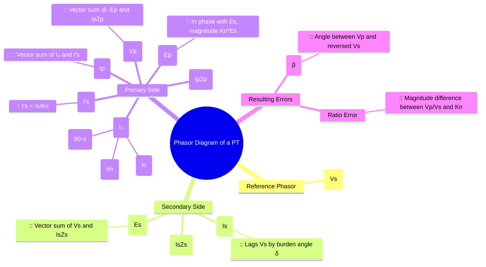

---
tags:
  - instrument-transformer
  - potential-transformer
  - phasor-diagram
  - electrical-measurements
  - gate
created: 2025-10-18
aliases:
  - PT Phasor Diagram
  - Potential Transformer Phasor Diagram
  - VT Phasor Diagram
subject: "[[Electrical & Electronic Measurements]]"
parent:
  - Potential Transformers (PT)
modified: 2026-08-04T10:13:20
---
### Phasor Diagram of a Potential Transformer (PT)
#potential-transformer/phasor-diagram #instrument-transformer/errors

> The phasor diagram of a Potential Transformer (PT) is a graphical representation that illustrates the phase and magnitude relationships between the various voltages and currents within it. It is an essential tool for understanding the sources of **Ratio Error** and **Phase Angle Error**, which arise from voltage drops across the winding impedances and the effect of the no-load exciting current.

---
#### Construction of the Phasor Diagram
#phasor-diagram/construction

The diagram is constructed by considering the transformer's equivalent circuit. For convenience, the secondary terminal voltage ($V_s$) is often taken as the reference phasor. We assume a lagging power factor burden.

1.  **Reference Phasor**: Take the secondary terminal voltage $\vec{V_s}$ as the reference.
2.  **Secondary Current ($\vec{I_s}$)**: The secondary current $\vec{I_s}$ is drawn lagging $\vec{V_s}$ by the burden's power factor angle, $\delta$.
3.  **Secondary Induced EMF ($\vec{E_s}$)**: The voltage induced in the secondary winding, $E_s$, must be greater than the terminal voltage $V_s$ to supply the voltage drop across the secondary winding impedance ($Z_s = R_s + jX_s$).
    $$\vec{E_s} = \vec{V_s} + \vec{I_s Z_s} = \vec{V_s} + I_sR_s + jI_sX_s$$
4.  **Primary Induced EMF ($\vec{E_p}$)**: The primary EMF $\vec{E_p}$ is in phase with $\vec{E_s}$ and its magnitude is $K_n$ times $E_s$, where $K_n = N_p/N_s$ is the nominal turns ratio.
    $$\vec{E_p} = K_n \vec{E_s}$$
5.  **Exciting Current ($\vec{I_0}$)**: The no-load current $\vec{I_0}$ is required to set up the flux. It is the vector sum of the core-loss component $\vec{I_c}$ (in phase with the applied voltage, i.e., $-\vec{E_p}$) and the magnetizing component $\vec{I_m}$ (in phase with the flux, which lags $-\vec{E_p}$ by $90^\circ$).
6.  **Primary Current ($\vec{I_p}$)**: The total primary current is the vector sum of the exciting current $\vec{I_0}$ and the reflected secondary (load) current $\vec{I_s'}$, where $\vec{I_s'} = \vec{I_s}/K_n$.
    $$\vec{I_p} = \vec{I_0} + \vec{I_s'}$$
7.  **Primary Terminal Voltage ($\vec{V_p}$)**: The voltage applied to the primary terminals, $\vec{V_p}$, must overcome the primary EMF (represented by $-\vec{E_p}$) and also supply the voltage drop across the primary winding impedance ($Z_p = R_p + jX_p$).
    $$\vec{V_p} = -\vec{E_p} + \vec{I_p Z_p} = -\vec{E_p} + I_pR_p + jI_pX_p$$

#### Errors from the Phasor Diagram
#ratio-error #phase-angle-error

In an ideal PT, $\vec{V_p}$ would be exactly equal to $-\vec{E_p} = -K_n \vec{E_s}$, and $\vec{E_s}$ would be equal to $\vec{V_s}$. Thus, $\vec{V_p}$ would be exactly $K_n$ times $\vec{V_s}$ in magnitude and exactly $180^\circ$ out of phase. The phasor diagram shows why this is not the case in a practical transformer.

1.  **Ratio Error**:
    The actual transformation ratio $R = V_p/V_s$ is not equal to the nominal ratio $K_n$. The difference is primarily due to the voltage drops in both primary ($I_pZ_p$) and secondary ($I_sZ_s$) windings. As seen in the diagram, the magnitude of $V_p$ is different from $K_n V_s$.
    $$\text{Ratio Error} = \frac{K_n - R}{R}$$

2.  **Phase Angle Error ($\beta$)**:
    This is the angle between the primary terminal voltage $\vec{V_p}$ and the reversed secondary terminal voltage $-\vec{V_s}$. The diagram clearly shows that these two phasors are not perfectly aligned due to the phase shifts introduced by the reactive components of the winding impedance drops and the exciting current.
    The error is considered positive if $\vec{V_p}$ leads $-\vec{V_s}$. This error is critical for power measurement accuracy.

---
### Related Concepts
#topic/related-concepts

> [[Ratio Error and Phase Angle Error for PT]]

[[Potential Transformers (PT)]]
[[Construction and Principle of Operation for PT]]
[[Phasor Diagram of a CT]]
[[Instrument Transformers]]
[[Transformer Equivalent Circuit]]
[[Phasor Diagrams]]
