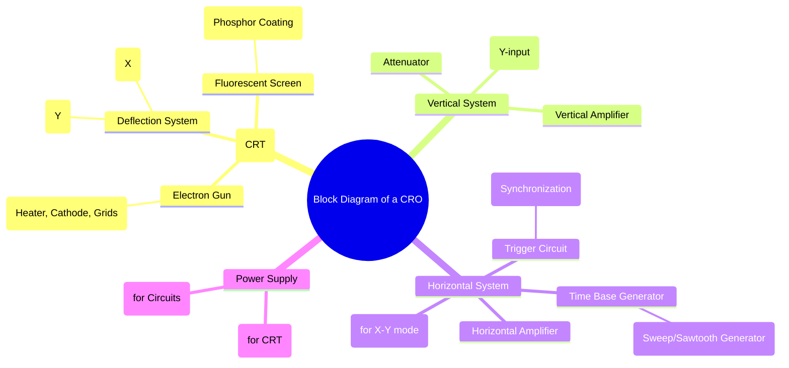

---
tags:
  - cro
  - oscilloscope
  - electronic-instruments
  - electrical-measurements
  - gate
created: 2025-10-18
aliases:
  - CRO Block Diagram
  - Functional Blocks of CRO
subject: "[[Electrical & Electronic Measurements]]"
parent:
  - Cathode Ray Oscilloscope (CRO)
modified: 2026-08-04T09:13:14
---
### Block Diagram of a Cathode Ray Oscilloscope (CRO)
#cro/block-diagram #electronic-instruments/oscilloscope

> A Cathode Ray Oscilloscope (CRO) is a versatile electronic instrument used to display, measure, and analyze waveforms by plotting a voltage signal against time or against another voltage signal. Its operation can be understood by examining its main functional blocks, with the Cathode Ray Tube (CRT) being the heart of the instrument.

The major blocks of a general-purpose CRO are:
1.  Cathode Ray Tube (CRT)
2.  Vertical Deflection System
3.  Horizontal Deflection System
4.  Power Supply

---
#### 1. Cathode Ray Tube (CRT)
#crt #cathode-ray-tube

The CRT is a vacuum tube that generates, accelerates, focuses, and deflects a beam of electrons, which then strikes a fluorescent screen to produce a visible spot. It consists of three main parts:
*   **Electron Gun:** Generates a narrow, focused beam of high-velocity electrons. It includes a heater, a cathode (emits electrons), a control grid (controls beam intensity/brightness), a pre-accelerating anode, a focusing anode, and an accelerating anode.
*   **Deflection System:** Consists of two pairs of parallel plates, oriented perpendicularly to each other.
    *   **Vertical Deflection Plates (Y-plates):** The amplified input signal is applied here, which deflects the beam vertically (up and down).
    *   **Horizontal Deflection Plates (X-plates):** The time base (sweep) voltage is applied here, which deflects the beam horizontally (left to right) at a constant speed.
*   **Fluorescent Screen:** The inner face of the CRT is coated with a phosphor material. When the high-energy electron beam strikes the screen, the phosphor glows, producing a visible spot. The persistence of the phosphor determines how long the spot continues to glow after the beam has moved.

#### 2. Vertical Deflection System
#cro/vertical-system

This system processes the input signal to be measured and applies it to the vertical deflection plates.
*   **Input Attenuator:** A network of resistors used to scale the input signal. The `Volts/Div` knob on the CRO controls the attenuation, ensuring the signal is within the operating range of the vertical amplifier.
*   **Vertical Amplifier:** This is a wideband amplifier that amplifies the weak input signal from the attenuator to a level sufficient to produce a measurable deflection of the electron beam on the screen. The gain of this amplifier is calibrated by the `Volts/Div` setting.

#### 3. Horizontal Deflection System
#cro/horizontal-system

This system is responsible for sweeping the electron beam horizontally across the screen to represent the time axis.
*   **Time Base Generator (Sweep Generator):** This circuit generates a **sawtooth waveform** of constant frequency. The linearly rising portion of the sawtooth, called the **sweep**, moves the electron beam from left to right at a constant velocity. The rapidly falling portion, called the **retrace** or **flyback**, quickly brings the beam back to the left side to start the next sweep. The `Time/Div` knob controls the frequency of this sawtooth, setting the horizontal time scale.
*   **Trigger Circuit:** This is one of the most critical circuits for displaying a stable waveform. It generates a pulse to start the sweep of the time base generator at the same point on the input waveform for every cycle. This synchronization ensures that successive traces are superimposed perfectly, making the waveform appear stationary. It includes controls for trigger level, slope (rising/falling edge), and source (internal/external).
*   **Horizontal Amplifier:** Amplifies the sawtooth wave from the time base generator before it is applied to the horizontal deflection plates. When the CRO is in X-Y mode, this amplifier is fed by an external signal via the X-input instead of the time base generator.

#### 4. Power Supply
#cro/power-supply

The power supply block provides the necessary DC voltages for all the circuits. It consists of two parts:
*   **High Voltage (HV) Supply:** Provides the very high negative potential required by the CRT anodes (in the order of kilovolts) to accelerate the electron beam.
*   **Low Voltage (LV) Supply:** Provides the lower DC voltages required by the amplifier, trigger, and time base generator circuits.

---
### Related Concepts
#topic/related-concepts

> [[Cathode Ray Oscilloscope (CRO)]]

[[Measurement of Voltage and Time Period]]
[[Measurement of Frequency and Phase using Lissajous Patterns]]
[[Electronic and Digital Instruments]]
[[Signal & Systems]]
[[Analog & Digital Electronics]]
