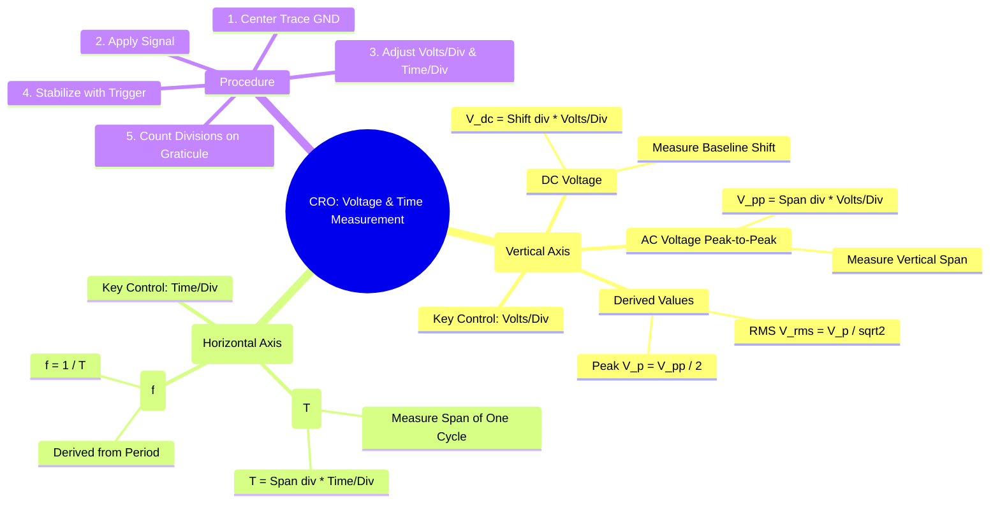

---
tags:
  - cro
  - oscilloscope
  - voltage-measurement
  - time-measurement
  - electronic-instruments
  - gate
created: 2025-10-18
aliases:
  - CRO Measurements
  - Voltage and Time Period Measurement with CRO
subject: "[[Electrical & Electronic Measurements]]"
parent:
  - Cathode Ray Oscilloscope (CRO)
modified: 2026-08-04T10:01:55
---
### Measurement of Voltage and Time Period using CRO
#cro/measurement #voltage-measurement #time-measurement

> The screen of a Cathode Ray Oscilloscope is overlaid with a grid called a **graticule**, which is calibrated in divisions (div). By using the calibrated `Volts/Div` and `Time/Div` control settings, a CRO can be used as a versatile measuring instrument for parameters like voltage, time period, and frequency.

---
#### Measurement of Voltage (Vertical Axis)
#voltage-measurement #vertical-axis

The vertical deflection of the spot on the CRO screen is directly proportional to the voltage applied to the Y-input terminals. The `Volts/Div` knob calibrates the vertical sensitivity of the oscilloscope.

###### 1. DC Voltage Measurement
To measure DC voltage, the input coupling switch is set to the `DC` position.
1.  First, with the input set to `GND`, the horizontal trace is centered to the reference line (usually the central horizontal line).
2.  Next, the input coupling is switched to `DC` and the DC voltage is applied.
3.  The trace will shift vertically (up for positive, down for negative). The amount of this shift is measured in divisions.
The DC voltage is then calculated as:
$$\boxed{\quad V_{DC} = (\text{Vertical Shift in div}) \times (\text{Volts/Div setting}) \quad}$$

###### 2. AC Voltage Measurement (Peak-to-Peak)
To measure AC voltage, the vertical span of the waveform is measured.
1.  The AC signal is applied, and the `Volts/Div` and `Time/Div` knobs are adjusted to display a clear, stable waveform.
2.  The total vertical distance from the highest point (positive peak) to the lowest point (negative peak) of the waveform is measured in divisions.
The peak-to-peak voltage ($V_{pp}$) is calculated as:
$$\boxed{\quad V_{pp} = (\text{Peak-to-Peak Vertical span in div}) \times (\text{Volts/Div setting}) \quad}$$
From this, other parameters can be derived:
-   **Peak Voltage (Amplitude):** $V_p = \frac{V_{pp}}{2}$
-   **RMS Voltage (for a sine wave):** $V_{rms} = \frac{V_p}{\sqrt{2}} = \frac{V_{pp}}{2\sqrt{2}}$

#### Measurement of Time Period and Frequency (Horizontal Axis)
#time-measurement #frequency-measurement #horizontal-axis

The horizontal axis of the CRO represents time. The `Time/Div` knob controls the speed at which the spot sweeps horizontally across the screen, thus calibrating the horizontal axis.

###### 1. Time Period (T) Measurement
The time period is the time taken to complete one full cycle of the waveform.
1.  The waveform is adjusted using the `Time/Div` control to display one or more complete cycles on the screen.
2.  The horizontal distance (span) occupied by one complete cycle is measured in divisions. For better accuracy, it's advisable to measure the span for several cycles ($N$) and then divide by $N$.
The time period is calculated as:
$$\boxed{\quad T = (\text{Horizontal span for one cycle in div}) \times (\text{Time/Div setting}) \quad}$$

###### 2. Frequency (f) Measurement
Frequency is the reciprocal of the time period. Once the time period ($T$) is measured, the frequency ($f$) can be easily calculated.
$$\boxed{\quad f = \frac{1}{T} \quad}$$

---
### Related Concepts
#topic/related-concepts

> [[Cathode Ray Oscilloscope (CRO)]]

[[Block Diagram of a CRO]]
[[Measurement of Frequency and Phase using Lissajous Patterns]]
[[Electronic and Digital Instruments]]
[[Signal & Systems]]
[[Accuracy and Precision]]
[[Waveform Parameters (Amplitude, Period, Frequency)]]
