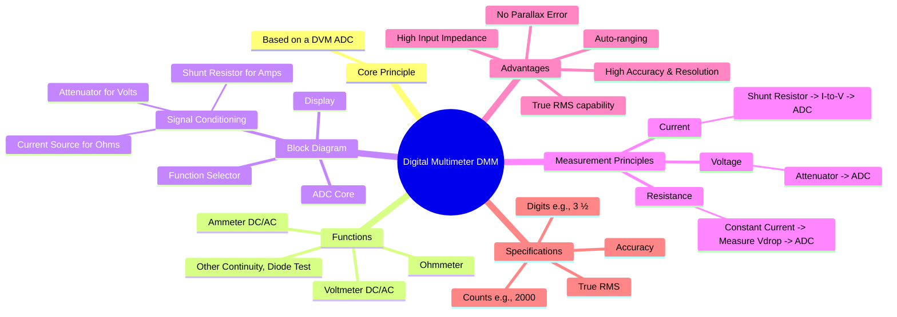

---
tags:
  - dmm
  - multimeter
  - digital-instrument
  - electronic-instruments
  - electrical-measurements
  - gate
created: 2025-10-18
aliases:
  - DMM
  - Digital Multimeter
subject: "[[Electrical & Electronic Measurements]]"
parent:
  - Electronic and Digital Instruments
modified: 2026-08-04T09:33:32
---
### Digital Multimeter (DMM)
#dmm #multimeter #digital-instrument

> A Digital Multimeter (DMM) is a fundamental and versatile electronic testing device that combines the functions of a multi-range voltmeter, ammeter, and ohmmeter into a single, portable unit. Its core is essentially a **Digital Voltmeter (DVM)**, with additional signal conditioning circuitry to enable various types of measurements. DMMs have largely replaced analog multimeters due to their higher accuracy, resolution, input impedance, and ease of use.

---
#### Principle of Operation and Block Diagram
#dmm/principle #block-diagram

A DMM operates by converting the measured analog quantity (voltage, or a voltage proportional to current or resistance) into a digital value using an Analog-to-Digital Converter (ADC), which is then displayed numerically.

The main functional blocks are:
1.  **Function/Range Selector:** A switch that configures the internal circuitry for the desired measurement (Volts, Amps, Ohms) and selects the appropriate range.
2.  **Signal Conditioning Circuitry:** This block adapts the input signal to a DC voltage level that the ADC can process.
    *   **For Voltage Measurement:** A high-impedance **attenuator** (a precision voltage divider) scales the input voltage. For AC, a **rectifier** (ideally a True RMS converter) is used to convert the AC to an equivalent DC value.
    *   **For Current Measurement:** A set of precise, low-value **shunt resistors** is used. The current to be measured flows through a selected shunt, and the DMM measures the resulting small voltage drop across it.
    *   **For Resistance Measurement:** A highly stable **constant current source** passes a known current through the unknown resistor. The DMM then measures the voltage drop across the resistor.
3.  **Analog-to-Digital Converter (ADC):** This is the heart of the DMM. It takes the conditioned DC voltage from the previous stage and converts it into a digital representation. A dual-slope integrating ADC is often used for its high accuracy and noise rejection.
4.  **Display:** The digital output from the ADC is decoded and displayed on an LCD or LED screen.

#### Measurement Functions
#dmm/functions

###### 1. Voltage Measurement
This is the DMM's native mode. The input voltage is scaled by the attenuator and fed directly (for DC) or via a rectifier (for AC) to the ADC. The high input impedance (typically $\ge 10 M\Omega$) is a key advantage, as it prevents the DMM from significantly loading the circuit under test.

###### 2. Current Measurement
To measure current, the DMM is placed in series with the circuit. The current flows through an internal, precise shunt resistor ($R_{sh}$). The DMM measures the voltage drop ($V_{sh}$) across this resistor and calculates the current using Ohm's Law.
$$I = \frac{V_{sh}}{R_{sh}}$$
The display is calibrated to show the result in Amperes.

###### 3. Resistance Measurement
To measure resistance, the DMM's internal circuitry passes a known constant current ($I_{source}$) through the unknown resistor ($R_x$). It then measures the resulting voltage drop ($V_x$) across the resistor. The resistance is calculated using Ohm's law and displayed.
$$\boxed{\quad R_x = \frac{V_x}{I_{source}} \quad}$$
Since the current is constant, the voltage drop is directly proportional to the resistance.

#### Key Specifications and Features
#dmm/specifications

*   **Resolution (Digits and Counts):** A common specification is **3 ½ digits**, which means it has three full digits (0-9) and one "half" digit (can only display 0 or 1). This allows it to display values up to 1999 (a "2000-count" meter). A 4 ½ digit meter can display up to 19999 ("20000-count").
*   **Accuracy:** Typically specified as a percentage of the reading plus a number of least significant digits. For example, `±(0.5% rdg + 2 digits)`.
*   **True RMS:** An essential feature for accurately measuring the RMS value of non-sinusoidal AC waveforms (common in power electronics). Cheaper meters are "average responding" and are only accurate for pure sine waves.
*   **Auto-ranging:** The ability of the DMM to automatically select the best measurement range, simplifying its operation.

---
### Related Concepts
#topic/related-concepts

> [[Digital Voltmeters (DVMs)]]

[[Types of DVMs]]
[[Electronic and Digital Instruments]]
[[Analog to Digital Converter (ADC)]]
[[Ohm's Law]]
[[Shunts for Ammeter Range Extension]]
[[Accuracy and Precision]]
[[Electrical & Electronic Measurements]]
