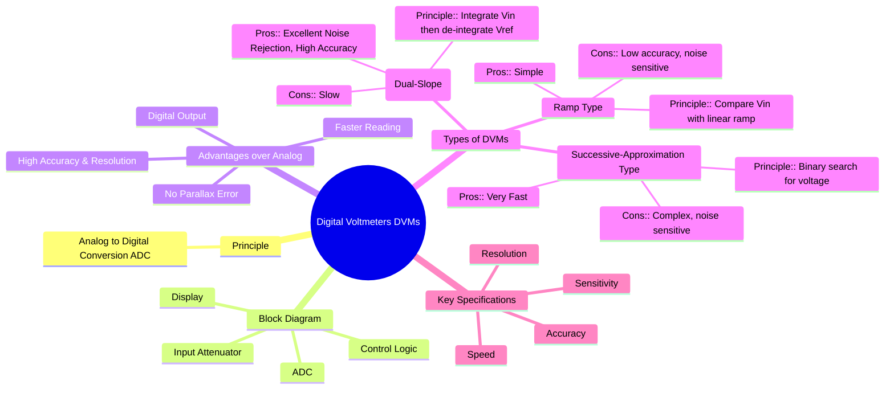

---
tags:
  - dvm
  - digital-voltmeter
  - electronic-instruments
  - adc
  - electrical-measurements
  - gate
created: 2025-10-18
aliases:
  - DVM
  - Digital Voltmeter
subject: "[[Electrical & Electronic Measurements]]"
parent:
  - Electronic and Digital Instruments
modified: 2026-08-04T09:34:04
---
### Digital Voltmeters (DVMs)
#dvm #adc #digital-instrument

> A Digital Voltmeter (DVM) is an instrument used to measure an analog voltage and display its value in a digital format (numeric digits). The core of any DVM is an **Analog-to-Digital Converter (ADC)**, which performs the conversion. DVMs offer significant advantages over analog voltmeters, including higher accuracy, higher resolution, faster reading speed, and elimination of parallax error.

---
#### General Principle and Block Diagram
#dvm/principle #block-diagram

All DVMs, regardless of their specific type, follow a general structure:
1.  **Input Attenuator/Range Selector:** A voltage divider network that scales the input voltage to a level that the ADC can handle.
2.  **Analog-to-Digital Converter (ADC):** The heart of the DVM. It takes the scaled analog DC voltage as input and converts it into an equivalent digital code.
3.  **Control Logic & Clock:** Manages the entire conversion process, sending timing signals to the ADC and processing its output.
4.  **Display:** The digital code from the ADC is decoded and shown on a numerical display, typically a 7-segment LED or LCD.

#### Types of DVMs
#dvm/types

The classification of DVMs is based on the type of ADC they employ. The most common types are:

###### 1. Ramp Type DVM
#ramp-type-dvm
*   **Principle:** An internal linear ramp voltage is generated and compared with the input voltage ($V_{in}$). A counter, driven by a clock, starts counting at the beginning of the ramp. When the ramp voltage equals $V_{in}$, the comparator sends a signal to stop the counter. The number of counts is directly proportional to the input voltage.
*   **Operation:** The final count is proportional to the time duration ($t$) for which the counter was active, which in turn is proportional to the input voltage.
    $$\boxed{\quad V_{in} = k \cdot t \quad}$$
    where $k$ is the slope of the ramp.
*   **Pros:** Simple and inexpensive.
*   **Cons:** Susceptible to noise, and its accuracy is highly dependent on the linearity of the ramp and the stability of the clock frequency.

###### 2. Integrating Type DVM (Dual-Slope)
#integrating-type-dvm #dual-slope-dvm
This is a very popular and accurate type of DVM.
*   **Principle:** The conversion happens in two distinct phases (slopes).
    1.  **Phase 1 (Integrate):** The input voltage $V_{in}$ is applied to an integrator for a fixed time period, $T_1$. The integrator's output voltage ramps up (or down) to a level proportional to $V_{in}$.
    2.  **Phase 2 (De-integrate):** The input of the integrator is switched to a known, stable reference voltage ($V_{ref}$) of opposite polarity. A counter starts, measuring the time $T_2$ it takes for the integrator output to return to zero.
*   **Operation:** The peak voltage reached is proportional to $V_{in}T_1$, and the discharge is proportional to $V_{ref}T_2$. By equating the charge and discharge:
    $$\begin{align}
    \frac{V_{in}}{R} T_1 &= \frac{V_{ref}}{R} T_2 \\
    V_{in} T_1 &= V_{ref} T_2 \\
    \implies V_{in} &= V_{ref} \left( \frac{T_2}{T_1} \right)
    \end{align}$$
    Since $V_{ref}$ and $T_1$ are fixed, $V_{in}$ is directly proportional to the measured time $T_2$ (the count).
*   **Pros:** **Excellent noise rejection** (averaging effect of the integrator), high accuracy, and accuracy is independent of the integrator's R, C values and the clock frequency.
*   **Cons:** Slower conversion speed compared to other types.

###### 3. Successive-Approximation Type DVM
#successive-approximation-dvm #sar-adc
*   **Principle:** This method works like a binary search. It uses a comparator, a Digital-to-Analog Converter (DAC), and a Successive Approximation Register (SAR). The SAR generates an N-bit digital output by trying one bit at a time, starting from the Most Significant Bit (MSB). It generates a trial voltage via the DAC, compares it to $V_{in}$, and decides whether to keep or reset the bit before moving to the next.
*   **Pros:** Very high conversion speed (typically takes only N clock cycles for an N-bit conversion).
*   **Cons:** More complex circuitry, and noise can cause the comparator to make an incorrect decision for a bit, leading to a significant error.

---
### Related Concepts
#topic/related-concepts

> [[Electronic and Digital Instruments]]

[[Digital Multimeter (DMM)]]
[[Analog to Digital Converter (ADC)]]
[[Cathode Ray Oscilloscope (CRO)]]
[[Accuracy and Precision]]
[[Resolution and Sensitivity]]
[[Analog & Digital Electronics]]
