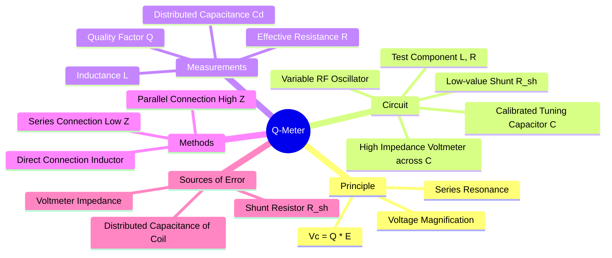

---
tags:
  - q-meter
  - quality-factor
  - electronic-instruments
  - high-frequency-measurement
  - electrical-measurements
  - gate
created: 2025-10-18
aliases:
  - Q Meter
  - Quality Factor Meter
subject: "[[Electrical & Electronic Measurements]]"
parent:
  - Electronic and Digital Instruments
modified: 2026-08-04T10:20:29
---
### Q-Meter for Measurement of Quality Factor
#q-meter #quality-factor #series-resonance

> A **Q-Meter** is a direct-reading instrument used to measure the quality factor (Q) of a circuit or component, primarily inductors and capacitors, at radio frequencies (RF). Its operation is based on the principle of **series resonance** and the associated phenomenon of voltage magnification.

---
#### Principle of Operation
#q-meter/principle #voltage-magnification

The Q-meter works on the principle that in a series RLC circuit at resonance, the voltage across the capacitor (or inductor) is Q times the total voltage applied to the circuit.

Consider a series RLC circuit excited by a voltage source $E$. The quality factor is defined as:
$$Q = \frac{\omega_0 L}{R} = \frac{1}{\omega_0 C R}$$
At the resonant frequency $\omega_0$, the reactances cancel out ($X_L = X_C$), and the circuit impedance is purely resistive, $Z = R$. The current flowing through the circuit is maximum:
$$I_0 = \frac{E}{R}$$
The voltage across the capacitor, $V_C$, is given by:
$$V_C = I_0 X_C = \frac{E}{R} \left( \frac{1}{\omega_0 C} \right)$$
Substituting $R = \frac{1}{\omega_0 C Q}$ into the equation, we get:
$$V_C = E \cdot (\omega_0 C Q) \cdot \left( \frac{1}{\omega_0 C} \right) = Q \times E$$
$$\boxed{\quad Q = \frac{V_C}{E} \quad}$$
The Q-meter circuit is designed to apply a known, low voltage $E$ and measure the resulting voltage $V_C$ across a calibrated tuning capacitor. By keeping $E$ constant, the voltmeter connected across the capacitor can be calibrated to read the value of Q directly.

#### Circuit and Working
#q-meter/circuit

The basic circuit of a Q-meter consists of:
1.  **A Variable Frequency RF Oscillator:** Provides the AC signal over a wide frequency range.
2.  **A Low-Value Shunt Resistor ($R_{sh}$):** Typically around 0.02 $\Omega$. A thermocouple ammeter is used to set the current through this resistor, thereby establishing a known, very low injection voltage ($E = I \cdot R_{sh}$).
3.  **A Calibrated Tuning Capacitor (C):** A variable capacitor whose dial is calibrated to read its capacitance value directly.
4.  **A High-Impedance Electronic Voltmeter:** Connected across the tuning capacitor. Its scale is calibrated directly in terms of Q.

**To measure the Q of an unknown coil (Direct Measurement):**
1.  The unknown coil (with inductance $L_x$ and effective resistance $R_x$) is connected to the 'Test Terminals'.
2.  The oscillator is set to the desired frequency.
3.  The tuning capacitor $C$ is varied until the voltmeter shows a maximum reading. This indicates that the circuit is in resonance.
4.  The voltmeter reading directly gives the apparent Q-factor ($Q_{apparent}$) of the circuit. Since Q is primarily limited by the coil's resistance (as other resistances are negligible), this reading is taken as the Q-factor of the coil.

#### Measurement of Component Parameters
#q-meter/applications

Besides measuring Q directly, the Q-meter can be used to determine other component values.

1.  **Inductance ($L_x$):** At resonance, the reactances are equal. The inductance can be calculated from the known frequency ($f_0$) and tuning capacitance ($C$) at resonance.
    $$\omega_0 L_x = \frac{1}{\omega_0 C} \implies \boxed{\quad L_x = \frac{1}{(2\pi f_0)^2 C} \quad}$$

2.  **Distributed or Self-Capacitance ($C_d$):** This is a very common and important application. A coil inherently has some capacitance between its windings. This is measured using the two-frequency method.
    1.  Resonate the circuit at a frequency $f_1$, and note the tuning capacitance $C_1$.
    2.  Double the frequency to $f_2 = 2f_1$, and re-resonate the circuit by adjusting the capacitor to a new value $C_2$.
    The distributed capacitance is then calculated by:
    $$\boxed{\quad C_d = \frac{C_1 - 4C_2}{3} \quad}$$

#### Sources of Error
#q-meter/errors

1.  **Distributed Capacitance ($C_d$):** The presence of $C_d$ means the voltmeter reading is the "apparent Q" ($Q_{app}$) and not the "true Q" ($Q_{true}$). The true Q is always higher.
    $$\boxed{\quad Q_{true} = Q_{app} \left( 1 + \frac{C_d}{C} \right) \quad}$$
2.  **Shunt Resistor ($R_{sh}$):** The resistance of the shunt is added to the coil's effective resistance, causing the measured Q to be slightly lower than the actual value. This error is usually negligible due to the very small value of $R_{sh}$.

---
### Related Concepts
#topic/related-concepts

> [[Quality Factor (Q)]]

[[Resonance (Series and Parallel)]]
[[Electronic and Digital Instruments]]
[[AC Bridges]]
[[Hay's Bridge (for High Q coils)]]
[[Maxwell's Inductance-Capacitance Bridge]]
[[Electrical & Electronic Measurements]]
