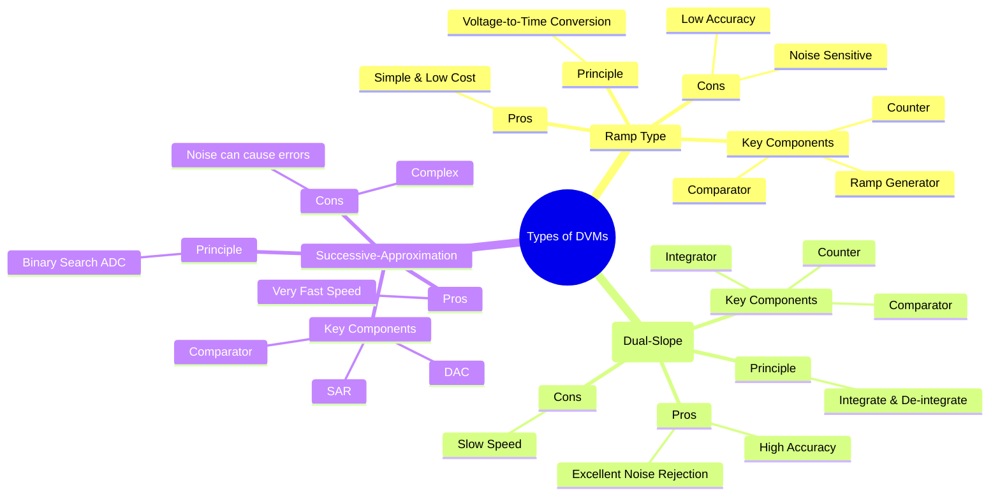

---
tags:
  - dvm
  - digital-voltmeter
  - adc-types
  - electronic-instruments
  - electrical-measurements
  - gate
created: 2025-10-18
aliases:
  - DVM Types
  - Comparison of DVMs
  - Types of DVMs (Ramp, Integrating, Successive-Approximation)
subject: "[[Electrical & Electronic Measurements]]"
parent: "[[Digital Voltmeters (DVMs)]]"
modified: 2026-08-04T10:45:16
---
### Types of Digital Voltmeters (DVMs)
#dvm/types #adc-comparison

> The functionality and performance of a Digital Voltmeter (DVM) are primarily determined by its internal Analog-to-Digital Conversion (ADC) technique. The three most fundamental types of DVMs are the **Ramp Type**, the **Integrating (Dual-Slope) Type**, and the **Successive-Approximation Type**, each with distinct advantages and disadvantages in terms of speed, accuracy, and noise immunity.

---
#### 1. Ramp Type DVM
#ramp-type-dvm

*   **Principle (Voltage-to-Time Conversion):** This DVM works by measuring the time it takes for a linearly increasing ramp voltage to equal the unknown input voltage.
*   **Operation:**
    1.  A ramp generator starts producing a linear voltage ramp, and a digital counter starts counting clock pulses simultaneously.
    2.  A comparator continuously compares the ramp voltage with the unknown input voltage ($V_{in}$).
    3.  When the ramp voltage becomes equal to $V_{in}$, the comparator generates a pulse that stops the counter.
    4.  The final count is proportional to the time interval, which in turn is directly proportional to the magnitude of the input voltage.
*   **Key Characteristics:**
    *   **Simplicity:** The circuitry is straightforward and inexpensive.
    *   **Accuracy:** Limited by the linearity of the ramp and the stability of the clock frequency.
    *   **Noise Susceptibility:** A noise spike can cause the comparator to trigger prematurely, leading to a significant error in the reading.

---
#### 2. Integrating Type DVM (Dual-Slope)
#integrating-type-dvm #dual-slope-dvm

*   **Principle (Voltage-to-Time Conversion via Integration):** This is a highly accurate method that involves two integration phases. It effectively averages out noise over the integration period.
*   **Operation:**
    1.  **Phase 1 (Integrate $V_{in}$):** The unknown input voltage ($V_{in}$) is integrated for a fixed period of time ($T_1$). The integrator's output voltage rises to a level proportional to the average value of $V_{in}$ during $T_1$.
    2.  **Phase 2 (De-integrate $V_{ref}$):** The integrator input is switched to a stable, known reference voltage ($V_{ref}$) of opposite polarity. A counter measures the time ($T_2$) it takes for the integrator output to return to zero.
*   **Governing Equation:** The final reading is derived from the relation:
    $$\boxed{\quad V_{in} = V_{ref} \left( \frac{T_2}{T_1} \right) \quad}$$
    Since $V_{ref}$ and $T_1$ are constants, the measured time $T_2$ is directly proportional to $V_{in}$.
*   **Key Characteristics:**
    *   **High Accuracy:** The accuracy is independent of the integrator's RC time constant and the clock frequency, as they affect both phases equally and cancel out.
    *   **Excellent Noise Rejection:** The integration process averages out high-frequency noise. By setting the integration time $T_1$ to a multiple of the power line period (e.g., 20 ms for 50 Hz), power supply hum (a major source of noise) can be almost completely rejected.
    *   **Slow Speed:** The conversion process, involving two full slopes, is inherently slow.

---
#### 3. Successive-Approximation Type DVM
#successive-approximation-dvm #sar-adc

*   **Principle (Binary Search):** This DVM determines the input voltage by performing a binary search. It is one of the fastest ADC methods.
*   **Operation:**
    1.  A Successive Approximation Register (SAR) generates an N-bit digital code, starting with the Most Significant Bit (MSB) set to '1' and all others to '0'.
    2.  This code is fed to a Digital-to-Analog Converter (DAC), which produces a corresponding analog voltage ($V_{trial}$).
    3.  A comparator compares $V_{trial}$ with the input voltage $V_{in}$.
    4.  If $V_{in} > V_{trial}$, the MSB is kept at '1'; otherwise, it is reset to '0'.
    5.  The process is repeated for the next bit, and so on, down to the Least Significant Bit (LSB), progressively "zeroing in" on the correct digital representation of $V_{in}$.
*   **Key Characteristics:**
    *   **Very High Speed:** The conversion takes a fixed number of clock cycles (N cycles for an N-bit converter), making it much faster than the other types.
    *   **Complexity:** Requires a high-speed DAC and complex control logic (the SAR).
    *   **Noise Susceptibility:** Like the ramp type, a noise spike occurring at a comparison instant can cause an incorrect bit decision, which can be significant for higher-order bits.

---
#### Comparison Summary

| Feature | Ramp Type | Dual-Slope Integrating | Successive-Approximation |
| :--- | :--- | :--- | :--- |
| **Principle** | Voltage-to-Time | Voltage-to-Time via Integration | Binary Search (Voltage Comparison) |
| **Speed** | Slow to Medium | **Slowest** | **Fastest** |
| **Accuracy** | Low to Medium | **Highest** | Medium to High |
| **Noise Rejection**| Poor | **Excellent** | Poor |
| **Complexity** | **Simplest** | Medium | Complex |
| **Key Advantage**| Low Cost | High Accuracy & Noise Immunity | High Speed |
| **Key Disadvantage** | Noise & Linearity Sensitive| Slow Conversion Rate | Complex & Noise Sensitive |

---
### Related Concepts
#topic/related-concepts

> [[Digital Voltmeters (DVMs)]]

[[Digital Multimeter (DMM)]]
[[Analog to Digital Converter (ADC)]]
[[Analog & Digital Electronics]]
[[Resolution and Sensitivity]]
[[Accuracy and Precision]]
